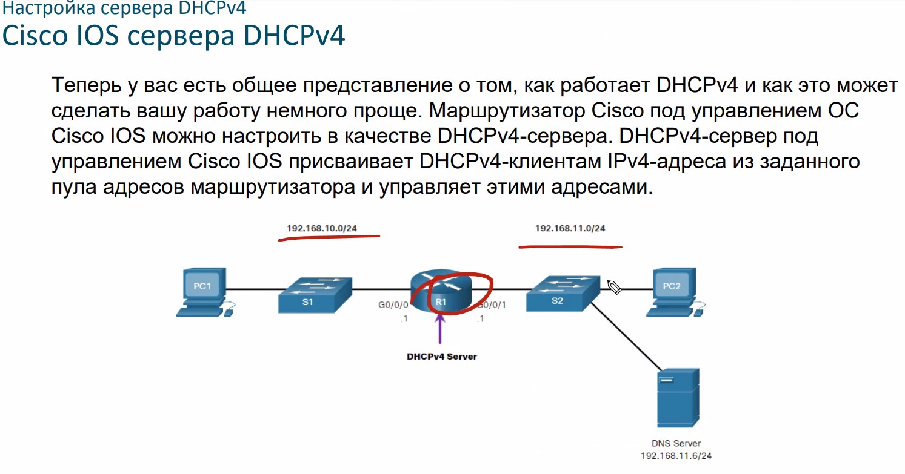
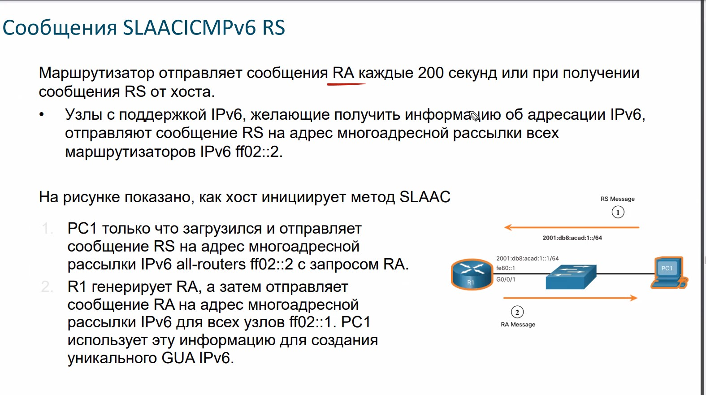
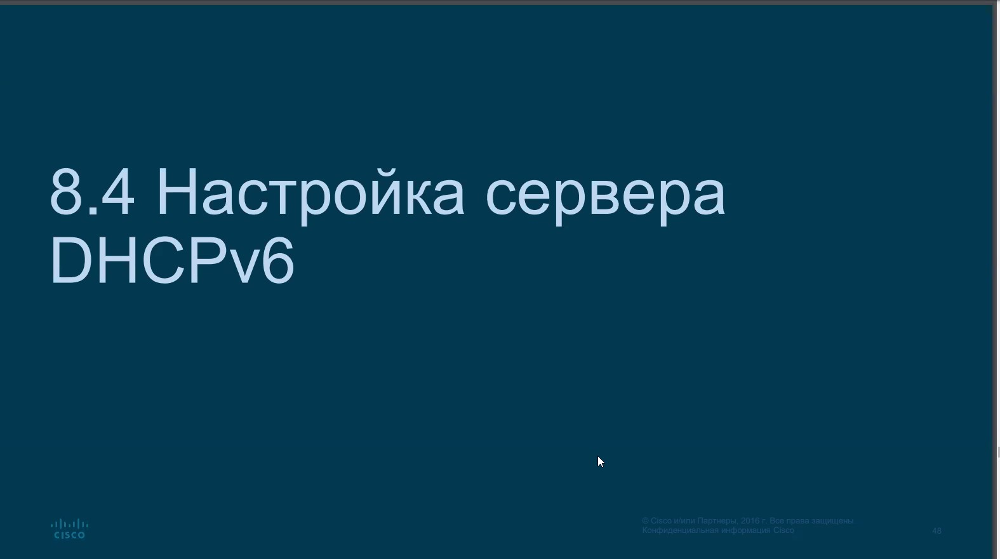
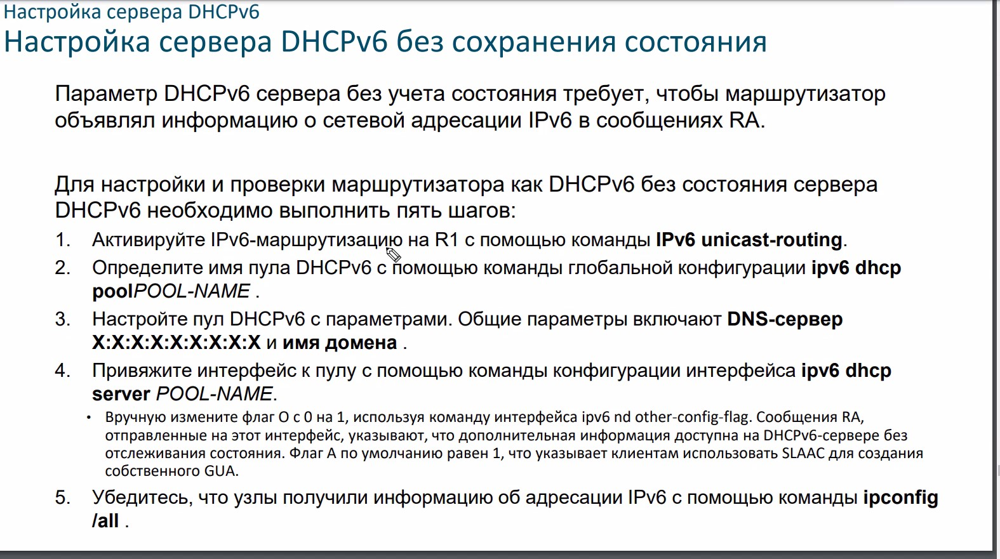

# OTUS /05/ 20210316
# DHCP server


DHCP обладает пулом адресов, из которого выдает адреса. Адреса выдаются на какой-то срок (по-умолчанию 5-7 джней). DHCP - клиент-серверное приложение:
- клиент отправляет запрос на DHCP
- DHCP предлагает адрес из пула адресов

По-истечении срока аренды DHCP возвращает адрес в пул


___DORA___ - Выполняется BC - пакетами
- DHCP ___D___ iscover (DHCPDISCOVER) - BC запрос (ip и MAC)
- DHCP ___O___ ffer (DHCPOFFER) - BC Предложение от сервера


- DHCP ___R___ equest (DHCPREQ) - Подтверждение приема предложения клиентом
- DHCP ___A___ ck (DHCPACK) - Подтверждение выдачи сервером

Если нет ответа на 1 этапе (нет DHCP/нет ip/ закрыто FW), то клиент повторно отправляет DHCP Discopver может сам назначить себе APIPA адрес

Продление - выполняется UC - пакетами:
- DHCP request (DHCPREQ) - Я хотел бы обновить
- DHCP Ack (DHCPACK) - Подтверждение обновления сервером


# Настройка




проверка:


## Ручная резервация


## Включение/выключение


## Ретрансляция DHCPv4

Надо промежуточный роутер оформить релеем. Настраивается на IF смотрящем в сегмент без DHCP. Релеей переиначивает BC и SRC-адресом  указывает ip IF смотрящего в сегмент клиента и на котором настроен ip-helper. DHCP получив запрос от указанного диапазона, выдает ip и пула, соответствующего диапазону.


Релей будет работать для перечисленных иже протоколов, что плохо


## получение ip на IF роутера


# DHCP IPv6

Порты UDP/546, UDP/547. 128-bit ip-адрес. Сейцчас выдают /64 ip-адреса


Логика выдачи/3 способа получения ip:
- SLAAC - Stateless address auticonfi
        RA (router Advertisement)
- Stateless DHCPv6/DHCPv6 Lite - здесь DHCP-сервер выдает только опции, а адрес - выдает маршрутизатор
- Statefull DHCPv6 - все операции делает DHCP-сервер

link-local адреса - аналог MAC - адреса, то есть взаимодействие в границах одного сегмента. Рекомендуется настраивать вручную. LLA - может совпадать с обоих сторон роутера, поэтому в выводах - указывается некий id выходного IF.


доработать по https://github.com/fazzzan/Specialist/blob/master/CCNA70_LABS02/Module08/README.MD


RA рассылаются маршрутизатором 1р/200 сек. 
RS (домогательство) - клиент отправляет запрос на R
RA - ответы:
- A flag - Address Autoconfiguration признак: чувак, сам себе настраивай адрес GUA методом [Stateless Address Autoconfiguration] - SLAAC.
- A+O flag - Other Configuration признак: Other информация есть на Stateless DHCPv6 server.
- A+M flag - Managed Address Configuration признак: Stateful DHCPv6 выдаст IPv6 GUA.

## SLAAC
SLAAC - способ генерации GUA Ipv6 - адреса, без использования DHCPv6


от SLAAC получаем
- network
- GW
- prefix

### Включение SLAAC
- на IF скорее всего уже будет LLA,
- также должен быть сконфигурирован GUA
- кроме этого IF уже должен быть подписан на MC - рассылку FF02::1 


RS отправляется от клиента на FF02::2
RA отправляются в ответ


проверка ```show ipv6 interface```

#### Метод "только SLAAC"


### SLAAC ICMPv6 RS



### SELF - Создание Ipv6 IF
2 способа:
- Случайно (используется чаще всего)
- EUI-64: 64-bit NET+ fffe +48-bit MAC


### Обнаружение дублей ___DAD___


Запрос с вырезанными 24-bit сгенерированного ip, отправляетсмя на ff02::24-bit

## DHCPv6


- RS 3 - отправляется на ВСЕ DHCP-сервера

### DHCPv6 stateless


## Настройка DHCPv6







## Проверка


## DHCPv6 relay
Здесь уже сделано правильно, и перенаправляются только DHCP - RS


