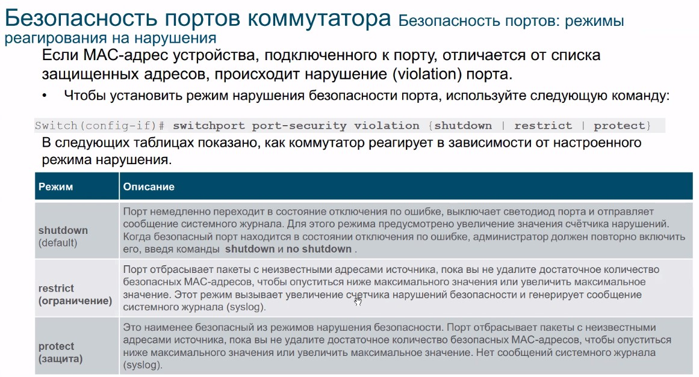
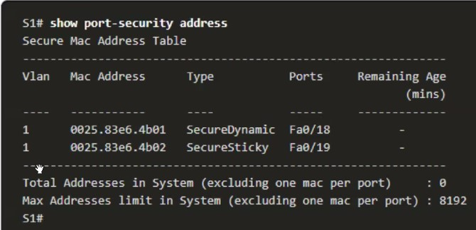

# 20210319 сетевые концепции безопасности локальных сетей


Изначально считалось, что внутри сети злоумышленников не будет. Поэтому L2-защита не развивалась. Но как оказалось, "все враги внутри". Защита может работать на всех уровнях , но L2 - самый незащищенный уровень.

## Категории атак


- переполнение CAM-таблицы, после чего свич становится хабом и злоумышленник начинает считывать весь трафик. Легальный способ - зеркалироваие портов
- атаки на VLAN:
   - двойное тегирование (односторонняя атака, на предмет открытия бесконечных сессий)
   - атака на транк
   - защита - MGM - отдельная сеть
- атаки DHCP, чтобы раздавать клиентам собственные настрйки.
- ARP-атаки: 
- подмена MAC, отравление кэша - на предмет перехвата чужого трафика с(свич считает что он отправляет кадры нужному клиенту)
- Атака STP 

## Зщита
Способов несколько:
- Отслеживание DHCP
- Отслеживание ARP


## атака на таблицу MAC
Тазмер таблиц SW - фиксированный, его пытаются забить лавиной кадров. Инструмент - ```MACOF```.


Для этого используют port-security

## атака VLAN


МДФТ hopping - подделка транка на стороне злоумышленника, когда настроенный по-умолчанию порт поднимается ___AUTO___? если с другой стороны (у злодея), транк

## Атака VLAN Hopping


Заача - формирование каро с меткой native VLAN? когда при прохождении по trunk native VLAN срезается и кадр транслируется в защищенный VLAN.

## атаки DHCP
- боремся путем назначения количества запросов через 1 порт (инструмент Goobler)
- Проблемы со взломанным DNS:
   - неправльный GW
   - Неверный DNS
   - Неправильный IP (для создания DOS-атаки на этого клиента)
Нельзя просто ответить ip-reply, так как src - может быть dhcp relay

## ARP-атаки, STP - атаки
...

# нейтрализация атаки
Надо обеспечить защуту портов
- ограничение числа MAC - на порту (тяжело админить, так как надо физически перекоммутировать и заходить в конфиг и двигать MAC-и между портами)

```
swi mo access - использовать portsec на trunk - не получится
switchport portsecurity - включение протокола безопасности на портуЭ,
```

Затем задаем параметры работы защищаемого порта

```
swi port-sec maximum <Number> - число разрешенных MAC
swi port-sec mac-address <MAC> - разрешенные MAC (в виде XXXX.XXXX.XXXX)
swi port-sec mac-address sticky - MAC прилипают к порту и сохраняются в конфиг-файле
```


можно применить настройку, которая сбрасывает запомненные данные на порту через какое-то время:


реагирование на нарушения:




После отключения порта по нарушению, проще всего включить порт командой ```shut```,  ```no shut```

Проверка
``` show port-security```


```show port-sec address```



## Атаки на VLAN
не используем DTP на портах
```
swi no negotiate
swi mo trun
swo mo acc
```

## атаки на DHCP
1. Истощение DHCP
2. Включение своего DHCP

ip dhcp snooping - задаем что все порты - недоверенные
<IF>
ip dhcp snooping trust - задаем что на IF может быть DHCP
</IF>


Ограничиваем скорость запросов DHCP 6 в секунду на access-порту


В этом случае коммутатор разрешает прохождление DHCP-offer только на разрешенных портах

Проверка:


## Нейтрализация ARP-атак Dynamic ARP Inspection


не транслирует те ARP-запросы, от MAC которых на было замечео на IF свича


Настройка


DAI - пример конфига


Чем больше проверок - тем выше нагрузка на железки


#  Атаки на STP
Позволяют злоумышленнику испортить стройную конфигурацию сети. Включить защиту через PortFast - без него не заработает (на портах доступа, чтобы быстрее включался при включении ПК) и BPDU Guard. В этом случае если кто-то захочет подключить SW через access-порт, то BPDU с этого порта не проникнет в защищаемый сегмент. Порт отключается.


