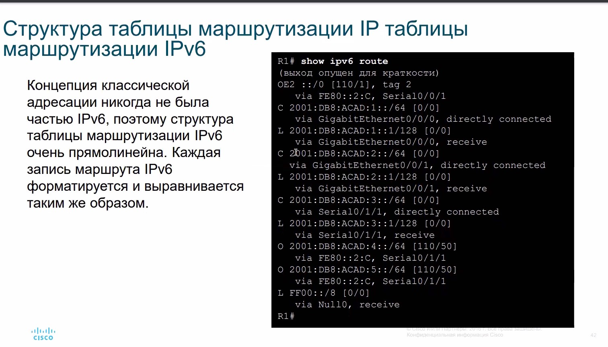
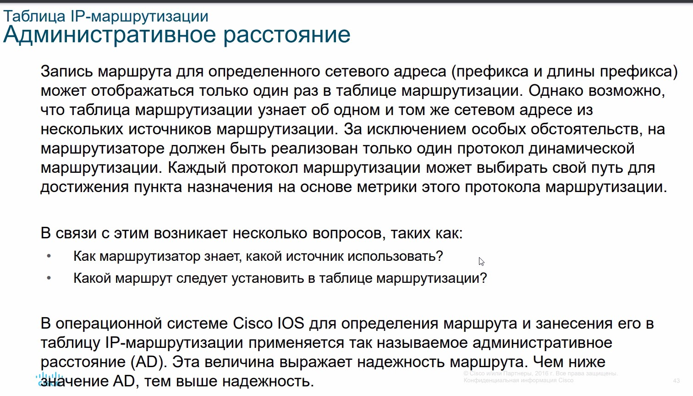
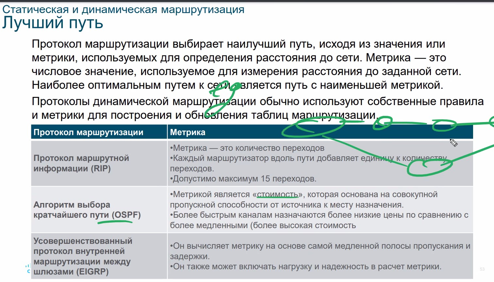
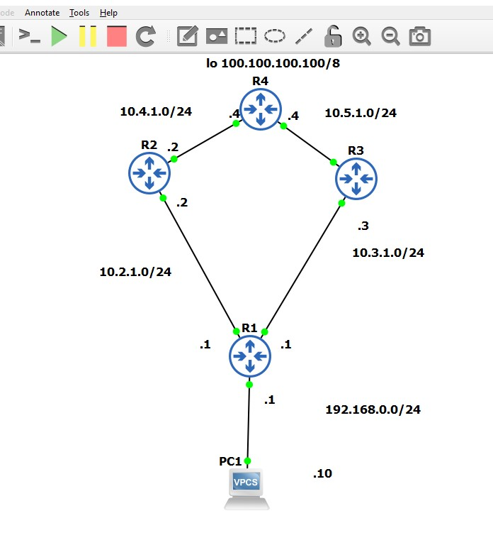
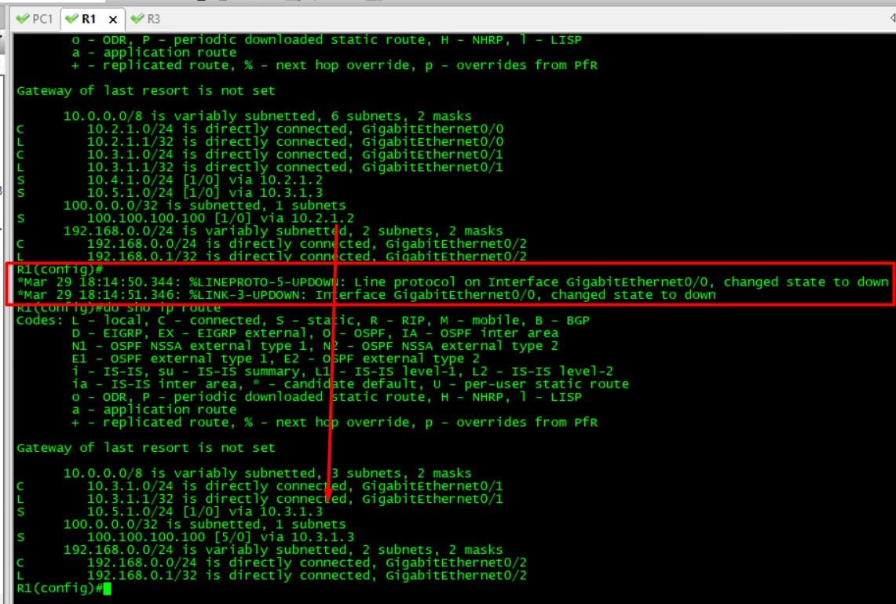
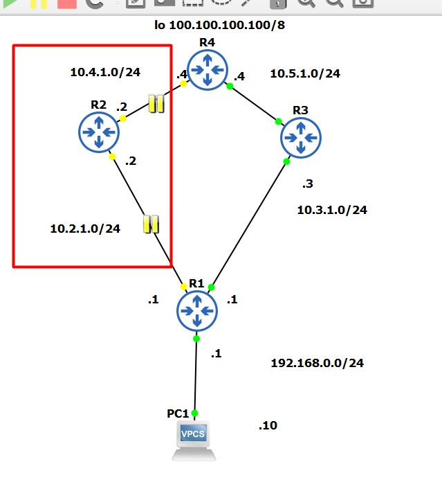

# 20210323 Маршрутизация (модуль 14 Netacad)


Пакет уходит в сторону лучшей сети. Лучший путь - тот, который:
- имеет самое длинное совпадение (максимально близкая подсеть)
   - например для 8.8.8.8 лучшая из (8.0.0.0/8, 8.8.0.0/16, 8.8.8.0/24) будет 8.8.8.0/24

Для Ipv6 - чем длиннее префикс - тем приоритетнее маршрут


На примере , 2 совпадение - лучшее, так как 3-я запись имеет большую длину маски.

Типы маршрутов в таблице маршрутизации:
- С (Connected) - к IF подключена сеть, на ША настроен адрес, IF - UP
- Удаленная
   - Static
   - Dynamic route
- Default route - та сеть, куда маршгрутизатор сливает трафик, если отсутствуют другие маршруты. ___Маршрут последней надежды___

Любой протокол динамической маршрутизации наполняет таблицу маршрутов/базу данных протокола маршрутизации, но в таблицу маршрутизации попадают только лучшие маршруты.

## Процесс принятия решений о переадресации


## Процесс передачи пакетов
Изменился со временем:
- Process-Switching - старый, каждый пакет отправлялся в Control Plane, где CPU искал подходящую запись в таблице маршрутов
- Fast Switching - старый, добавлися fast-switching cache (с next-hop информацией), который заполняется CPU и используется для пакетов всего потока (у которых DST - одинаковый). Все остальные пакеты не будут обрабатываться control plane, а сразу проскочат dataPlane
- CEF - современный, default - включенный. Процесс CEF строит FIB (forwarding information base) и adjacency table (я где-то это читал, но забыл). Строится на основании изменений маршрутов. Таким образом когда сеть сошлась - FIB и adjacency table содержат всю информацию которая нужна роутеру для маршрутизации, все пакеты пойдут чреез DataPlane

(СМ Специалист https://github.com/fazzzan/Specialist/blob/master/CCNA70_LABS02/Module14/README.MD)

Понятия для современного опнимания процессов маршрутизации
- Control Plane (подготовка сети/устройства к передаче данных - заполнение ARP-таблицы) - отвечает процессор
   - построение таблиц маршрутов
   - вычисление метрик
   - сверка AD
   - занесение маршрута в таблицу маршрутизации
   - Вычисление топологии у SW,
   - Вычисление ROOT STP
   - Формирование правл FW
- Data Plane (процесс форвардинга на основании построенной ARP) - отвечают ASIC
   - пакеты/кадры при сформированных/заполненных таблицах - не ходят
- MGM Plane

Для NEXUS.
- Маршруты (расчет, получение маршрутов, формирование ACL) - Control Plane
- Передача (реализация сформированных ACL) - Data Plane


## Базовый конфиг роутера


```
Router> enable
Router# configure terminal
Enter configuration commands, one per line. End with CNTL/Z.
Router(config)# hostname R1
R1(config)# enable secret class 
R1(config)# line console 0  
R1(config-line)# logging synchronous
R1(config-line)# password cisco 
R1(config-line)# login 
R1(config-line)# exit 
R1(config)# line vty 0 4 
R1(config-line)# password cisco 
R1(config-line)# login 
R1(config-line)# transport input ssh telnet 
R1(config-line)# exit 
R1(config)# service password-encryption 
R1(config)# banner motd #
Enter TEXT message. End with a new line and the #
***********************************************
WARNING: Unauthorized access is prohibited!
***********************************************
#
R1(config)# ipv6 unicast-routing
R1(config)# interface gigabitethernet 0/0/0
R1(config-if)# description Link to LAN 1
R1(config-if)# ip address 10.0.1.1 255.255.255.0 
R1(config-if)# ipv6 address 2001:db8:acad:1::1/64 - глобальный
R1(config-if)# ipv6 address fe80::1:a link-local - Link Local адрес
R1(config-if)# no shutdown
R1(config-if)# exit
R1(config)# interface gigabitethernet 0/0/1
R1(config-if)# description Link to LAN 2
R1(config-if)# ip address 10.0.2.1 255.255.255.0 
R1(config-if)# ipv6 address 2001:db8:acad:2::1/64 
R1(config-if)# ipv6 address fe80::1:b link-local
R1(config-if)# no shutdown
R1(config-if)# exit
R1(config)# interface serial 0/1/1
R1(config-if)# description Link to R2
R1(config-if)# ip address 10.0.3.1 255.255.255.0 
R1(config-if)# ipv6 address 2001:db8:acad:3::1/64 
R1(config-if)# ipv6 address fe80::1:c link-local
R1(config-if)# no shutdown
R1(config-if)# exit
R1# copy running-config startup-config 
Destination filename [startup-config]? 
Building configuration...
[OK]
```

Проверка
```
sho ip int br
show run int <IFx/y>
show interfaces
sho ip interface
show ip route
ping
...
show ipv6 interface brief
show running-config interface <int X/Y>
show interfaces
show ipv6 interface
show ipv6 route
ping
```

Фильтрация вывода
```
show run | sec ospf
show run | in ospf

```

## Таблица IP-маршрутизации
- Содержит префиксы, маски
- Маршруты
   - Статические
   - Динамические
- Туче-hop router
- Время существования маршрута
- Выходной IF


- ___110___ - AD - степень доверия маршруту: у каждого протокола маршрутизации - своя AD: чем она меньше, тем надежнее маршрут, и в таблицу маршрутизации попадет маршрут с минимальной AD
- ___50___ - Метрика - рассчитываемая величина, которая сравнивается в рамках конкретного протокола. Сначалша протокол маршрутизации выбирает лучший маршрут (скажем BGP и OSPF), затем пытаются разместить лучшие маршруты в таблице маршрутизации, а маршрутизатор сам выбирает подходящий маршрут, на основании AD.

Непонятно почему используется такой алгоритм, кажется что первый этап (внутри протокола) - лишний

## Connected сети
- Connected (подсеть)
- L - 32 маска (IF)

В Ipv6 - аналогичная ситуация

## Статические маршруты
- S - удобно для небольших/стаб - сетей
cisco рекомендует поднимать динамические протоколы маршрутизации, их удобнее эксплуатировать
```
ip route <NET> <MASK> <Next-hop>
ipv6 route 2001.db8.acad.4::/64 2001.db8.acad.3::2
``` 


## Динамическая маршрутизация


Проверка таблицы маршрутизации
```sho ip route```

## Таблица маршрутизации


Таблицу ipv6 route уже удобно фильтровать


## AD




___Pапомнить___
- Connected = 0
- Static = 1
- BGP = 20
...
- iBGP - 200

## Сравнение статической и динамической маршрутизации
- Использовать разумное сочетание, отдавая предпочтение Dynamic маршрутизации
- Статику используют:
   - маршрут по-умолчанию для Access - узлов или на ISP
   - для маршрутов, которые не имеют маршрутов в рамках динамического проктола маршрутизации
- Динамику используют
   - от 2 роутеров
   - в случае возможного изменения маршрутов в сети
   - Масштабируемость (добавление маршрутизаторов)

## Статическая и динамическая маршрутизация
- Дистанционно-векторная - знает только направления (EIGRP? также частично знает и про состояние пути)
- Link-state протоколы (все К знают про все маршруты в сети),
- Exterior Gateway protocol


## Принципы протоколов динамической маршрутизации




## Распределение нагрузки
Если у маршрутизатора есть 2 маршрута в одну и ту же сеть, то в таблице маршрутизации будет 2 маршрута, а трафик в очень грубом приближении будет Round Robin, что предпочтительно для распараллеливания нагрузки

ECMP - не даст распараллелить нагрузку до 1 IP. Параметры FLOW:
- port Src/Dst
- IP Src/DST
- Proto


# 20210326 Продолжение по статической маршрутизации

Задание статического маршрута через выхъодной IF - работает только в (.)-(.)


Ipv6 Link-local адрес нельзя задавать без выходного IF.


Проверка
```
sho ip route
sho ipv6 route
sho ip route static
sho ip route <x.x.x.x/M>
``` 

## Default route


Настройка default route - работает ECMP? если существует 2 маршрута по-умолчнию
1


Настройка плавающего маршрута


AD - нужна чтобы в таблицу маршрутизации попал наиболее доверенный маршрут
Метрика - необходима чтобы сравнить маршруты с одной AD


Недостатки:
- При падении (connected) основного канала, в таблицу маршрутизации попадет маршрут с худшей метрикой. Но если за R находится SW, то линк не упадет и маршрут не уйдет из таблицы маршрутизации.
- флаппинг сети приведет к постоянным перестроениям таблицы маршрутизации, фризам, глюки в базах данных, невозможность докачать файл.


## настройка статики на хостах
- DHCP (ip + default GW)
- статика на хосте


## Пример настройки статической маршрутизации и резервирования маршрутов при помощи AD в GNS3

[Файлы проекта](labs/floating_route)



```
R1(config)#do sho ip int br
Interface                  IP-Address      OK? Method Status                Protocol
GigabitEthernet0/0         10.2.1.1        YES NVRAM  up                    up      
GigabitEthernet0/1         10.3.1.1        YES NVRAM  up                    up      
GigabitEthernet0/2         192.168.0.1     YES NVRAM  up                    up      
GigabitEthernet0/3         unassigned      YES NVRAM  administratively down down   

R1(config)#do sho run | in ip route
ip route 10.4.1.0 255.255.255.0 10.2.1.2
ip route 10.5.1.0 255.255.255.0 10.3.1.3
ip route 100.100.100.100 255.255.255.255 10.2.1.2
ip route 100.100.100.100 255.255.255.255 10.3.1.3 5
```

Как видно, маршрут через R3 имеет худшую AD, чем через R2, поэтому его нет в таблице маршрутизации, пока с Gi0/0 все хорошо. Стоит Gi0/0 упасть, то ___CONNECTED___ маршрут через R2 пропадет из таблицы маршрутизации и на его место высплывет запасной ___floating___ маршрут. То есть маршрут как бы был в таблице маршрутов, но "всплыл" он тольк при падении основного маршрута. 



