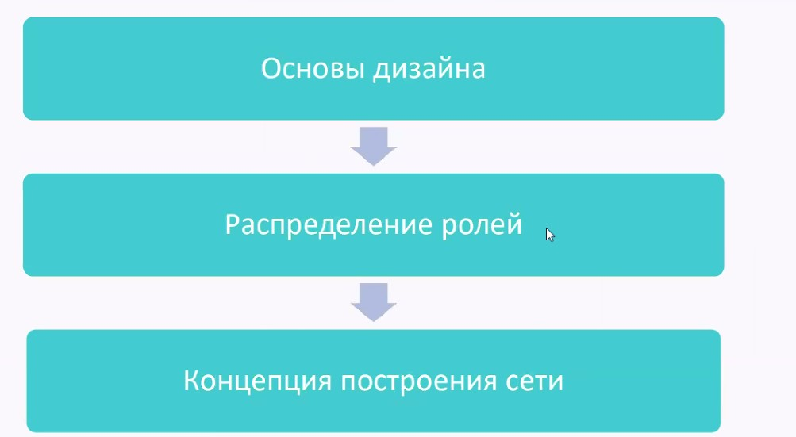
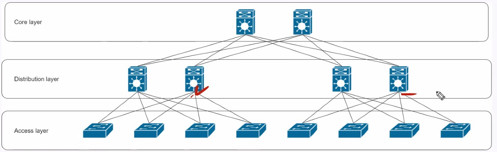
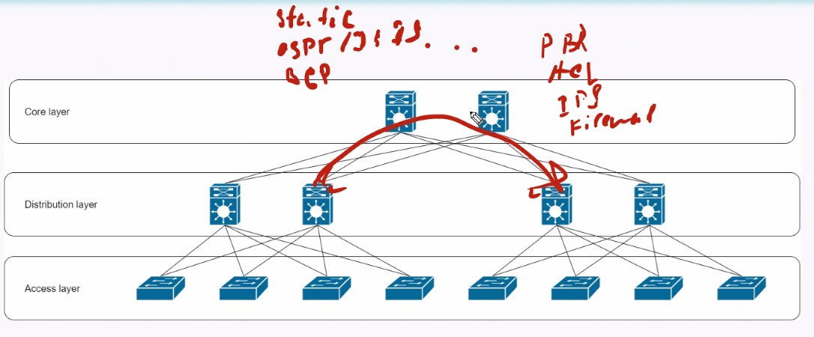
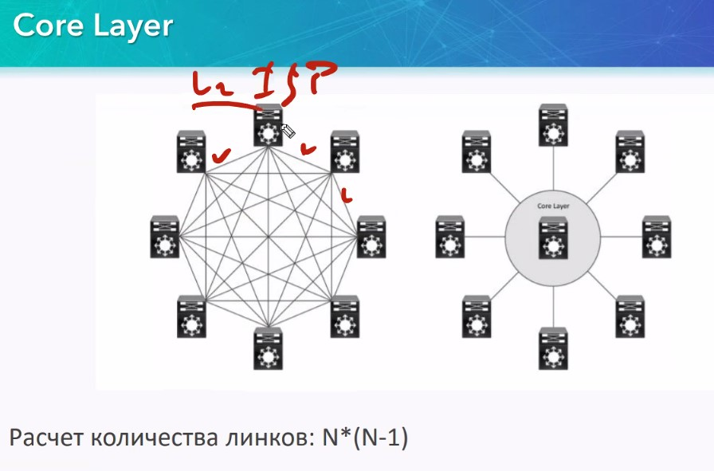
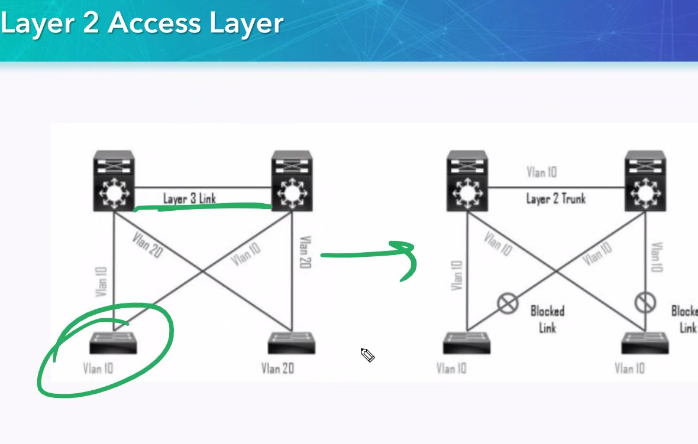
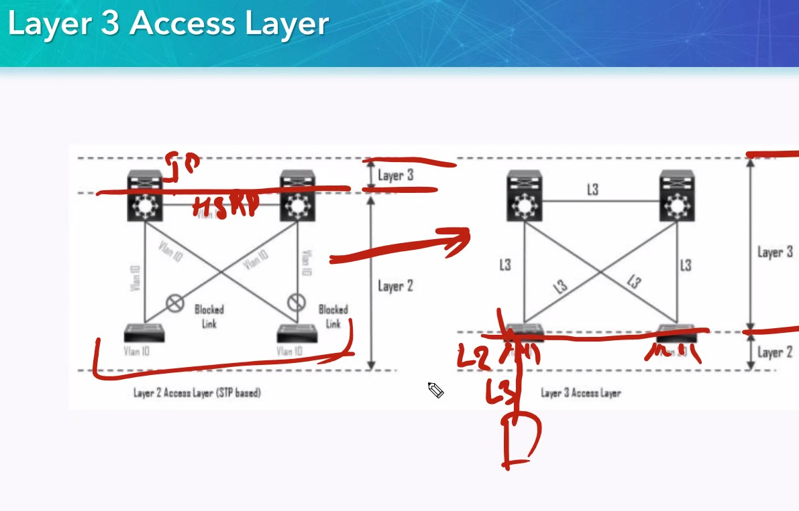
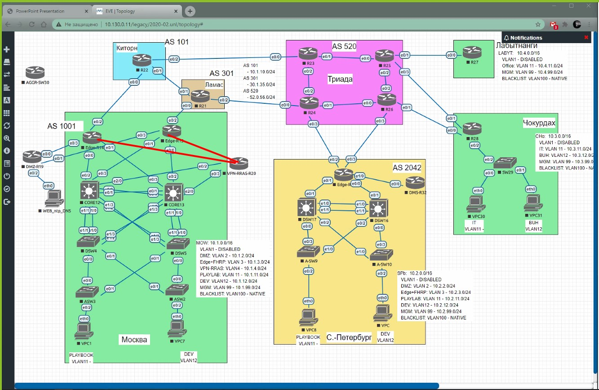

# OTUS 20210402
# Основы дизайна

## Основы дизайна

CORE - самый тупой уровень, его может и не быть, и тогда это называется Collapsed Core

Но CORE - необходим, когда у нас кончаются порты на DISTRIUTION SW, и DISTRIBUTION надо связать между собой

## ACCESS Layer

Обеспечивает подключение конечных хостов (проводных, беспроводных и т.п.), точек доступа и т.д. Выполняет функции:
- Сегментирования сети (VLANS)
- Поддержка QoS
- Упрощение управления
- Безопасность (PortSec+Snooping+802.1x, в каких-то умных SW - ACL)

## Distribution Layer
Нужен для:
- агрегирование
- GW для клиентов Access
- Граница STP
- Суммаризация маршрутов (соседям не нужны все сети, их будет интересовать суммарная подсеть)

А при разработке адресого пространства - саоме важное придумать некую схему распределения адресов, и придерживаться ее при проектировании.

## CORE Layer

На этом уровне ничего не делаем, кроме перебрасывания пакетов с одного порта на другой.

Collapsed CORE мешает нобходимость использования линкОв для организации FullMesh, поэтому экономим линки, внедряя CORE.

Для включения firewall 
- в ENterprise надо создавать отдельный CORE
- в DC - надо включать в ACCESS уровень

## Концепции построения сети

### 1 Two-tier/Collapsed CORE
Все должно быть просто, суммироваться, разбиваться на VLAN

### 2 Three-tier Design
Увеличивается количество етевых сервисов  трафика в сети

### 3 L2 Access-Layer (STP-based)
STP - хуже, так как:
- скорость сходимости по-прежнему низкая
- не 100% использование линкОв (неправильная настройка использования линкОв)

Если VLAN распределенный по SW, то надо использовать левую картинку, а если VLAN ограничен рамками одного SW, то можно настраивать L3 - связность в дистрибьюшене (левая картинка)

Варианты использования:
- HSRP
- VRRP
- GLBP

И все эти протоколы требуют тонкой настройки

### 4 L3 Access Layer - Route-Based
Вся маршрутизация на ACCESS. То есть VLAN не выходит за рамки SW. SVI ACCESS-SW будет выступать GW для хостов, а маршрутизация на том же свиче ACCESS-SW

Плюсы:
- нет STP, линки полноценно утилизируются
- нет избыточных протоколов (STP)
- Быстрая сходимость (L3)
- Для маршрутизации - любые протоколы

Минусы:
- необходимо привыкнуть выделять подсети на этажи
- Удорожание уровня доступа

### 5 - упрощенный кампусный дизайн - никогда не строить в ЦОД

Это VSS, способ построения из нескольких - одного логического устройства/стека с использованием аплнков. Работает на 6000 и 4600/4500 серии Catalyst.

В обычном режиме - стек собирается на специализированных портах

Плюсы стеков
- Упрощение управления
- Нет необходимости в протоклах HSRP/VRRP
- нет STP
- Идет распределение нагрузки на Uplink (Etherchannel)
- Быстрая сходимость за счет снижения количества логических устройств
- Распределение VLAN по всей сети

Минусы стеков VSS
- плохая стабильность, выплывают баги

У StackWise - все гораздо надежнее, но на ACCESS - уровень пойдет.

### 6 SD-ACCESS

Все управление через Cisco-DNA [digital network architecture Center]. Все управление - через единый программный модуль. Но, возникает проблема в единственной точке отказа - ПО. Cisco сейчас заменила все простые железки на catalyst 9000, которые работаеют с DNA. Цена лицензия - космическая

ДЗ

Имиджи оборудолвания взял тут: https://drive.google.com/drive/folders/102jxZ9ECpe6ZFtXYdK_81iEVuuFoGOGR