# PBR - маршрутизация - OTUS 20210406


В некоторых случаях маршрутизация надо строить не дефолтным способом, а каким-то другим
- Для неоптимальных маршрутов
- для резервирования (нескольких ISP)
- Оптимизация пути трафика приложений
- Распределение нагрузки (балансировка)


PBR - позволяет повлиять на работу перекладывания пакетов, вне зависимости от таблицы маршрутов


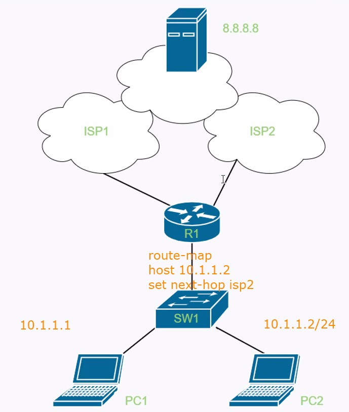

## Route-map

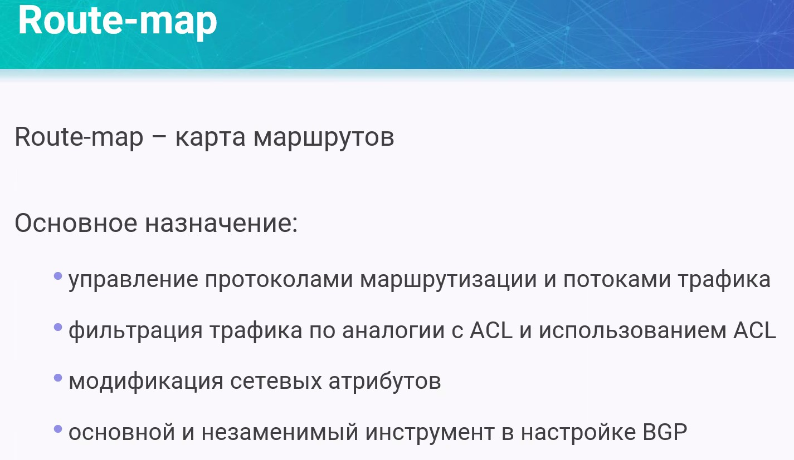

Особенности Route-map
- Это список инструкция, как и ACL
- также обрабатывается, как ACL 
   - прерывается после попадания
   - разделяется на пункты (clause) с порядковым номером
   - последний пункт - неявный запрещающий
   - route-map может использровать ACL


___Настройка___

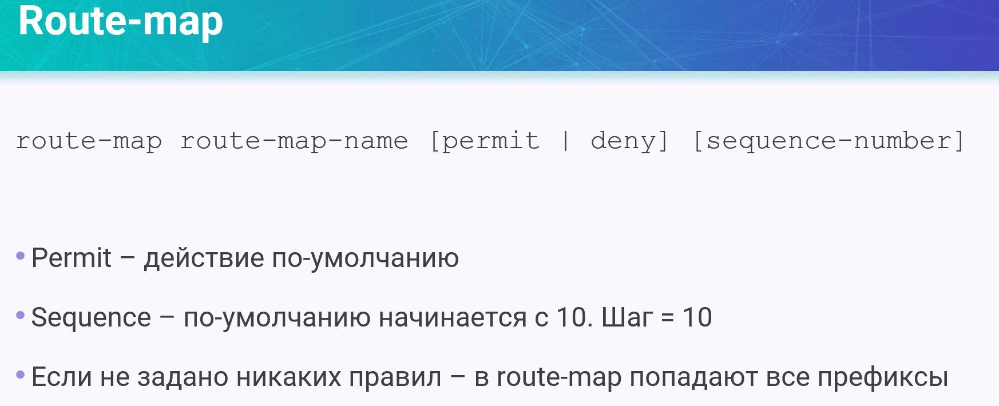
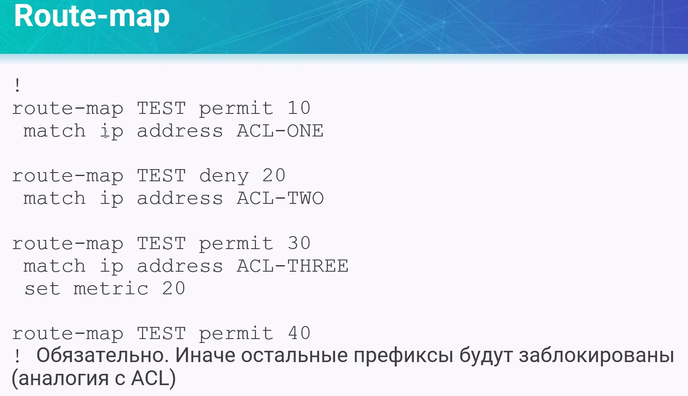

4-е правило - обязательно, без него в этот route-map попадет только ACL-ONE, ACL-THREE

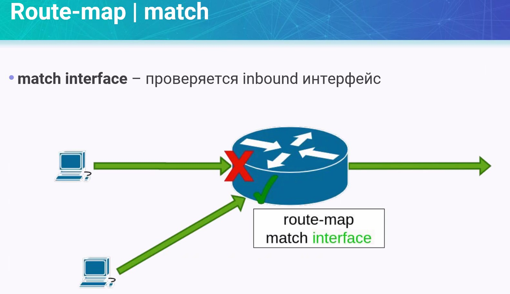

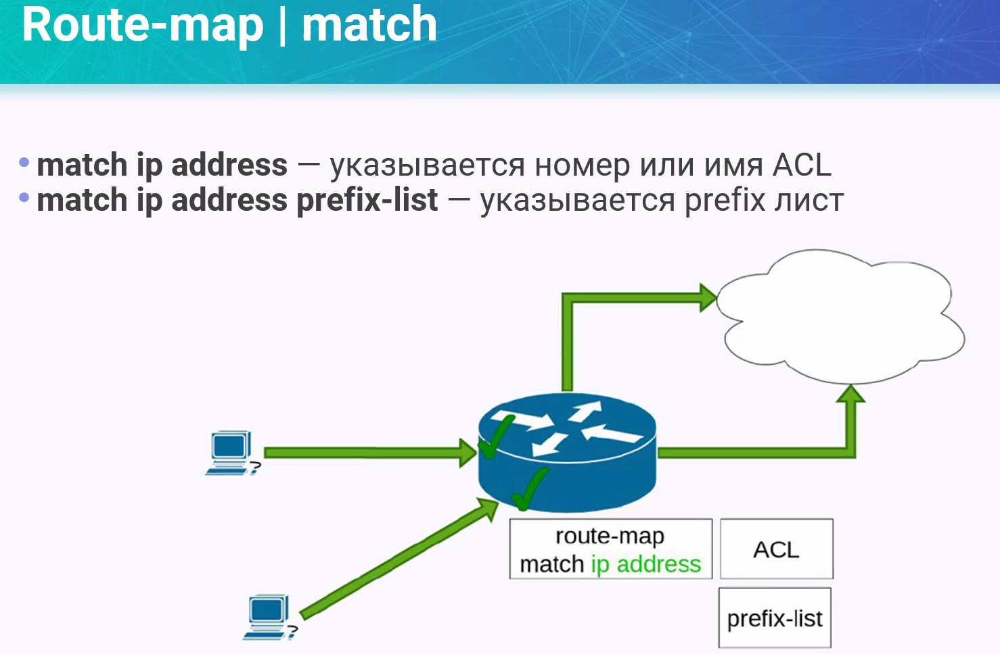

Также матчим по следующим параметрам:

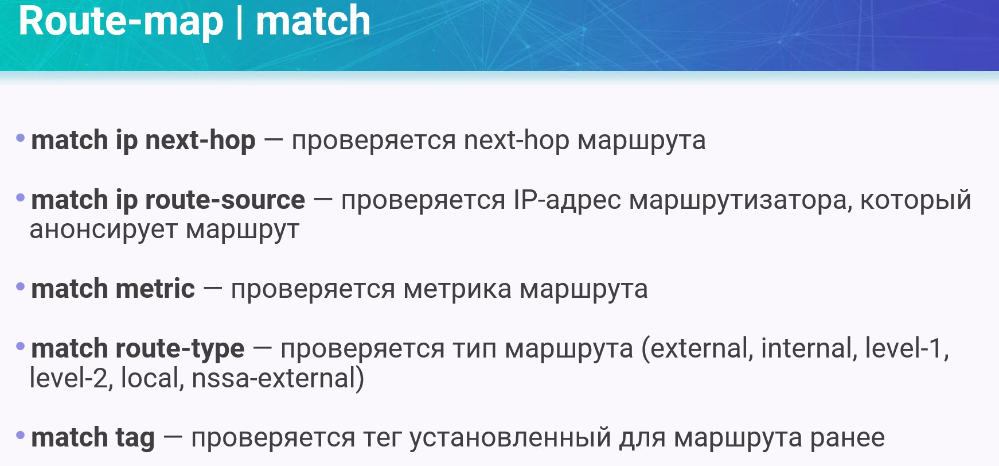

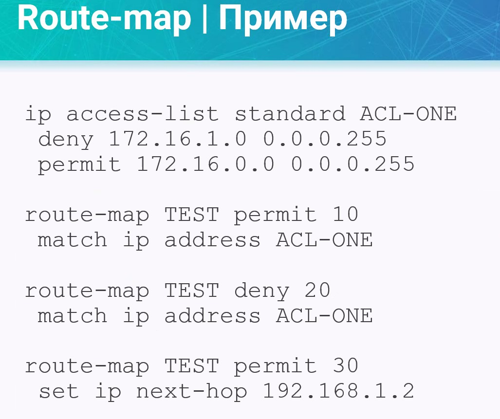


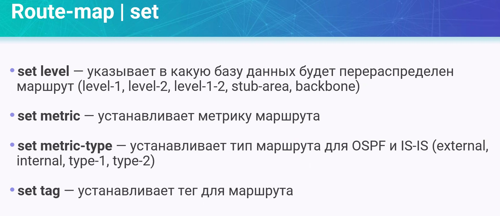

continue - продолжение, переход к следующему шагу

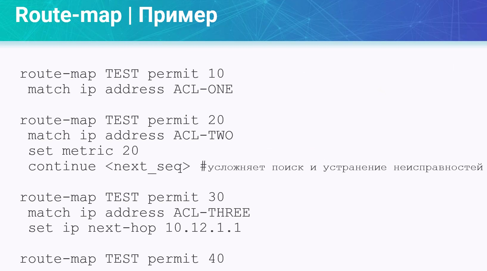

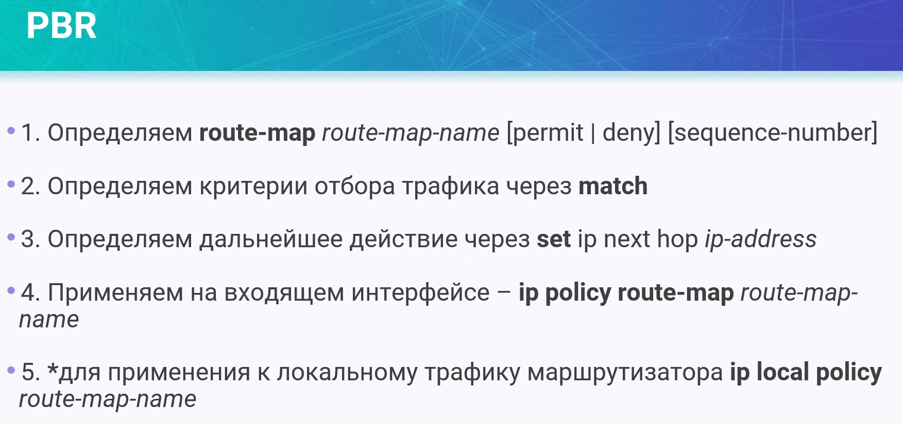

что делаем с IP SLA:

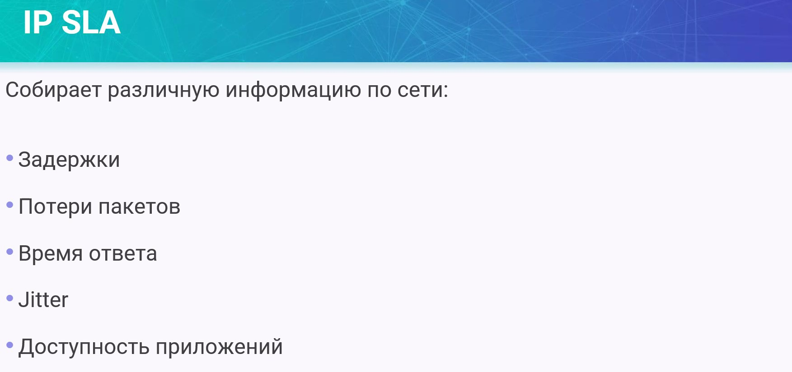

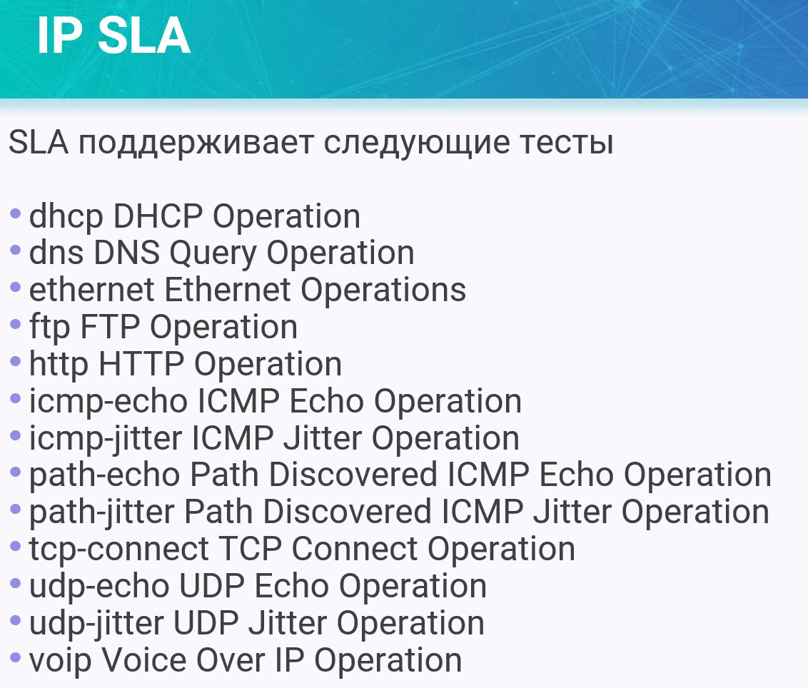

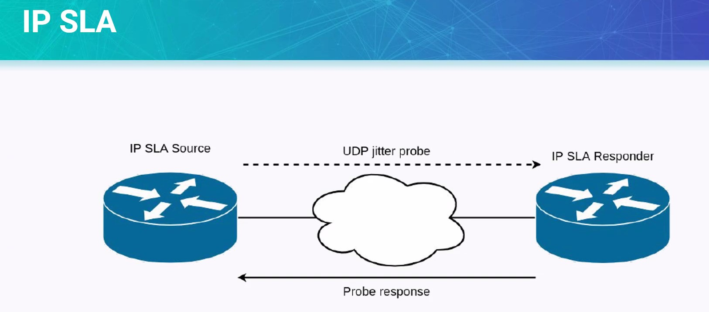

Пример:

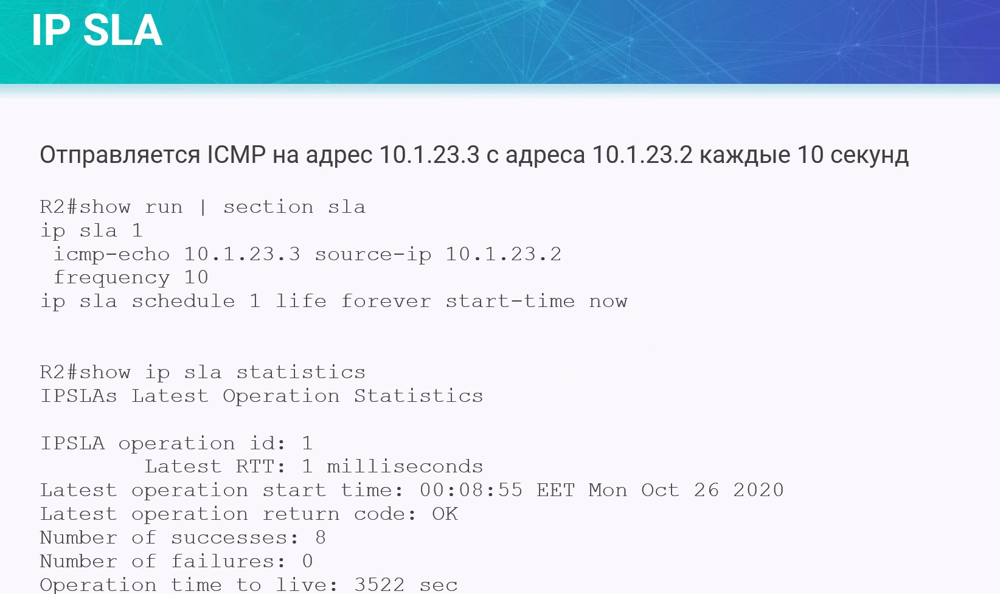


Проверка:

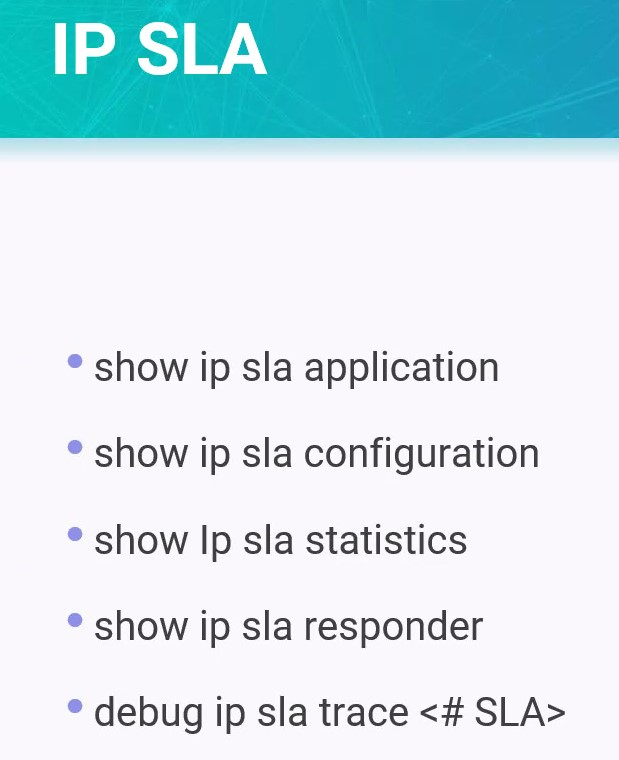

Информацию из диагностики сети можно использовать для:
- подмены маршрута в таблице маршрутизации

Пример на VIRL/CML2

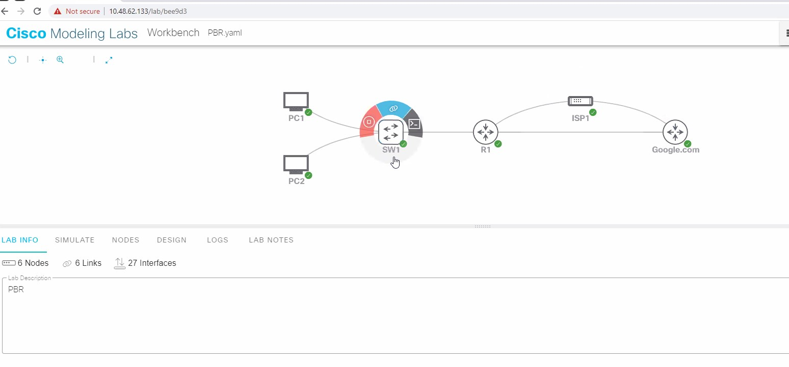

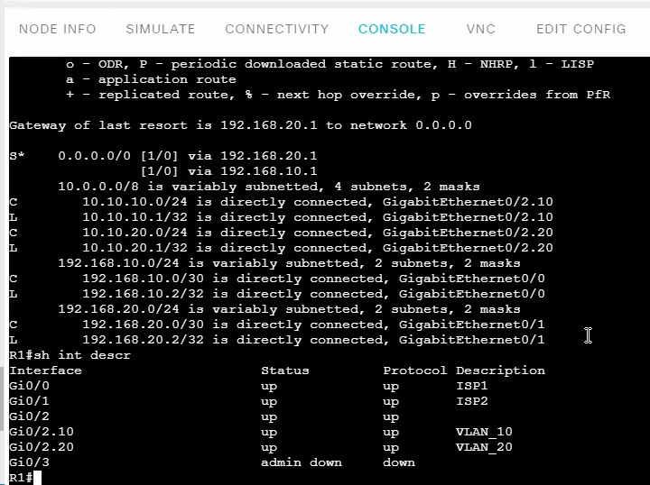

https://github.com/fazzzan/DarkMycal/tree/master/Part1/L19_3

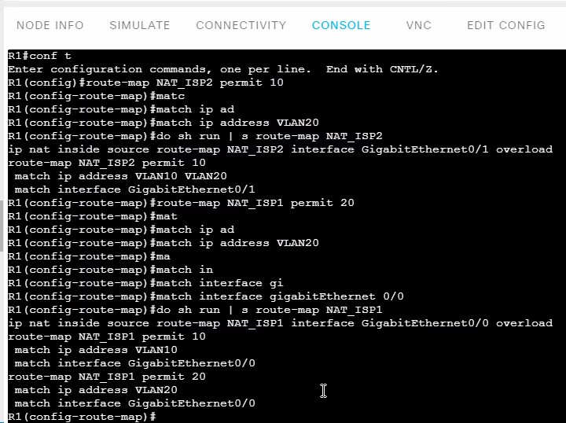

Route -map для матчинга telnet трафика
```
ip access-li extended TELNET
permit tc 10.10.20.0 0.0.0.255 host 8.8.8.8 eq 23

route-map TELNET
   match ip add TELNET
      set ip next-hop 192.168.20.2
exit

int gi0/2.20
ip policy route-map TELNET
exit

```

## Лабораторка
Настройка PBR для сегмента