# OSPF - базовые настройки


OSPF - разрабатывался как альтернатива RIP/ который вполне себя опраавдывал на заре сетей. Метрика RIP - число хопов, поэтому пути не всегда были оптимальными.

На замену ему пришел в мультивендорных сетях - OSPF:
- бесклассовый (не привязан к классам подсетей)
- Используемый для расчета метрик - понятие канал (соединения 2 маршрутизаторов или подключение тупиковой зоны)
- Метрика, связана с характеристиками IF

5 типов пакетов OSPF
- пакет приветствия ___hello___ (Hello (снюхиваются и признают дргу-друга соседями, или нет). 1р/10 сек - hello-timer)
- пакет описания базы данных ___DBD___ [database description] - обмен ведется небольшими кусками информации о сети. DBD - просто перечисление того, что у меня есть. Дальнейший обмен идет при помощи LSA.
- пакет состояния канала ___LSR___ - запрос по поводу какого-то кусочка
- пакет обновления состояния канала ___LSU___ - ответ на LSR
- пакет подтверждения состояния канала ___LSAck___ - поблагодарим за LSU

Инфа OSPF хранится в 3 таблицах
1. Таблица соседей  - ```show ip ospf neighbor```
2. Таблица топологий - собраны все данные ос состоянии каналов всех хостов в сети ```show ip ospf database.```
3. Таблица маршрутизации ```show ip route```

Таблица топологии формируется по резхультатам вычисления

## OSPF может разбить сети на области ##
- BACKBONE - обязательна яобласть, AREA 0
- все остальные AREA


- Чем больше зоны - тем лучше, так как меньше таблицы маршрутизации (используются суммарные маршруты в зону)
- Процессы внутри AREA не повлияют на другие AREA, так как суммарные маршруты не изменятся
- Снижение частоты расчетов SPF

## OSPFv3 ##

Позволяет работать с Ipv6

## пакеты OSPF ##
- 1 Hello - для установки соседства и слежки за соседом, на случай если он отвалится
- 2 DBD [database description], необходимы для синхронизации LSDB - базы данных между роутерами (записи таблицы link-state). LSDB - должна быть одинаковой на всех R в AREA.
- 3 LSR (link-staqte request) - на случай если понадобятся уточнения относительно содержимого DBD - пакетов
- 4 LSU (link-state update) - ответ на LSR, либо анонсирование доп. данных по LSR, либо информации, которая была запрошена в LSR. LSU может содержать 11 типов LSA (см. картинку выше).
- 5 LSAck (link-state Acknowledgement) - Ack на все типы OSPF-пакетов, за исключением HELLO и самих Ack

LSU/LSA - для обмена об изменениях в схеме. 

Hello - пакеты, должны содержать чатьс одинаковой информации:


## OSPF состояния ##

- Down State - изначальное состояние роутера/процесса
- Init State - начинаем флудить и получаем ответ от соседей по сегменту/AREA
- Two-way - когда получили ответ на наше HELLO, в котором перечислен наш RID в числе соседей (list of neighbors), только после этого переходим в состояние two-way, а дальше, в зависимости от типа линка:
    - если линк PPP, то переходим в ExStart State
    - если линк Ethernet (multiaccess), то у себя в мозгу начинаем Выборы DR/BDR: минимальный RID - побеждает и назначается ответственными за рассылку информации об изменениях в AREA. Выборы не совсем честные и проводятся в мозгу каждого роутера.
- ExStart State - выясняют по RID кто будет master/slave: делаем со всеми соседями по линкам, перед синхронизацией LSDB (люди, живущие со мной на одной лестничной клетке, знают что-то обо мне, но друзьями они мне не являются)
- Exchange State (начало обмена DBD о содержимом LSDB, для его синхронизации: DBD - LSR - LSU - LSAck )
- Loading State (продолжаем обмен и вопросы соседям LSR - LSU - LSAck), запускаем процесс SPF, переходим в Full State.
- Full State (LSDB - засинхронена)

Маршрутизаторы могут быть либо:
- FULL
- TWO way

В промежуточных состояниях маршрутизаторы не должны задерживаться

MC адреса для работы OSPF:
- 224.0.0.5
- 224.0.0.6
- FF02::5
- FF02::6

Синхронизация базы OSPF


Необходимость DR/BDR

https://github.com/fazzzan/Specialist/blob/master/CCNA70_LABS03/Module01/README.MD

Тут все просто: чтобы не засирать сеть LSA-шками, надо назначить/выбрать "старшего в отсеке" и его зама (DR/BDR), и уже с ними вести обмен LSA-шками. Все остальные - DROTHER. Все остальные стучат обо всех происшествиях  - DR/BDR, между ними - состояние FULL. Состояние между DROTHER - Two-Way.
BDR - только ждет пока умрет DR.

# Включение/настройка OSPF#
https://github.com/fazzzan/Specialist/blob/master/CCNA70_LABS03/Module02/README.MD

На R должен работать только 1 протокол OSPFv4/OSPFv6. RID - 32-bit, похож на Ipv4-адрес

Назначение RID, в итоге OSPF может и не запуститься:


Самый плохой вариант - не назначать RID, рассчитывая что RID будет назначен автоматом на основании Ipv4 рабочего IF. При этом IF может долго подниматься и OSPF тупо не получает RID. CISCO рекомендует только 1 вариант.
```
router ospf 10
router-id 1.1.1.1

do sho ip proto | in Router ID
```

перезапуск процесса через 

```
clear ip ospf process

clear ipv6 ospf process
```

## соединение точка-точка ##
```
int
int)# ip ospf netw point-to-point
```

Часто при настройке OSPF произносят "анонсируем сети в OSPF" - это не правильно, так как network - не анонсирует сети, а разрешает обмен OSPF на IF, ip-адреса которых соответствуют указанным подсетям. ТО разрешенные IF будут учитываться в работе протокола OSPF. Ошибка в понимании анонсирования - в подставлении подсетки в команду network.

wildcard-маска - тожде не правильно, верно - шаблонная маска. Получается пучем вычитания обычной маски из маски все единицы

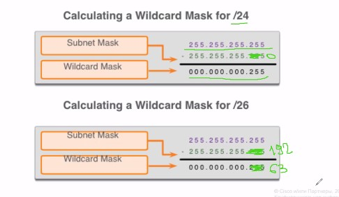

OSPF можно запустить и непосредственно на IF, аналогично настраивается IPv6 - другого варианта для OSPFv3  IPv6 - нет.

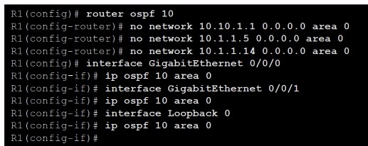

OSPF можно задать и с помощи IP-адреса IF (единственный минус - вход на каждый IF)

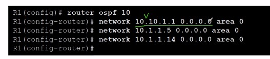

Если куда-то не надо делать рассылку LSA, то делаем этот IF passive. IF - лучше принудительно делать ```no passive-interface```, а в конфиге ```passove-interface default```

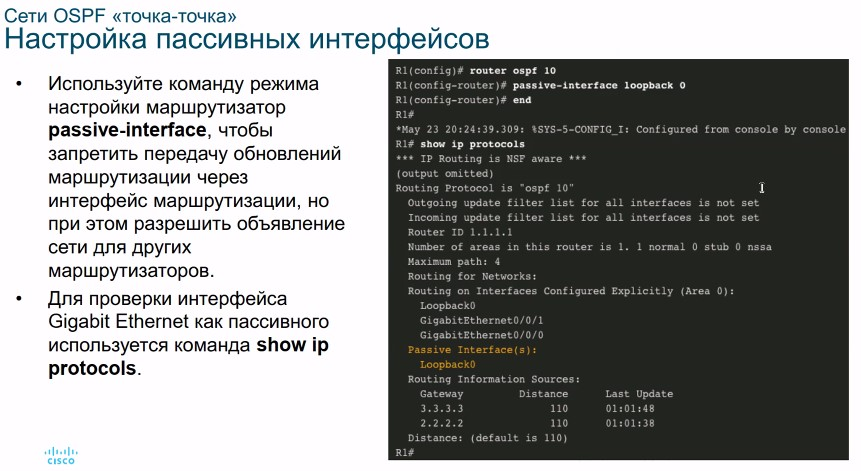

В подключении точка-точка:

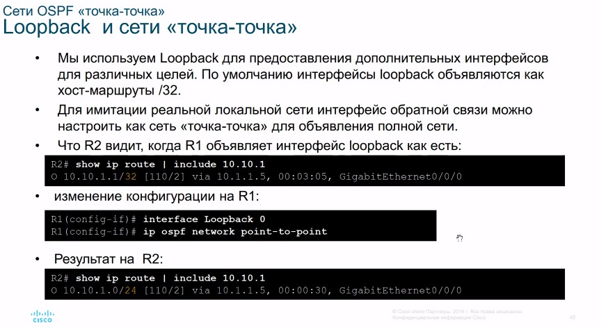


## DR/BDR Election Process

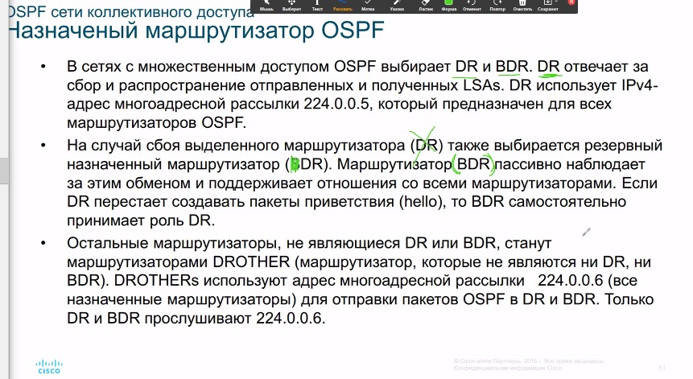

224.0.0.5 - обмен между DROTHER и DR/BDR
224.0.0.6 - обмен только между DR/BDR

## Проверка ролей маршрутизатора ##

 ``` sho ip ospf int giX/Y```

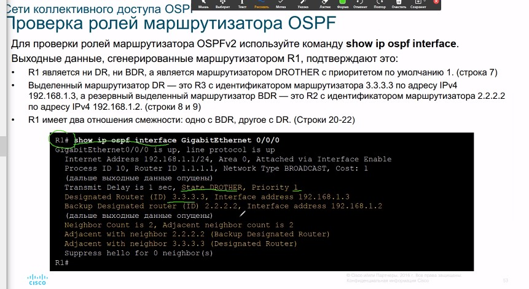

## проверка смежность ##

``` sho ip ospf nei ```

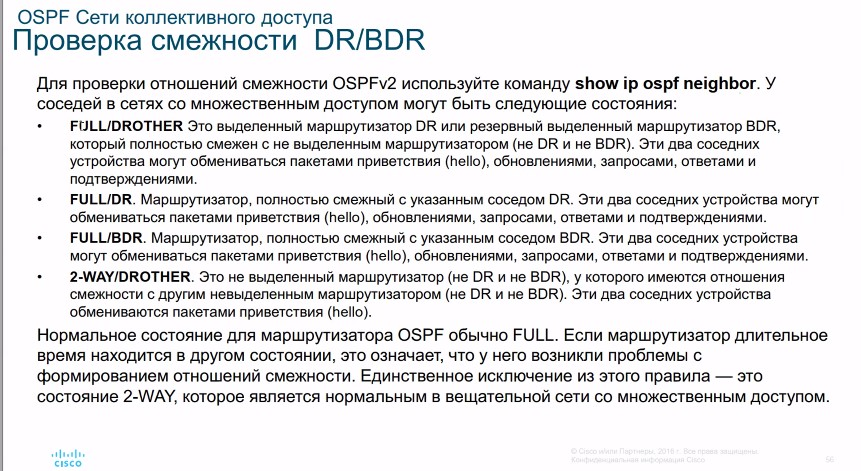

состояние FULL доступно только DR/BDR

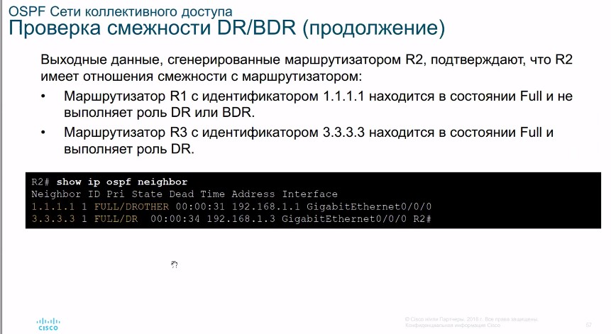


## Процесс выбора DR/BDR по-умолчанию ##

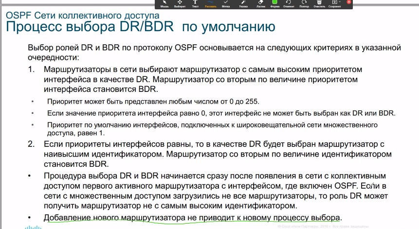

## Проверка ##

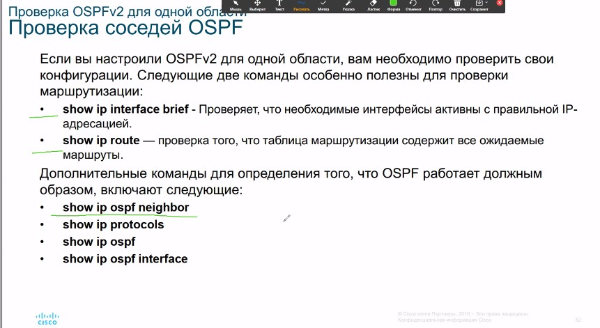

