OTUS 20210413

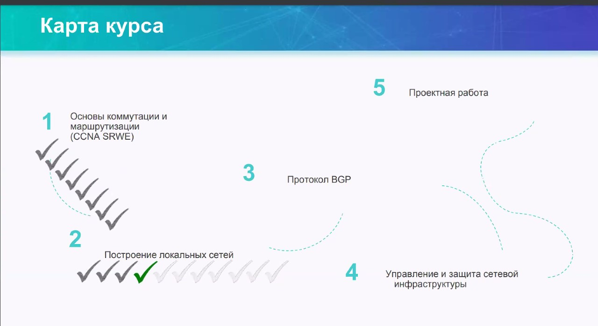

# Многозонная OSPF #

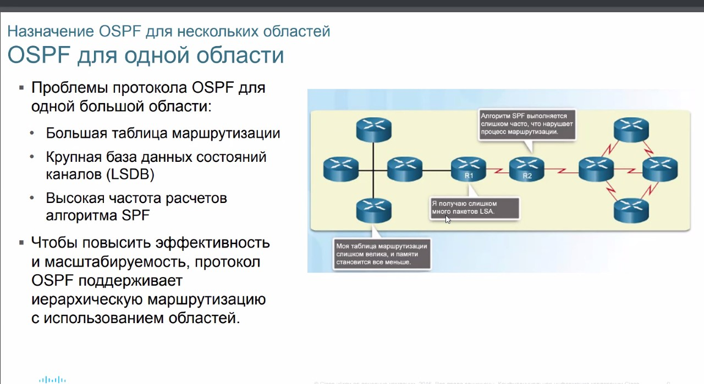

Несколько зон нужны для облегчения работы протокола маршрутизации (100-150 устройств в зоне):

- Таблица маршрутизации разрастается
- LSDB увеличивается в размере по количеству участников в AREA
- SPF постоянно перерасчитывается при любом чихе

Вводим зоны:

протокол стал Link-state и участники знают о другой зоне только направление


- LSDB - только соседи, в своей зоне
- Обязательно есть  AREA 0 (BackBone/магистральная), все включаются через нее, и все маршруты - через AREA 0
- Уменьшается время работы SPF

# Двухуровневая иерархия #


AREA0
- Основная Функция - бытрая передача ip-пакета (никакой фильтрации и т.п.)

AREA1, 51
- Обычные AREA.

# Роли маршрутизаторов # 

- Внутри AREA
   - DR (отправляют LSA2 на DROTHER)
   - BDR
   - DROTHER (отправляют LSA1 - на DR/BDR)

Между зонами
- На границе AREA0 - ABR
- Магистральный - все R внутри зоны AREA0
- Все зоны конкретной организации - AS [autonomous system]
- На границе AS - ASBR

# Типы сообщений LSA #
1 - о самам R
2 - о сетях
3 и 4 - суммарные LSA
5 - Внешний LSA для AS
6 - LSA OSPF для групповой рассылки
7 - для NSSA
8 - для BGP
9,10,11 - непрозрачные пакеты LSA

## LSA 1-го типа ##


Создается всеми типами R. Работает внутри одной зоны

ABR - суммирует LSA и передается в другую область

## LSA 2-го типа ##

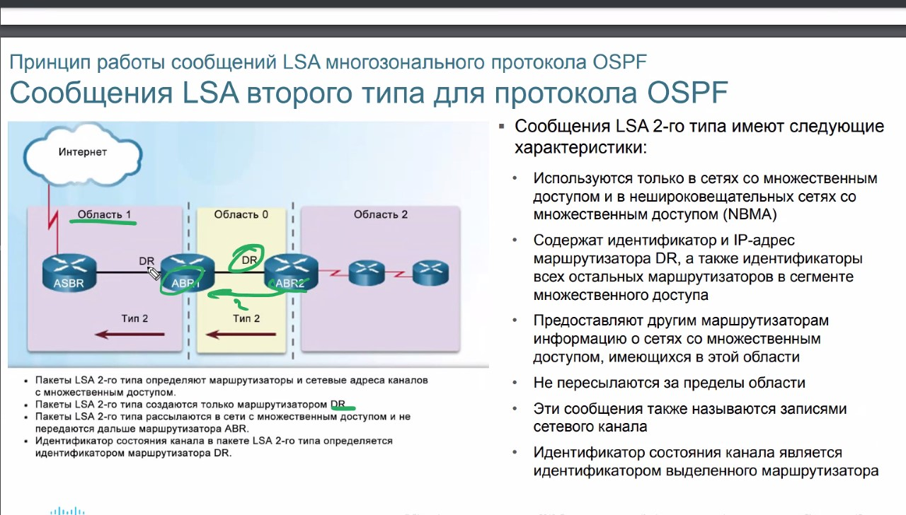

2-й тип отправляется DR каждому соседу, в multiaccess - сети при изменении топологии, но только в своей AREA

## LSA 3-го типа ##


Суммарный маршрут (на основании LSA2) о своей зоне, ABR отправляет LSA3 всем R другой сети

## LSA 4-го типа ##

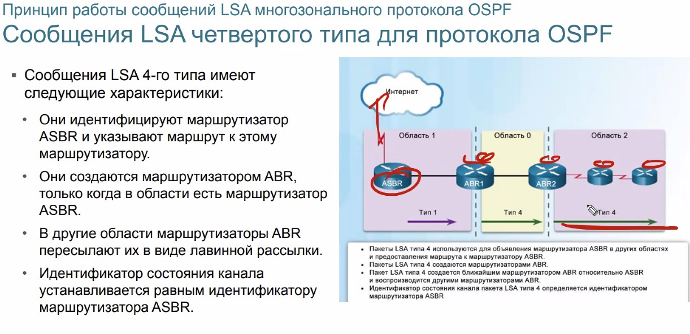

тип 4  - содержит информацию о ASBR (на этом ASBR есть еще 1 процесс маршрутизации, о котором я хочу рассказать), котрый есть в нашей зоне. Этот LSA4 - проходит сквозняком по всем AREA.


## LSA 5-го типа ##


Все R всех зон узнают информацию о маршруте из LSA5 типа. Этот тип транслируется ABR-ами сквозняком во все зоны 

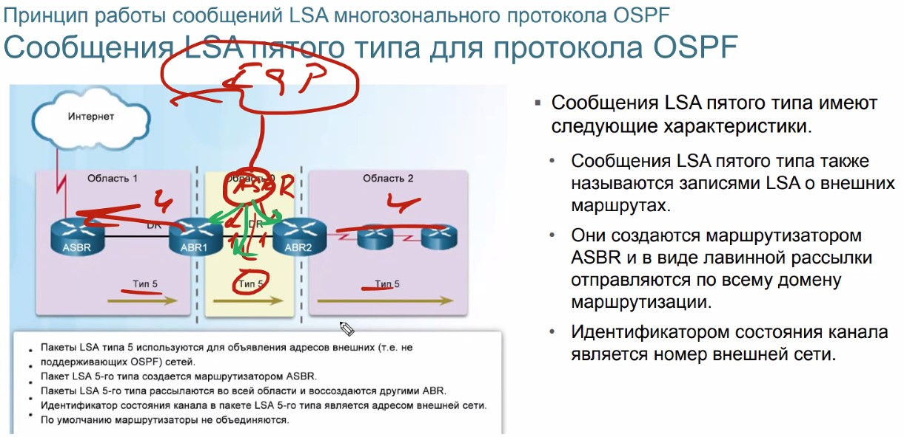

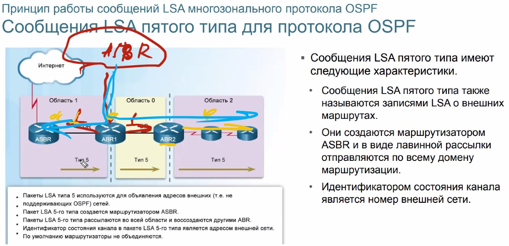

# Записи таблицы маршрутизации OSPF #

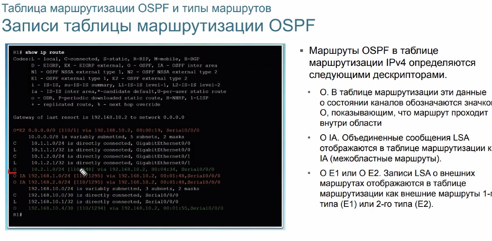


O IA - Inter Area - маршрут прилетел из друго йзоны
0*E2 - маршрут от ASBR


# Расчет оптимального / приоритетного маршрута #


# Настройка многозонного протокола OSPF # 

1. сбор требований к сети
2. Определение параметров OSPF
   - ip-адресация
   - граница зоны
   - топология сети (L2+L3 или чисто L3)
3. Реализация OSPF


<процесс> - произвольный для роутера
<router-id> - произвольно, в виде 4-группового идентификатора
<network> - ACL, который отбирает IF, primary- адрес которых попадает в заданный диапазон 

Также можно задать сети на самом IF


Для OSPFv3 (IPv6) - ркомендуемый способ для IPv6 и IPv4

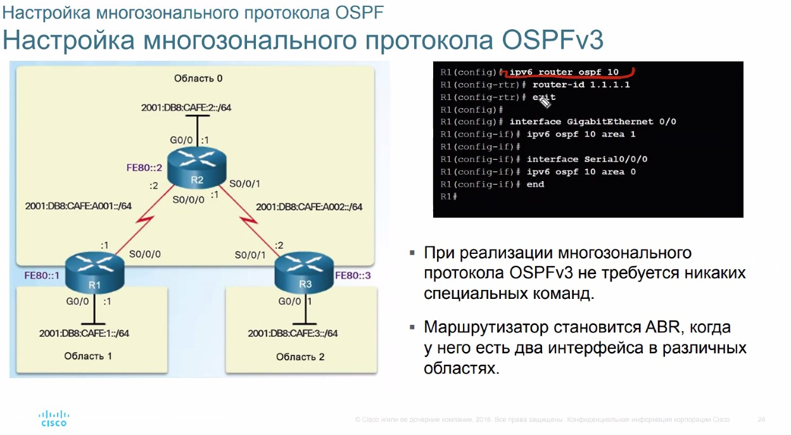

проверка (для IPv6 - просто ipv6, вместо ip):

```
sho ip ospf nei
sho ip ospf
sho ip ospf int
sho ip ospf int br
sho ip proto
sho ip route ospf - табл маршрутизации
sho ip ospf database - табл LSDB
```


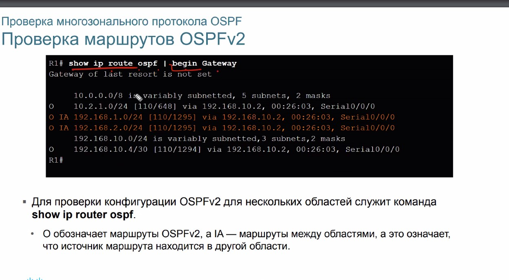

Для каждой AREA - своя табличка LSDB


Для ipv6

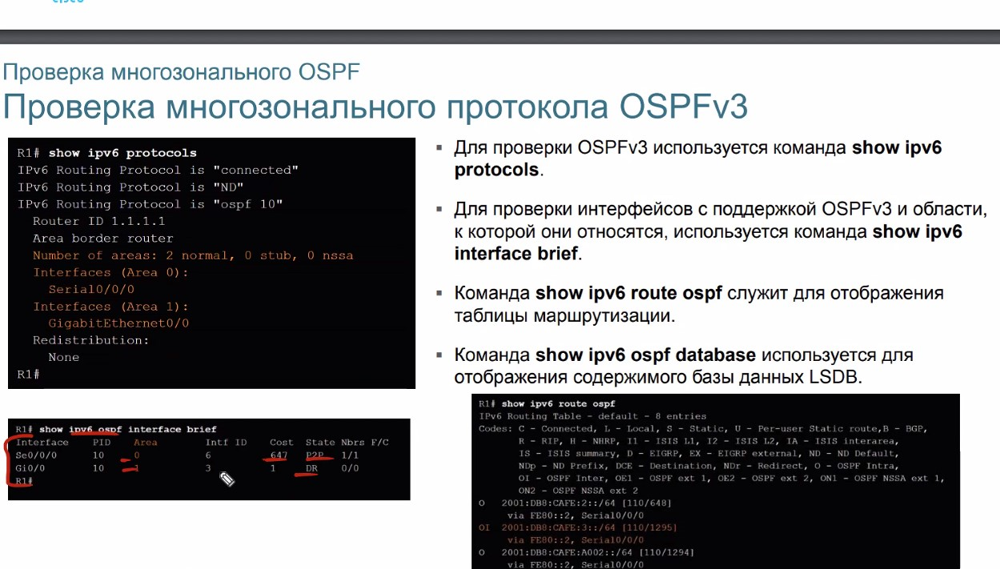


# Типы сетей OSPF #

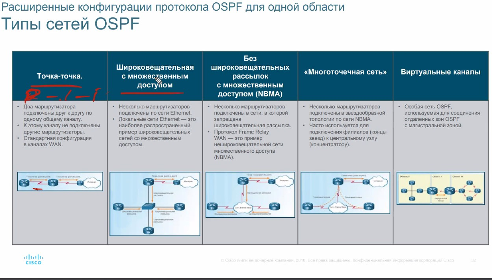


Лавина LSA - необходимость использовать зоны: 50-60 R в AREA - предел

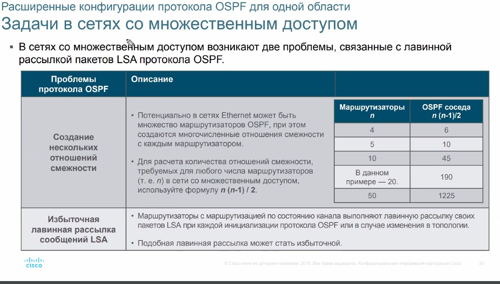


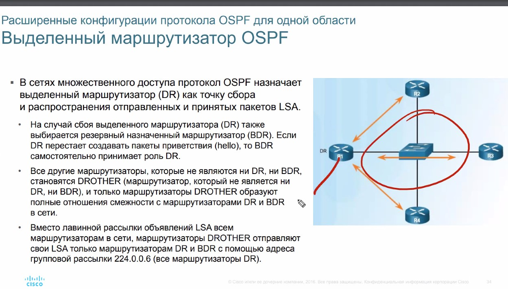

Проверка ролей:

```
sho ip ispf int gi 0/0
```


Проверка соседей/смежности:

FULL
 - DROTHER
 - DR
 - BDR
2-way
 - DROTHER

```
sho ip ospf nei
```

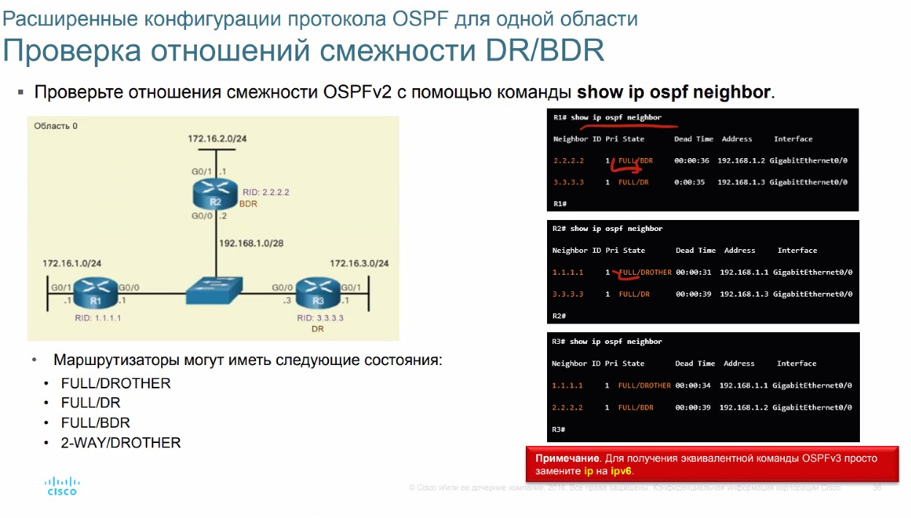


Выбор DR/BDR - по RID - наивысшему идентификатору, задаем желательно вручную. Возможно возьмется с loopback / активного IF

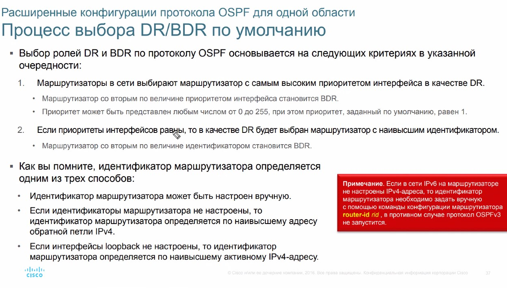

Продолжение  - перевыборы DR/BDR


Задание приоритета OSPF: чем выше - тем лучше. 1 - 255. Для перевыборов после смены приоритета - ```clear ip ospf process```

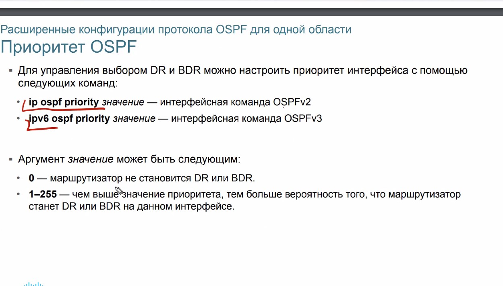


Настройка маршрута по-умолчанию  ```default information originate```. Такой маршрут улетит в другую зону как LSA5

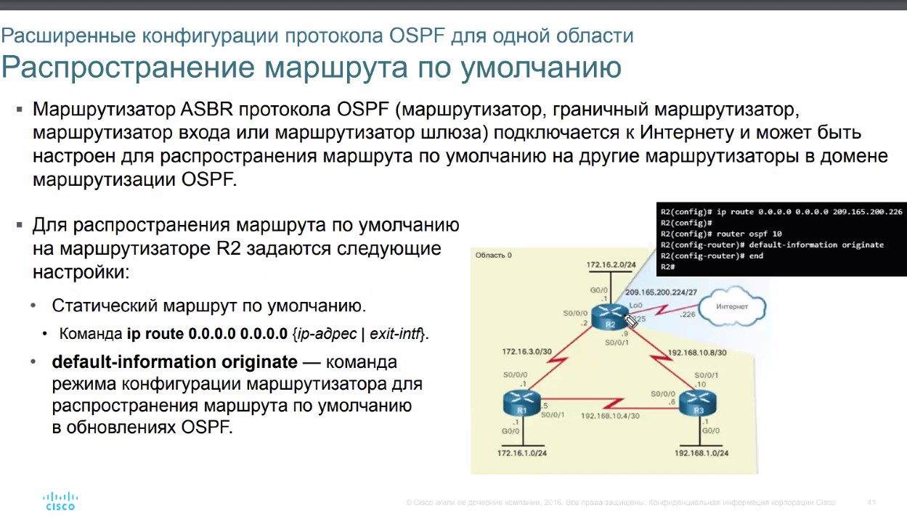


Проверка распространения. пришедгший маршрут ___O E2 0.0.0.0/0 - R2___


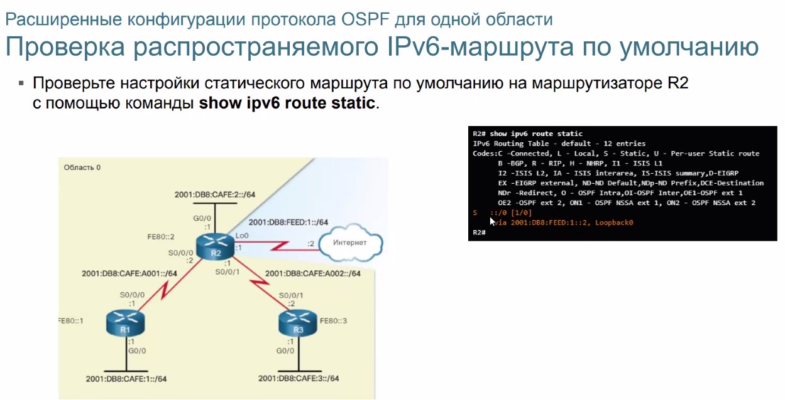


# нтервалы и приветствия #

Менять их не очень желательно просто так.

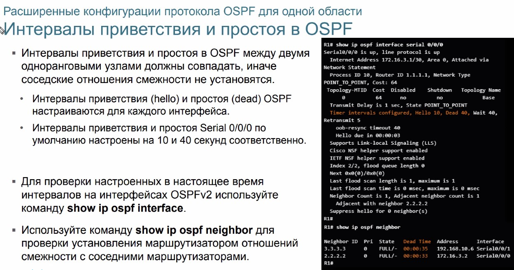

Изменить их надо 
- глобально
- на IF
- dead-интервал по-умолчанию кратен 4x hello-interval
- default интервалы 
   - ```no ip ospf hello-int```
   - ```no ip ospf dead-int```

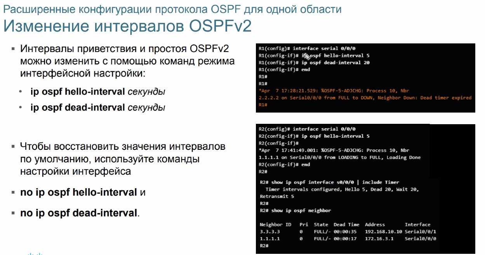