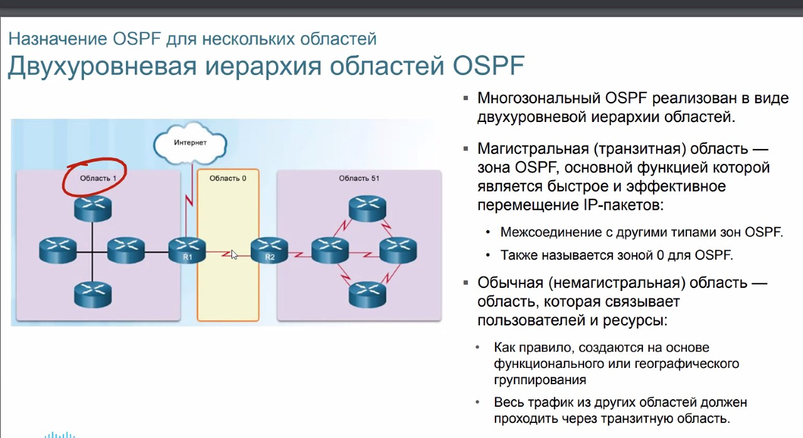

OTUS 20210423

# IS-IS #


протокол пришел из OSI

## Основные термины ##

- ES - End system - хосты системы
- IS - Intermediate system (R)
- System - network node (SW, DHCP, DNS)
- Circuit - IF/последовательность линков
- Domain - Autonomous system

- Intermediate system to intermediate system IS-IS
- End system - to - intermediate system ES-IS
- Connectionless mode Netw Proto - ___CLNP___ - ненадежный транспорт для приложений и сервисов. 
   - ISIS - формирует данные (L3)
   - CLNP - алгоритм обработки данных ISIS
- Connection-oriented Netw proto - ___CONP___ - надежный транспорт для приложений и сервисов


## Intermediate system to intermediate system IS-IS ##
ISO 10589 - настроен на поиск кратчайшего пути между точками
- Широко применяется (OTV, FabricPath, ISP)
- Более масштабируемый, чем OSPF
- Может быть использован в ЦОД
- не работает в VPN


## IS-IS ##

Link-state протоколы, использует алгоритм Дейкстра:
- Каждый расчитывает достижимости вершин и суммарные пути
- выбирает минимального пути



похожд на OSPF
- может быть фильтрация и суммаризация между зонами
- Аналог DR - DIS designated intermediate system

Отличия от OSPF
- Зона
   -  OSPF - маршрутизатор принадлежит всем зонам, так как для каждого IF есть своя таблица LSDB
   - IS-IS - обменивается маршрутами между зонами (аналог LSA 3), поэтому граница проходит через IF. Никакой подводящей информации между R IS-IS - не ходит
- Построение топологии
   - OSPF - все сложно, со сменой состояний линка/смежности
   - IS-IS - просто: DOWN-INIT(Two way из OSPF)- UP

- Транспорт
   - OSPF - IP
   - IS-IS - 802.3 (Ethernet/MAC) - Своя адресация для взаимодействия между R

Поля адреса IS-IS


- NET - Адрес модели OSI 
   - Initial domain part (IDP)
      - Authority Format Identifier = AFI - jgbcsdftn nbg flhtcf^
         - 49 - private
         - 39 - RIR
         - 47 - выдан ISO
      - Initial Domain Identifier
         - код страны-39/47+IDI - аналог AS BGP
   - Domain Specific Part (DPS)
      - High Order domain Specifi Part
      - AREA - Номер зоны, вкоторой находимся
      - System Identifier (RID)
      - N selector - аналог порта из IP. Для NET = 0


Пример адреса (десятичная система счисления) - обязательно задается вручную, используется 1 адрес для всех сетей


- 49 - ID - всегда
- 0100 - area
- 5555.5555.5555. = system ID (RID)
- 00 - N Selector

## Иерархия ##

Нет 0-й зоны, есть уровни взаимодействия
- L1 - LSA1 (только о своей зоне)
- L2 - LSA2 (это граничный маршрутизатор), граничные обмениваются L2 (суммарную информация)
- L1/L2 - LSA3 - аналог STUB OSPF
 ### L1 ###


L2 не пропускается в зону

 ### L2 ###
 - МАршрутная инфа о нескольких зонах
 - L2 - прорывается в зону
 - L2 - непрерывна
- Для L2 - отдельная LSDB
- cisco default использует L2


Бэкбона - нет, но есть Backbone - набор линков, который получается когда мы задаем на IF R - то, что они L2. 

L1 - R, у которого указан L1: он просто отправляет всю информацию о своих сетях везде.
L1/L2 - R, на IF у которого указан что он L2. Знает про всю топологию своей зоны (ловит все LSP (аналог LSU), содержащие LinkStatePacket (аналог LSA)).

## LSP - 1-го типа ##
В LSP влезает вся информация по сетям - L1, если не влезает, то бьется в соответствии с MTU


## LSP - 2-го типа ##
Вкл. в себя
- Connected сети
- 


## Типы/проблемы связности/смежности, при задании типа L1/L2 на соседних IF ##
Зависит как от типа IF так и от принадлежности R зоне


## Настройка ##

```
router is-is
-router)#net <type.area.SystemID.NSelector>
-router)#is-type <level-1 | level-1-2 (default) | level-2-only>
-router)# metric <metric> <level-1 | level-2> или на IF
...
-if)# router is-is
-if)# isis circuit-type <level-1 | level-2 (default) | level-2-only>
-ша)# isis <metric> <level-1 | level-2>
...
Команда суммарзиции - используется для IP-адресов (RFC 1195 - integrated ISIS)
-router)# summary-address <address-mask> <Level-1 | level-2| level-1-2>


```

Информация о линках/соседях/сетях - хранится в такихже таблицах, как и OSPF

## Проверка ##


