OTUS 20210413


# Многозонная OSPF #

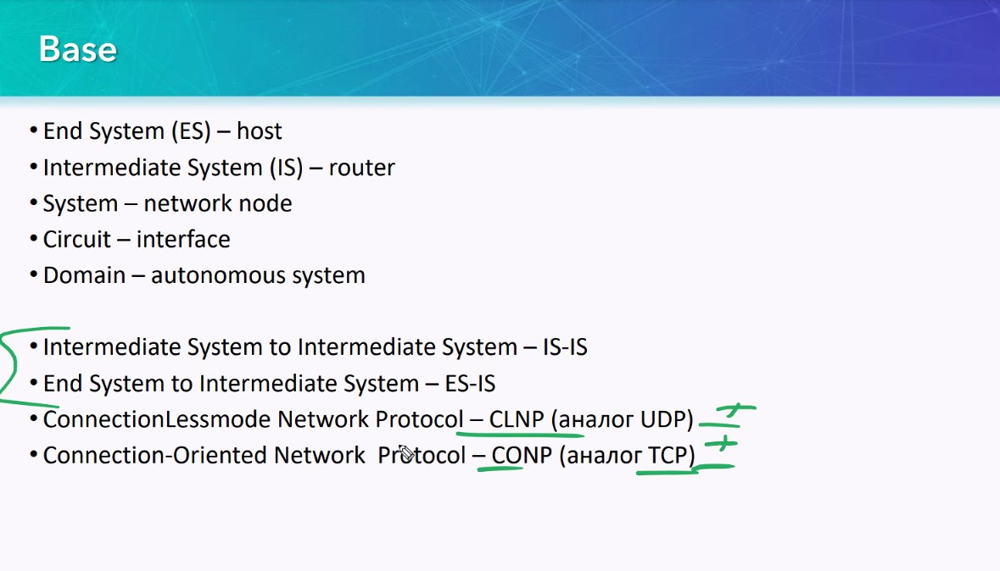

Несколько зон нужны для облегчения работы протокола маршрутизации (100-150 устройств в зоне):

- Таблица маршрутизации разрастается
- LSDB увеличивается в размере по количеству участников в AREA
- SPF постоянно перерасчитывается при любом чихе

Вводим зоны:

протокол стал Link-state и участники знают о другой зоне только направление
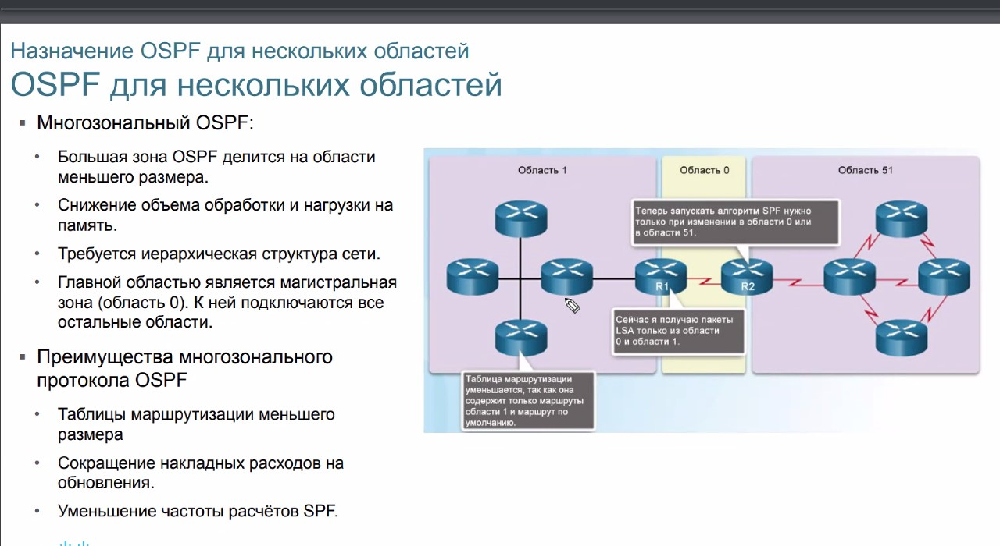

- LSDB - только соседи, в своей зоне
- Обязательно есть  AREA 0 (BackBone/магистральная), все включаются через нее, и все маршруты - через AREA 0
- Уменьшается время работы SPF

# Двухуровневая иерархия #

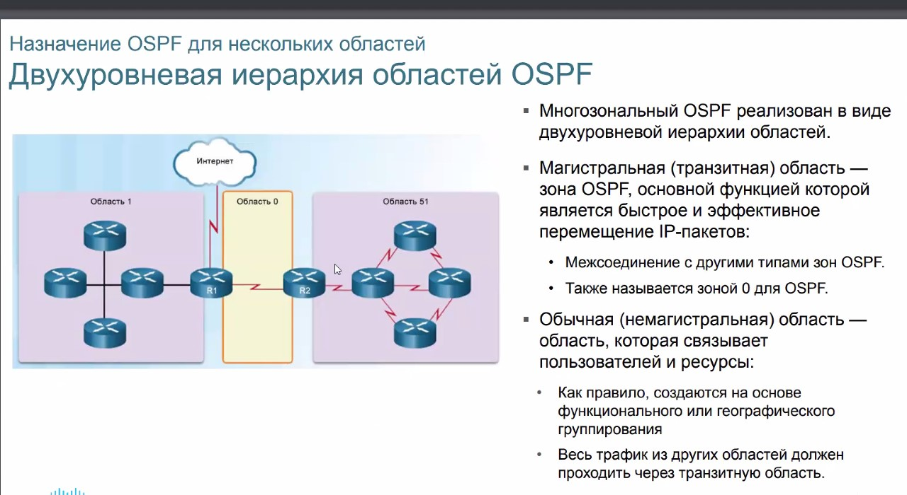

AREA0
- Основная Функция - бытрая передача ip-пакета (никакой фильтрации и т.п.)

AREA1, 51
- Обычные AREA.

# Роли маршрутизаторов # 

- Внутри AREA
   - DR (отправляют LSA2 на DROTHER)
   - BDR
   - DROTHER (отправляют LSA1 - на DR/BDR)

Между зонами
- На границе AREA0 - ABR
- Магистральный - все R внутри зоны AREA0
- Все зоны конкретной организации - AS [autonomous system]
- На границе AS - ASBR

# Типы сообщений LSA #
- 1 - о самам R
- 2 - о сетях
- 3 и 4 - суммарные LSA
- 5 - Внешний LSA для AS
- 6 - LSA OSPF для групповой рассылки
- 7 - для NSSA
- 8 - для BGP
- 9,10,11 - непрозрачные пакеты LSA

## LSA 1-го типа ##

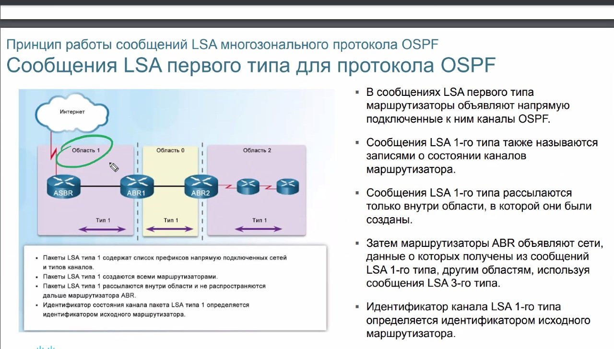

Создается всеми типами R. Работает внутри одной зоны

ABR - суммирует LSA и передается в другую область

## LSA 2-го типа ##

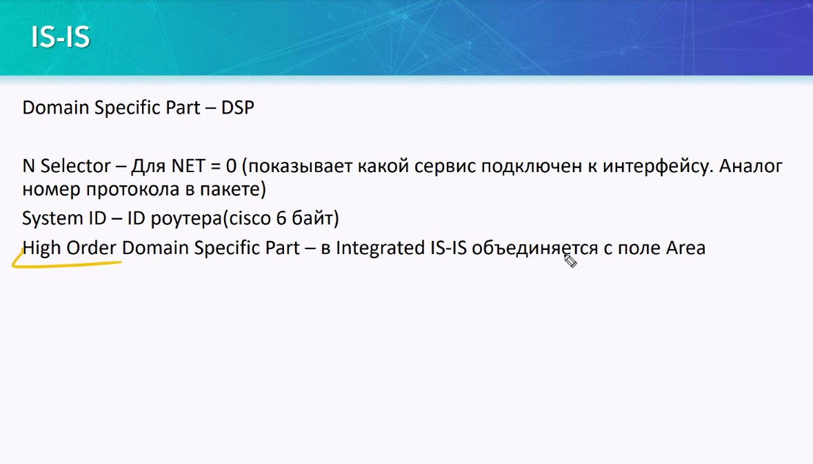

2-й тип отправляется DR каждому соседу, в multiaccess - сети при изменении топологии, но только в своей AREA

## LSA 3-го типа ##

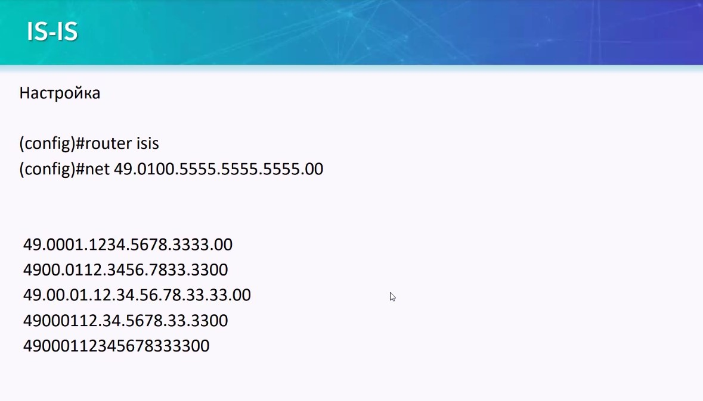

Суммарный маршрут (на основании LSA2) о своей зоне, ABR отправляет LSA3 всем R другой сети

## LSA 4-го типа ##


тип 4  - содержит информацию о ASBR (на этом ASBR есть еще 1 процесс маршрутизации, о котором я хочу рассказать), котрый есть в нашей зоне. Этот LSA4 - проходит сквозняком по всем AREA.

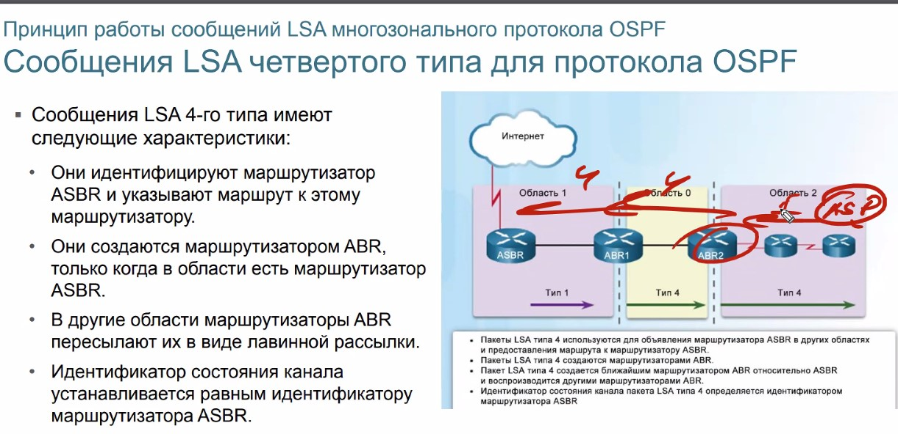

## LSA 5-го типа ##

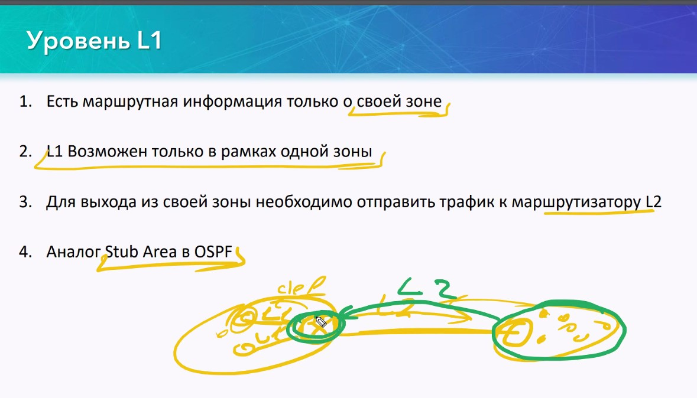

Все R всех зон узнают информацию о маршруте из LSA5 типа. Этот тип транслируется ABR-ами сквозняком во все зоны 

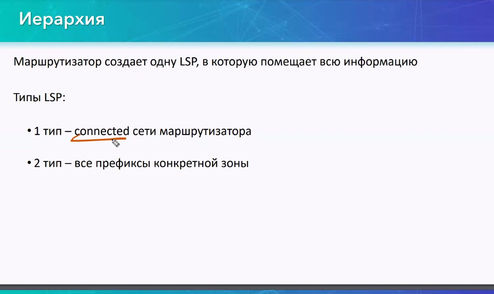


# Записи таблицы маршрутизации OSPF #

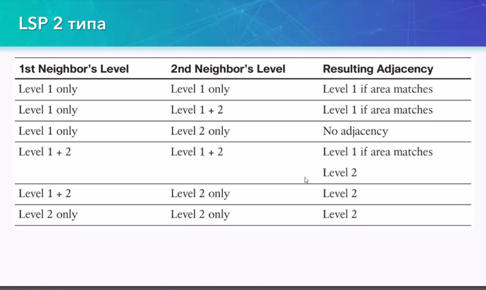

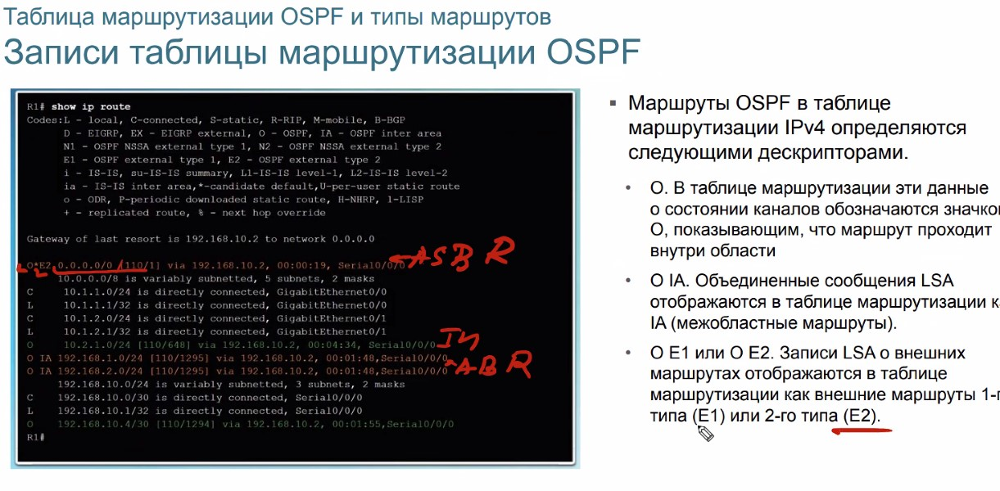

O IA - Inter Area - маршрут прилетел из друго йзоны
0*E2 - маршрут от ASBR


# Расчет оптимального / приоритетного маршрута #

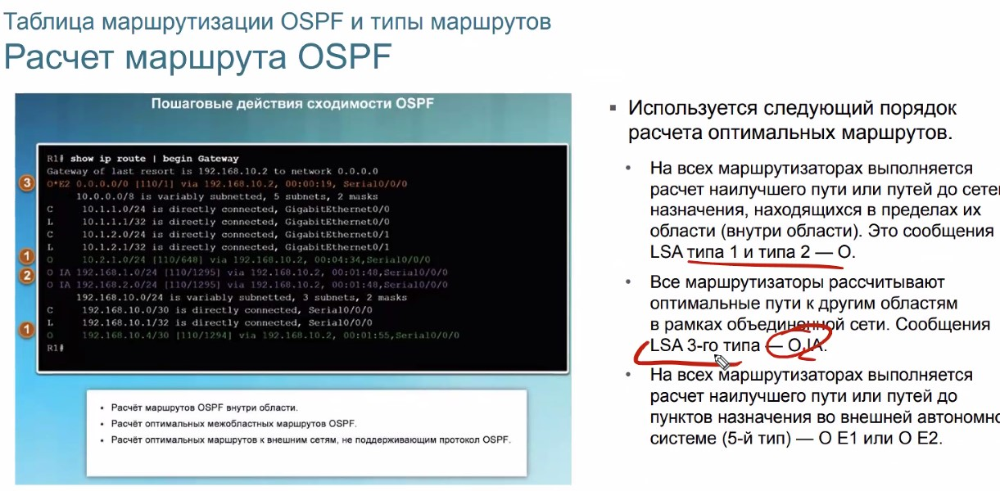

# Настройка многозонного протокола OSPF # 

1. сбор требований к сети
2. Определение параметров OSPF
   - ip-адресация
   - граница зоны
   - топология сети (L2+L3 или чисто L3)
3. Реализация OSPF

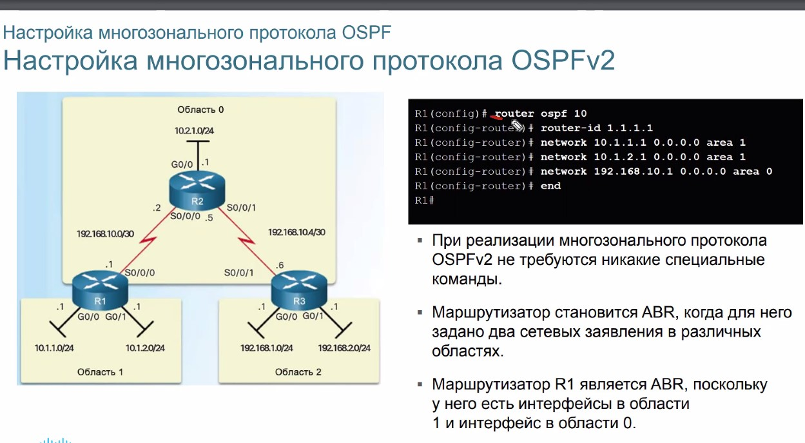

<процесс> - произвольный для роутера
<router-id> - произвольно, в виде 4-группового идентификатора
<network> - ACL, который отбирает IF, primary- адрес которых попадает в заданный диапазон 

Также можно задать сети на самом IF
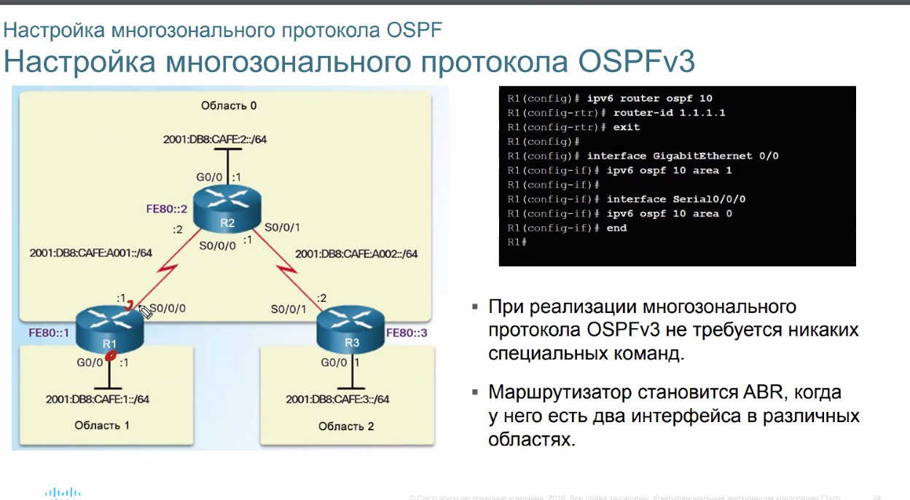

Для OSPFv3 (IPv6) - ркомендуемый способ для IPv6 и IPv4


проверка (для IPv6 - просто ipv6, вместо ip):

```
sho ip ospf nei
sho ip ospf
sho ip ospf int
sho ip ospf int br
sho ip proto
sho ip route ospf - табл маршрутизации
sho ip ospf database - табл LSDB
```


Для каждой AREA - своя табличка LSDB

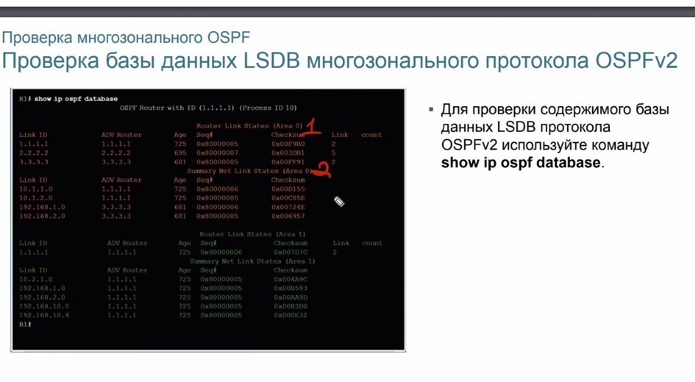

Для ipv6


# Типы сетей OSPF #


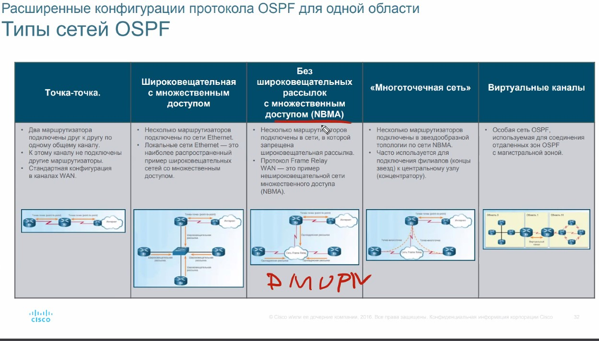

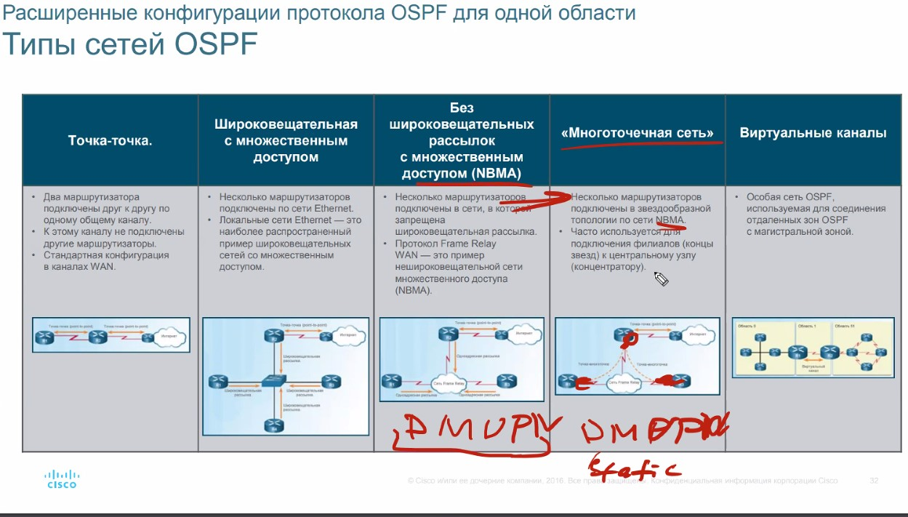


Лавина LSA - необходимость использовать зоны: 50-60 R в AREA - предел


Проверка ролей:

```
sho ip ispf int gi 0/0
```

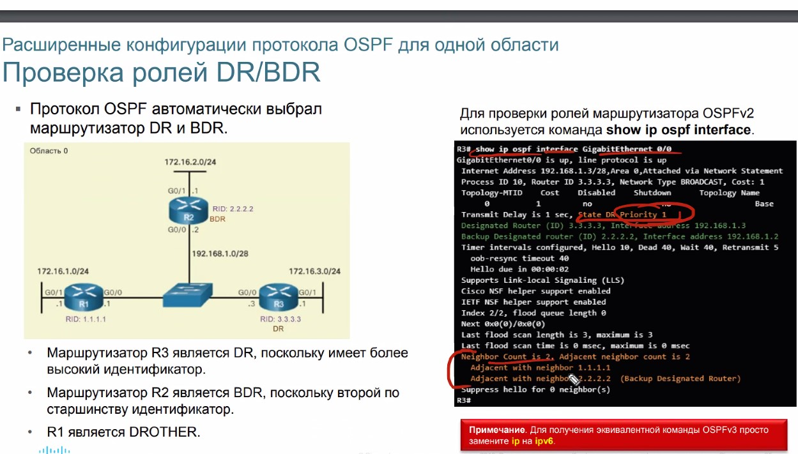

Проверка соседей/смежности:

- FULL
   - DROTHER
   - DR
   - BDR
- 2-way
   - DROTHER

```
sho ip ospf nei
```


Выбор DR/BDR - по RID - наивысшему идентификатору, задаем желательно вручную. Возможно возьмется с loopback / активного IF


Продолжение  - перевыборы DR/BDR

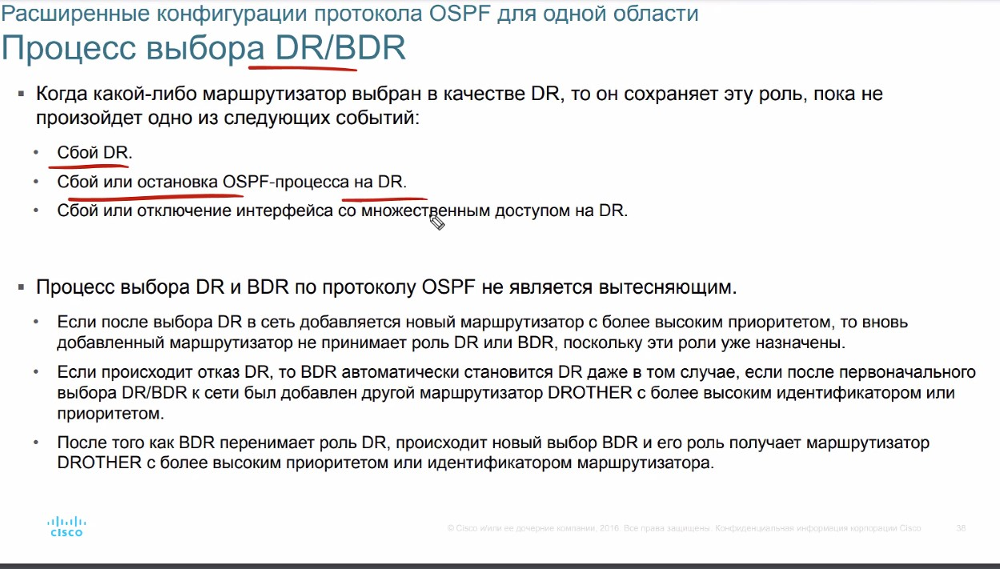

Задание приоритета OSPF: чем выше - тем лучше. 1 - 255. Для перевыборов после смены приоритета - ```clear ip ospf process```


Настройка маршрута по-умолчанию  ```default information originate``` (не сработает, если на ABR не задана 0.0.0.0). Такой маршрут улетит в другую зону как LSA 5


Проверка распространения. пришедший маршрут ___O E2 0.0.0.0/0 - R2___


# Интервалы и приветствия #

Менять их не очень желательно просто так.


Изменить их надо 
- глобально
- на IF
- dead-интервал по-умолчанию кратен 4x hello-interval
- default интервалы 
   - ```no ip ospf hello-int```
   - ```no ip ospf dead-int```


## Поиск и устранение неполадок ##

Сосдество не сформируется (если IF не трогали, то OSPF поднимется сразу)
- IF в разных зонах
- Типы сетей не совпадают (p-t-p и Multipoint не поднимется)
- не совпадают таймеры (трогать не ркомендуется)
- Один из IF пассивный, по отношению к другому
- ошиблись в команде ```network <aaaa> <mmmm> area <a>``` - лучше про network способ забыть и вводить команду на IF
- некорректная аутентификация
- До настройки OSPF - наблюдаем ip-связность

## состояния OSPF ##

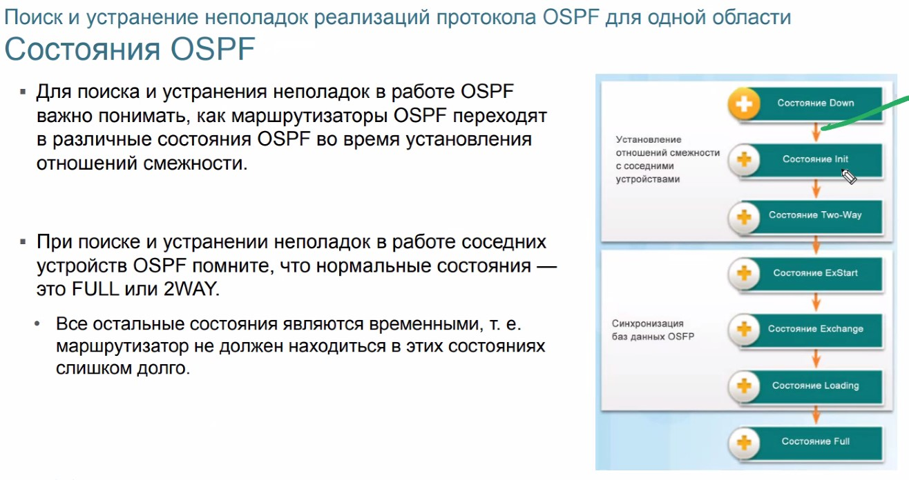
- Two-WAY - обмен между DROTHER
- ExStart/Exchange 
   - обмен с DR/BDR (для multiaccess сетей)
   - если point-to-point всегда будет 
- LOADING - расчет SPF
- FULL - все рассчитано, все маршруты известны

Если завис в Exstart/Exchange - это означает:
   - База LSDB может оказаться в разы больше, чем MTU линкА на каком-либо IF

решения
- Правильное: исправить MTU (не всегда удается, так как вендоры могут по-разному считать MTU)
- Неправильное ```ip ospf mtu-ignore``` - ospf сам пытается подобрать mtu


## Проверка/сброс ospf##

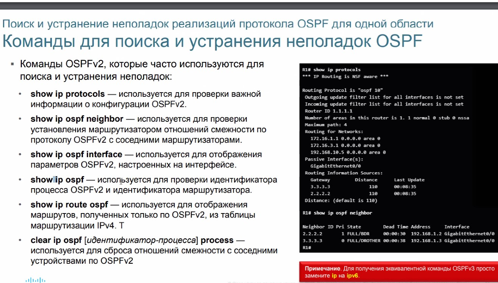

## Траблшутинг проблем OSPF ##

- проверка соседей
- проверка таблиц маршрутизации
- проверка/трассировка/дамп прохождения
- ```show ip cef```


Корректный способ задания сети - на IF, с указанием ```no passive interface```

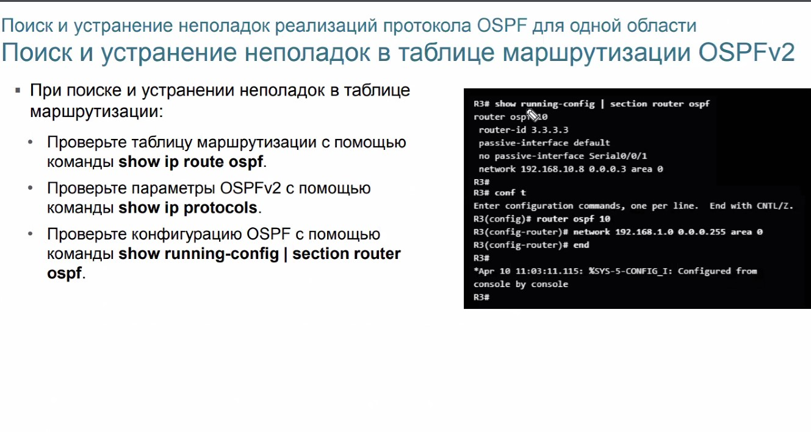

## структуры данных OSPF ##


- Таблица IF
- Таблица соседей
- База данных состояния канала (LSDB)
- Таблица маршрутизации

## для IPv6 ##
OSPF можно настраивать только на IF, сети задавать нельзя


## maximumpath ##
- Старые маршруты лучшие
- RIB - может хранить и 8 и 16 и 32 маршрута


## Вебинар по OSPF ##


### LSA ###
13 видов
- 1 тип - LSA маршрутизатора
- 2 тип - LSA сетей - рассылает DR
- 3, 4 тип - Суммарные LSA, рассылает ABR, если один из его линков в AREA0, LSA которые гуляют между зонами. 4 тип - прилетает только если в зоне есть ASBR.
- 5 тип - Внешний пакет LSA для AS. Рассылает ASBR
- 6 тип - Для MC
- 7 - для NSSA
- 8
- 9


на картинке выше  - нельзя все объединить в 1 зону, так как в этом случае будут работать только LSA1 и маршрутов в CORE прилетит просто куча.


### Связь между AREA и LSA ###


- В Нулевой зоне будут гулять все типы LSA
- 4 тип LSA не возьмется из зоны, в которой нет ASBR

STUB AREA - клиентская/тупиковая зона
- В ней фигурируют только LSA 1,2,3 типов (O * E1/E2)
- В ней никогда не будет ASBR, так как вней не может быть 4 типа LSA (ABR заблокирует этот LSA как FW)

Totally STUB - совсем тупиковая зона
- LSA 1,2
- LSA 3 сюда прийти не сможет: ABR анонсирует вместо пришедшего LSA XX себя как 0.0.0.0

NSSA - кто-то захотел в STUB area иметь ASBR
- LSA 1, 2, 3, 4, 7
- ASBR - разрешен
- LSA3 будет суммироваться
- LSA 5 будет блокироваться на входе ABR (как FW)
- LSA7  - замена LSA 5 только для данной зоны. Существует он только в NSSA, но наружу, в BB он может попасть только в виде LSA5
- default маршрут LSA 7 сгенерится при получении LSA 3,4,5 командой в контексте OSPF 
   - ```area 4 nssa default-information originate``` - анонсировать нулевку во все IF OSPF
   - ```default-information originate```

Totally NSSA
- LSA 1,2,7


### Настройка типов зон в AREA ###

настраивается в контексте OSPF
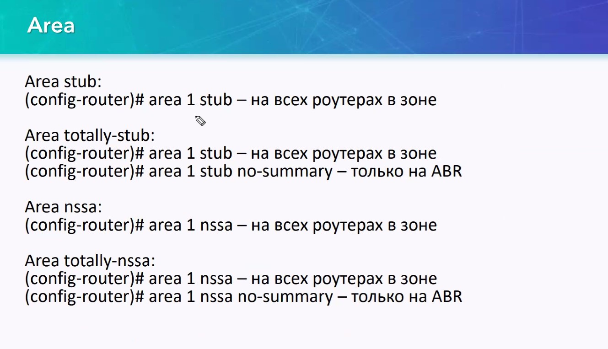

### настройка в лабе ###


## Virtual-link ##
Бывает, когда AREA0 находится не посередине и не имеет контакта со всеми зонами.

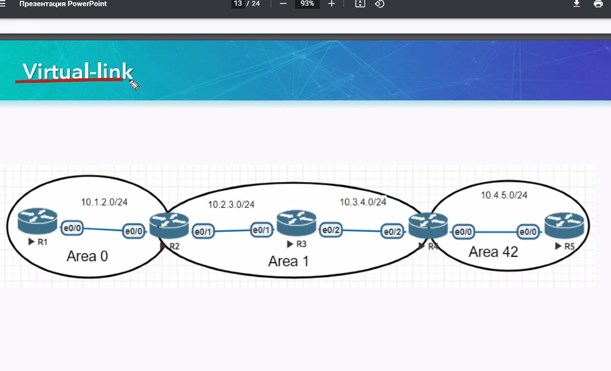

В этом случае нужен Virtual-link, который как-бы VPN и сможет передавать AREA0 в нужную зону. Вводить команду надо с двух сторон. То есть мы растягиваем AREA 0


## LSA фильтрация ##

Префиксы обязательно передаются на соседа, но:
- можно играть типами зон (T-STUB)
- настроить фильтрацию можно при помощи ACL
   - все
   - от какого-либо соседа


Через range - не очень хороший способ


Фильтрация префиксов - не использовать

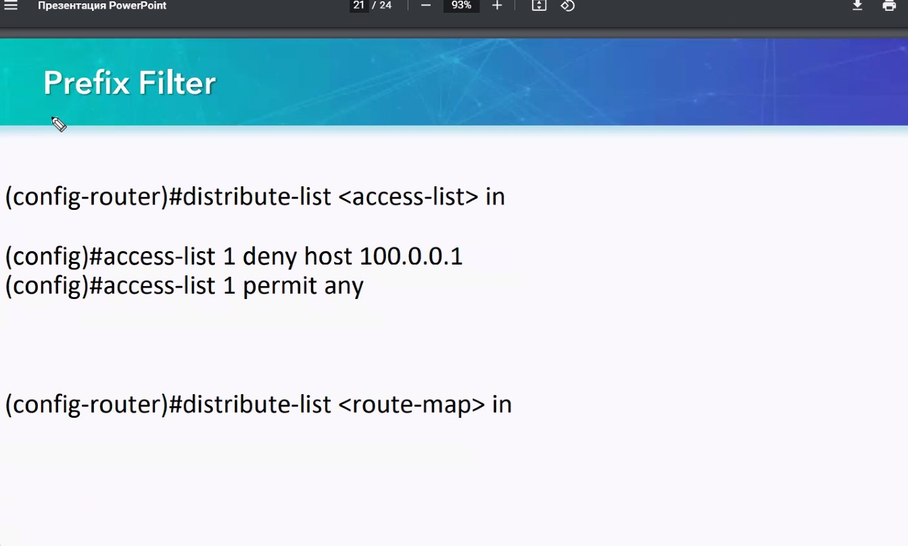

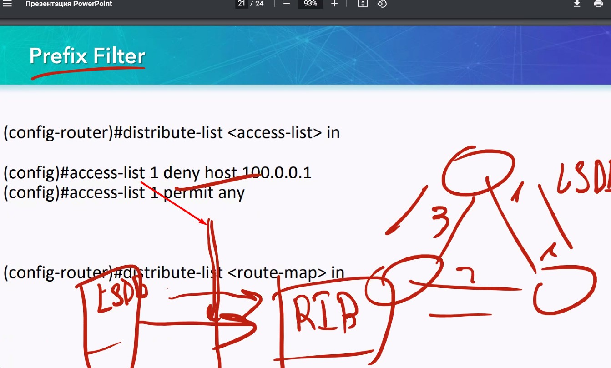


Через DISTANCE - не использовать


### [Тестовая л/р](/LECTURES/MODULE02/Lecture13/labs/README.MD) ### 

## Редистрибуция при помощи Route-map ##

