OTUS 20210427

# Продолжение IS-IS #


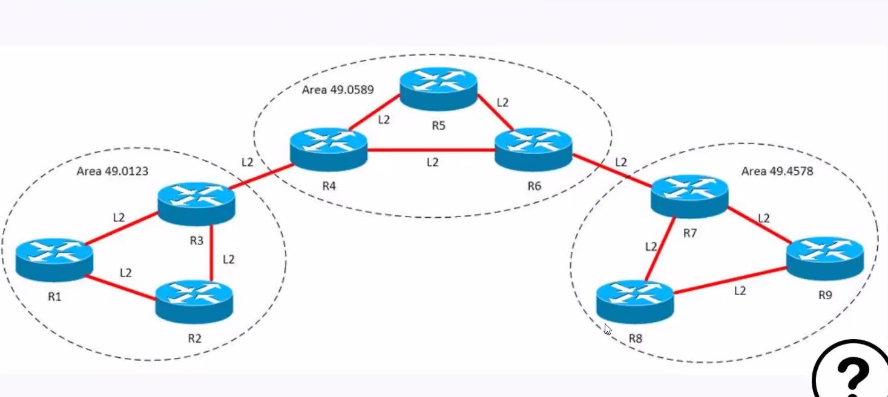
На рис. выше, трафик пойдет: бэкбон L2 - сквозной

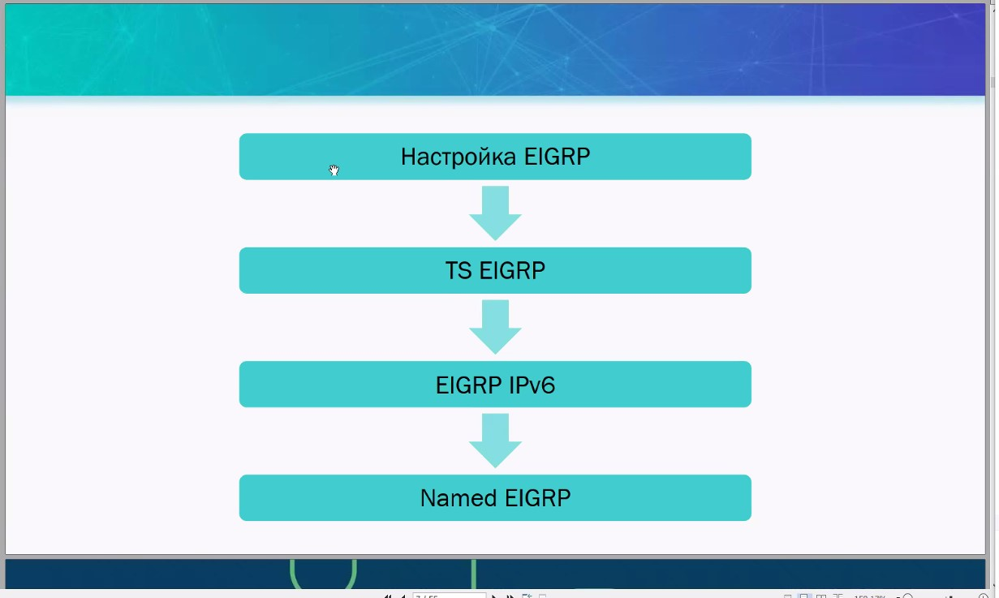
Трафик пойдет: бэкбон L2 - через центральную AREA. Внутрь будет отдаваться только DEFAULT (0.0.0.0 - аналог T-STUB)

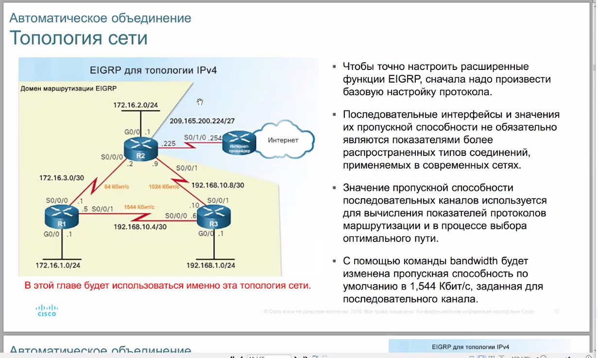
Трафик не пойдет, будет флаппинг: пакеты от R5 будут уходить то направо, то налево.

Соседство устанавливается через 
- HELLO, которых 2 типа:
   - Для LAN
   - Для P-t-P

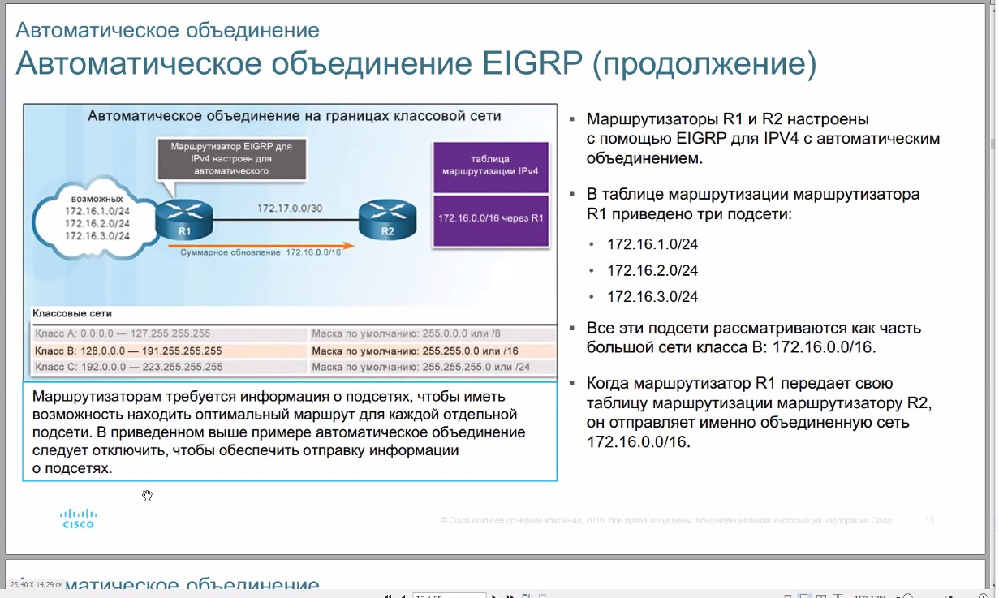

P-t-P - Отличаются тем, что обмен идети между непосредственными соседями и тут уже не нужен SID

## Установление соседства ##
1. DOWN - отправка HELLO-пакета (обмениваются)

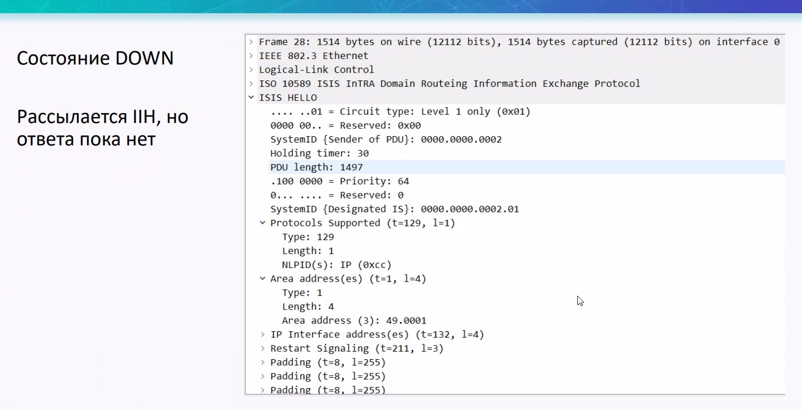
В Hello содержится:
- System ID (PDU - sender)
- System ID (Designated ID) - аналог DR
- TLV 129 (описывает определенную информацию, которая передается)
- TLV 1 - номер  AREA
- TLV 132 - IP-address
- TLV 211 - restart signalling

2. INIT - отправка второго HELLO-пакета - с указанием MAC-адреса соседа (типа подтверждение что я тебе увидел. трафик - мультикаст L2)

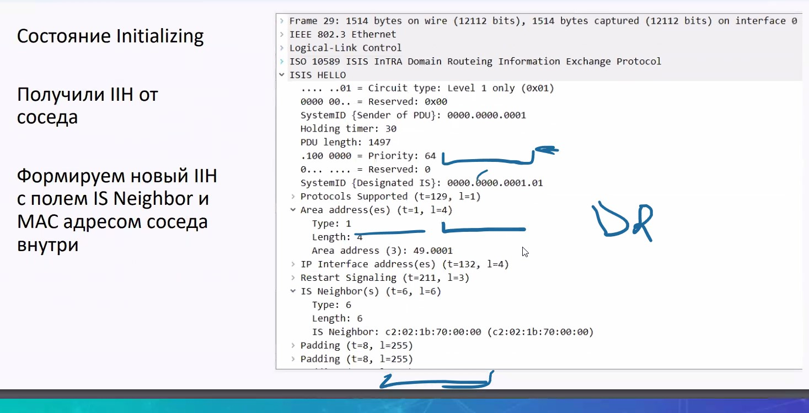
- TLV6 (с подтверждением MAC-адреса противоположного отправителя)

3. UP - поднимаем состояние в ответ на получение пакета из состояния INIT

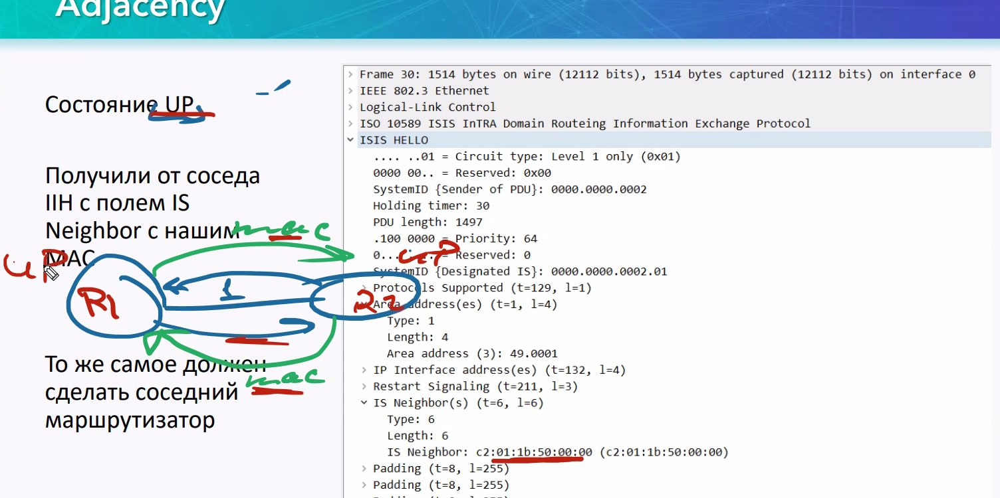

## DR в OSPF / DIS в IS-IS##

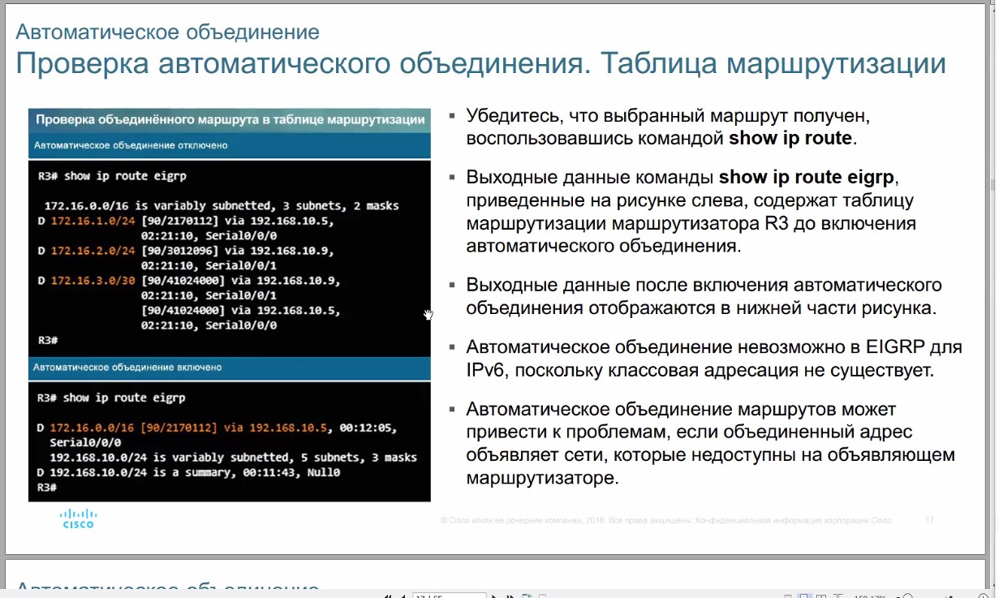

За счет внедрения DR/BDR происходит снижение L3-обмена

Аналогично OSPF - в IS-IS внедрили понятие DIS, но он не полный аналог DR/BDR (выбор на базе максимального MAC):
- не выбирается Backup DIS
- соседство все равно формирунется по схеме Full MESH, между всеми R (и рассылка пакетов получается всеми участниками сети). Но DIS раз в 20 секунд отправляет всем соседям маблицу LSDB (синхронизирует на всех R, которые не получили почему-то апдейта от какого-либо соседа). Если по какой-то причине DIS отправил LSDB с неактуальной (более старой версией), то R отбросит такую версию LSDB.
- даже поставив приоритет = 0, маршрутизатор все равно может стать DIS
- новый маршрутизатор, с более высоким приоритетом приведет к автоматическим перевыборам, новый R возьмет на себя DIS
- DIS выбирается как для L1, так и для L2

## TLV ##

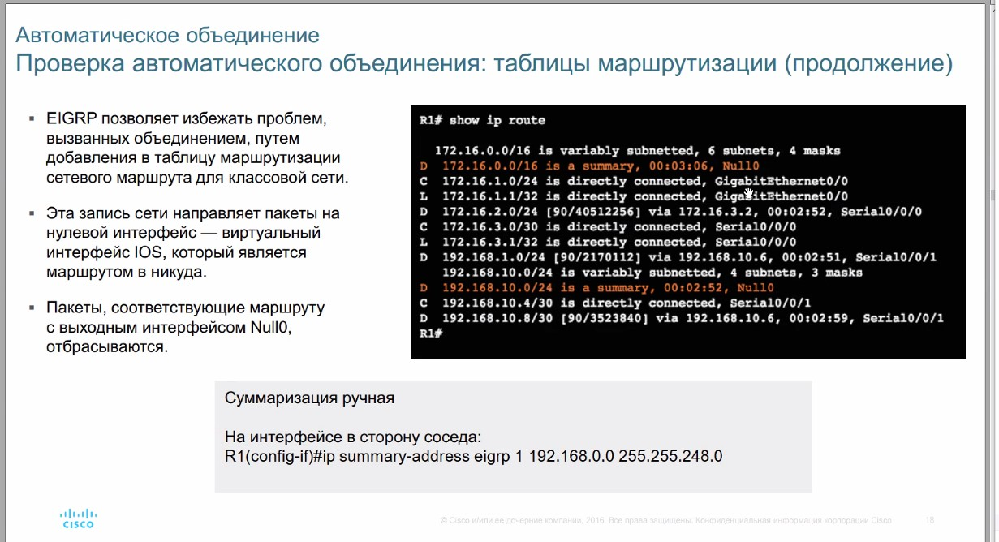

Трафик - multicast MAC

- SOURCE ID - кто отправил/идентификатор DIS
- Pseudonode ID
- LSP number - версия базы LSP
- Seq num (для дефрагменттированного TLV)

### TLV 1 ###


Адрес - зона

### TLV 2 ###

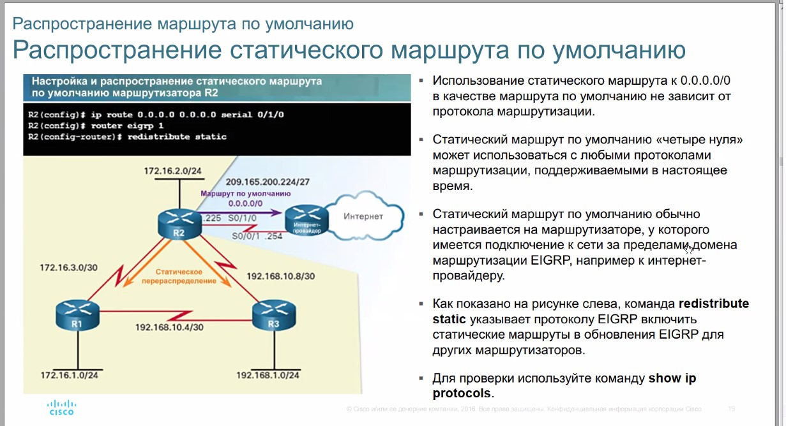

Описывает всех соседей, к которым подключен. Если в 1 TLV все соседи не влезут, то TLVv2 будет сегментирован (LSP number, Seq size)

### Составная метрика / TLV135 ###

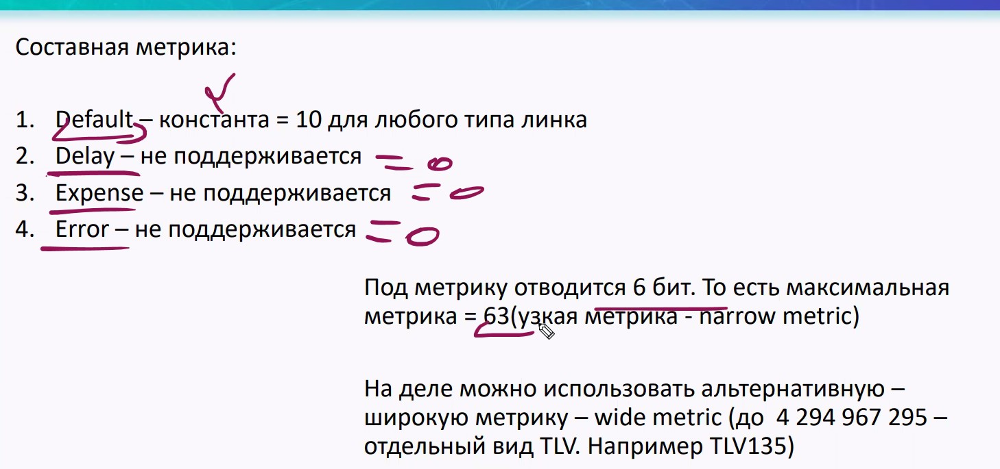

Под метрику отводится
- narrow metric (6 bit)
- wide metric (63 bit) - для этого ввели TLV 135, рекомендуется использовать её

### Различные типы TLV ###

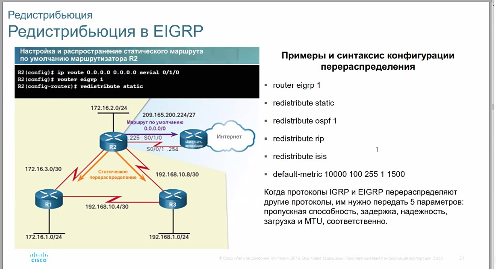


## Суммаризация/Редистрибуция ##

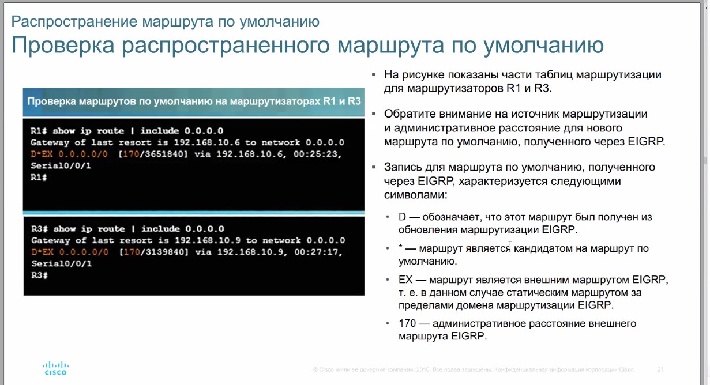

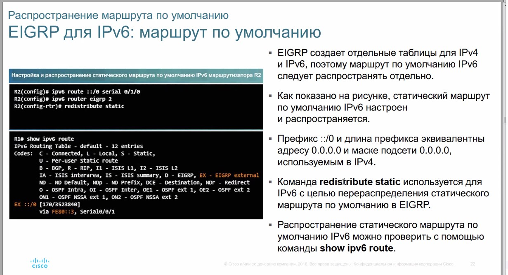

## DEFAULT ##
Не передается как 0.0.0.0 0.0.0.0, возможны 2 варианта:

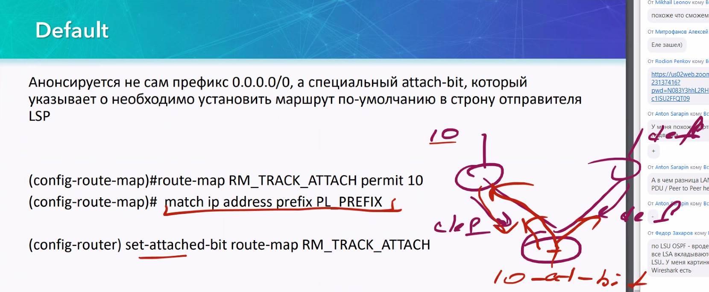


## OVERLOAD bit ##
На тот случай, если захотим трафик мягко убрать с какого-либо маршрутизатора. 2 варианта:
- ```set-ocerload-bit```
- ```set-overload-bit on-startup...```


## Лаба ##
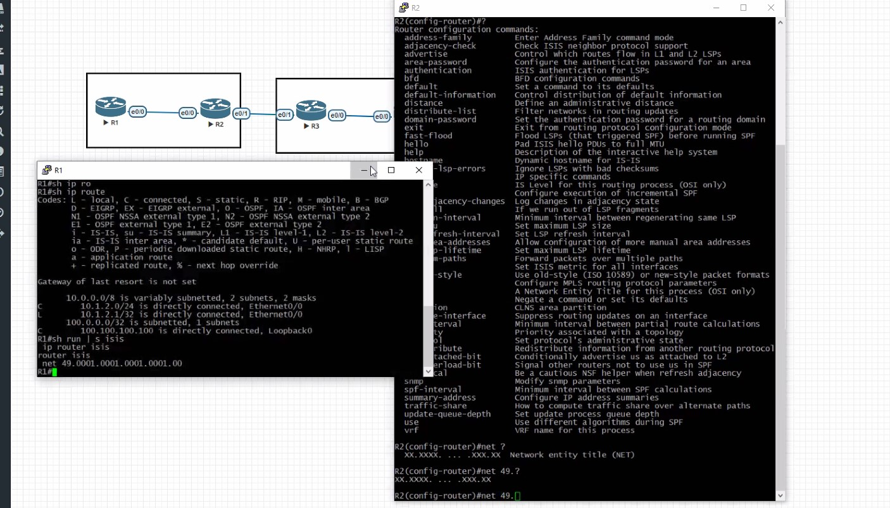

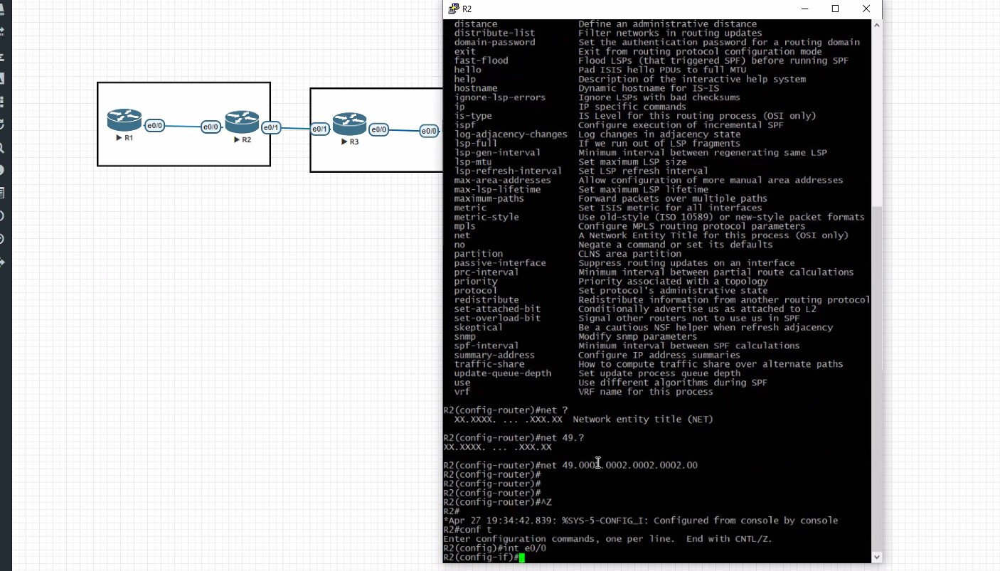

Доп. материал

[BRKRST-3302.pdf](BRKRST-3302.pdf)

