OTUS 202105181 (дополнено материалами INE)

# BGP #


## ОСНОВЫ ##
Между всеми протоколами динамической много общего, но много и разного. Еще один способ деления протоколов дин. маршрутизации - по возможности работать во внешней среде:
- IGP (ISIS/OSPF/RIP/EIGRP) - interior gateway protocol - как правило работают только во внутренних сетях/доменах/областях
- EGP (BGP) - exterior/border gateway protocol - работают во внешних/провайдерских сетях

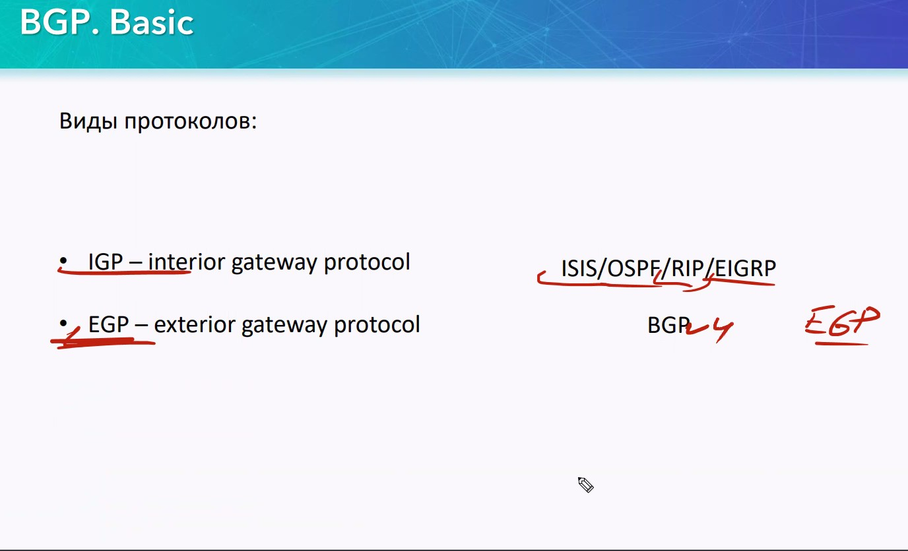

Прежде чем обмениваться маршрутами - как правило все IGP (исключение - RIP) протоколы, т.е. процессы динамической маршрутизации, запущенные на R-R-R, должны установить соседство (neighbor relationship btween peers[ровня/пэры/члены палаты лордов]). Обычно это directly connected, т.е. подключюченные друг к другу физическим кабелем, участники. После установки соседских отношений начинается обмен маршрутами и keepalives (пакеты-метки а-ля "я жив, приятель")

Также работает и BGP: устанавливает "соседство", обменивается маршрутами и кипэлайвами. При этом ошибочно сравнивать IGP и BGP neqighbors/соседей:  BGP relationships/BGP peerings - немного другая процедура: тут не требуется BC/MC трафик для выяснения кто же рядом. В отличии от IGP-устройств, BGP-устройства, как правило, не являются directly connected, не могут динамически обнаружить новых соседей и для установления соседских отношений им требуется ___четко прописать, задать/указать, с кем формировать/поднимать пиринг___. Таким образом, peer от neighbor отличается тем, что:
- neighbor-ы IGP чаще всего на одном физическом линкЕ (directly connected)
- peer-ам BGP не нужен общий физический линк, хотя они могут вступить в соседский отношения/поднять пиринг, будучи физически подключенными друг к другу.

Как и IGP:
- BGP advertise prefixes - BGP афиширует/объявляет/рекламирует префиксы/подсети.
- BGP advertise Next HOP for prefixes - BGP афиширует/рекламирует next-hop для объявляемых префиксов, так как для соседа плохо когда он знает "через кого можно добраться до пришедшего префикса".

Отличия от IGP:
- IP-адреса соседей/peer-ов могут и не быть в одной подсети (2-3-...-10 хопов между соседями - не проблема)
- используется TCP протокол, порт 179, UC-трафик, для взаимодействия процессов BGP у peer-ов. Еще раз подчеркну, что ___Весь___ обмен между пирами - UC:
   - первый обмен TCP-handhsake
   - обмен маршрутами
   - keeaplive

IGP OSPF использует свой собственный протокол для обмена, не TCP и не UDP. BGP - работает поверх надежного TCP.

Еще раз про IGP. Они как правило, хотя и не все, и не всегда, обмениваются unicast маршрутами: 
- DV протоколы (RIP/EIGRP) обмениваются чисто unicast маршрутами:
   - Маршрут - это адрес/маска/next-hop
   - где next-hop - сам источник-отправитель маршрута, то есть отправитель в общих чертах говорит: отправляй информацию в сеть, которую я тебе прислал - мне, а я уже разберусь.
- LS протокол OSPF - поступает так не всегда, он флудит LSA-шками. При этом LSA type 1&2 - вообще не содержат маршрутов, только структурированную инфомрацию для таблицы топологий.  Маршруты в чистом виде, как это происходит у DV - содержатся только в LSA следующих типов:
   - LSA type 3 summary
   - LSA type 5 external

Теперь опять вернемся к BGP. Технически, BGP, также как и OSPF, может  отправлть unicast маршруты в чистом виде. Говорят что BGP обменивается ___NLRI___ - network layer reachability information. BGP очень гибок и может организовывать обмен для:
- unicast-маршрутов
- MC-маршрутов
- IPv6-маршрутов
- и т.д.


Для взаимодействия между AS настроен BGP. По-сути это монополист в интернете. AS [autonomous system] - оборудолвание/сети, управляемые одной компанией, или под управлением нескольких организаций, имеющих общие концепции (наcтройки BGP и все исходящие из неё )


RIR - Организации отвечающие за работу сетей/AS в конкретном регионе (региональная регистратура). В каждом регионе - своя. За европейскую часть отвечают - RIPE. И с ней взаимодействовать можно как через провайдера, так и самостоятельно (в рублях - 60000/год за поддержание AS)

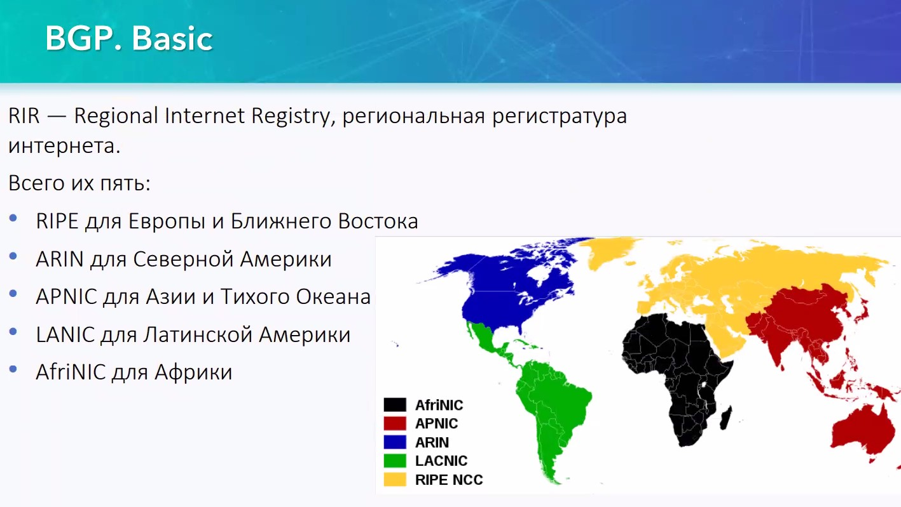

IANA/RIR - выпускают отчеты об использовании адресного пространства

Анонсировать адреса можно из любого географической области.

Под RIR - LIR,  и уже LIR имеет AS и адресное пространство. LIR работает с LIR.

looking glass - етсь не у всех провайдеров, для снятия статистики:
- https://www.msk-ix.ru/lookingglass/
- https://bgp.he.net/


## Расширенная информация о BGP ##


IPv4 купить уже нельзя, остается толькоарендовать у провайдеров. AS могут управлять несколько операторов (дочерние компании). Головная компания управляет всеми концепциями. Некоторые провайдеры успели понабрать себе AS (вместе с сетями), которые теперь могут делегировать клиентам (актуально для IPv6, для IPv4 - уже нельзя).

### iBGP/eBGP ###


При включении процесса BGP, мы обязательно указываем к какой AS он относится (также мы делали и при включении EIGRP). А затем, при задании пиров - дополнительно указываем к какой AS будет относится данный сосед/пир. 
```
router bgp 64500
neighbor 101.0.0.1 remote-as 64501
```
При этом R, который мы настраиваем, будет сравнивать эти AS: свою и пира. Делая вывод: в одной ли он AS с пиром, или - нет. Если ответ отрицательный, то R-R в разных AS и между ними - external BGP. Если положительный - между пирами - internal BGP. Таким образом пиринг может быть 2 типов :
- iBGP - внутри AS
- eBGP - между AS

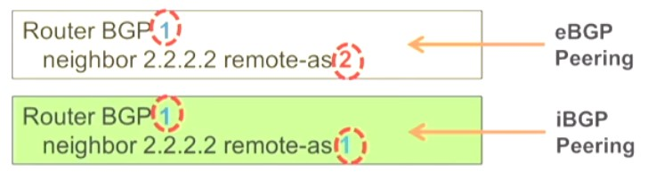

iBGP отличается от eBGP в следующих аспектах:
- Настройки пиринга:
   - eBGP накладывает некоторые ограничения на пиров (кто может со мной общаться), чего нет в iBGP.
- Обменом префиксами. Самое первое что делает R при получении BGP updates (NLRI)  - оценивает, из какой AS он пришел:
   - BGP updates/NLRI от external пира - можно транслировать на каких угодно пиров/соседей
   - BGP updates от internal - по-умолчанию можно транслировать ___ТОЛЬКО ВНЕШНИМ___ пирам, но ни в коем случае - внутренним. Это поведение по-умолчанию и оно помогает в борьбе с петлями внутри iBGP. Хотя протокол BGP универсален и гибок и можно некоторыми настройками заставить его передавать NLRI между iBGP пирами. Речь идет о функционале:
      - route reflectors
      - confidertions
- Update modificatoins. В случае сравнения iBGP vs eBGP, существуют соглашения, согласно которым атрибуты делятся на те, которые:  
   - могут передаваться только internal пирам
   - могут передаваться только external пирам

Чтобы понять последнее отличие, вспомним о способах фильтрации/отбора лучших маршрутов с одинаковой AD в IGP протоколах:
   - RIP - hop count (чем меньше - тем лучше)
   - EIGRP - distance (чем меньше - тем лучше)
   - OSPF - cost (чем меньше - тем лучше)

Речь идет про метрику: выбирается лучшая. В BGP это совсем другая процедура: BGP update включает в себя не метрику, а громадный, просто жуткий набор информации - NLRI [network layer reachability information]. Технически эта информация называется атрибутами пути - Path atttributes. При получении префикса/NLRI от двух пиров, BGP протокол начинает сравнивать не метрики, а эти наборы атрибутов. При этом атрибуты различаются в "весе": какие-то более важные, какие-то - менее. BGP перебирает их: от самого важного к самому неважному, чтобы остановиться/выбрать лучший маршрут при нахождении лучшего атрибута какой-либо важности. 

Например, возьмем такой обязательный атрибут, как next-hop - его ОБЯЗАТЕЛЬНО надо передавать всем пирам: и iBGP и eBGP.

Еще один пример - атрибут local preference - его нельзя передавать eBGP пирам.

Также необходимо отметить, что AD iBGP и eBGP - разные:
- eBGP AD = 20 - он бьет другие протоколы динамичесокй маршрутизации.
- iBGP AD = 200 и подходит только как маршрут последней надежды, если никаких других маршрутов уже не останется.


## AS ##
AS - это некий номер, который закреплен за конкретной организацией. Прогресс выдавания номеров AS - представлен ниже.

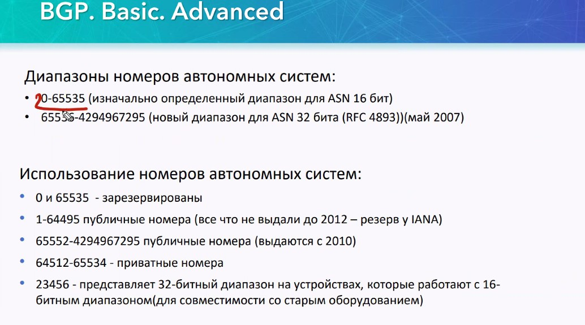

До 2012 года выдавались AS 1 - 64495, сейчас уже выдаются  из 2-го диапазона.

Приватные номера AS ___64512 - 65534___ - немаршрутизируемые, в целом они нужны для работы внутри моей AS. Назначаю их я сам.

23456 - для работы старого оборудования, которое умеет работать только с 16-битным номерами AS. Таким номером старое оборудрование дает понять что пришедший 32-битный номер AS оно не в состоянии переварить.


В RFC 4893 появилось понятие ___mappable ASN___, т.е. AS, которые имеют значение 0-65532 (к этим значениям спереди дописывают 16 нулей)

Виды записи ASN отличаются:
- 0 - 4294967295
- как нуль и последующее значение (разность номера AS и 65535)

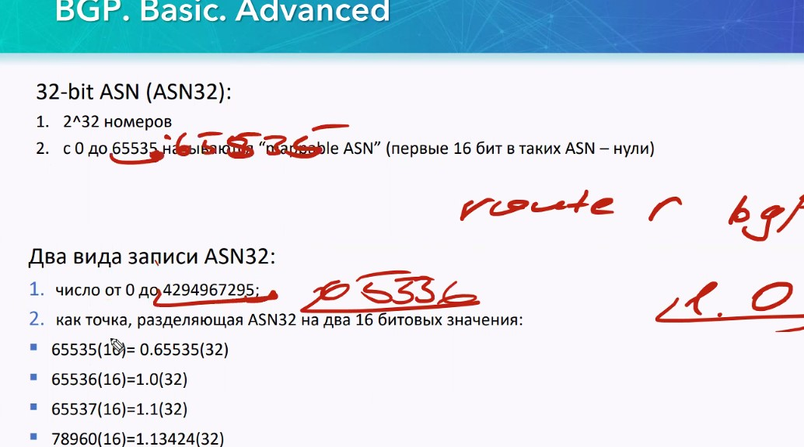

## BGP - DV протокол ##

BGP на Маршрутизаторе настраивают таким образом, что он начинает понимать: какая сеть находится в какой AS.

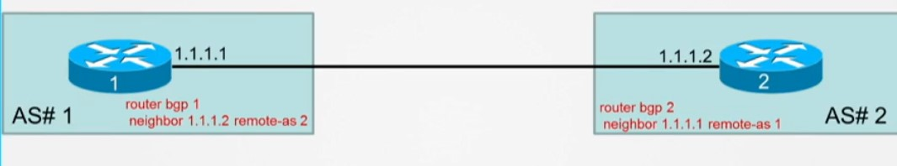

Позже появляется такое понятие как путь до конечной AS называемый AS-PATH: он составляется из номеров всех проходных AS.


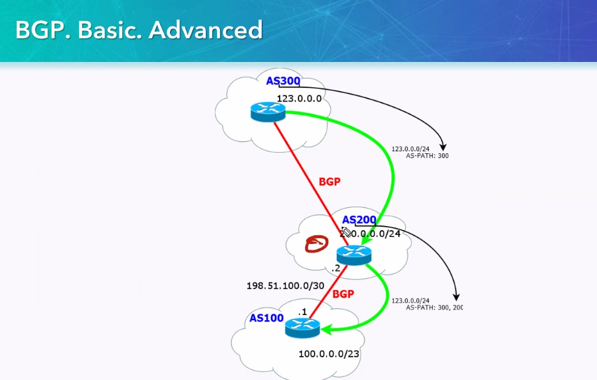

AS-PATH может использоваться для:
- Предотвращение петель (если update придет с информацией о собственной AS)
- Фильтрация
- Выбор минимального пути (логика RIP). В таблице маршрутов будут все пути, но в таблице маршрутизации  - лучший
- AS-Prepend (повторение номера зоны AS 300,300,300,300, что позволяет создать более емкий, фейковый, путь и выбрать лучший). - распределение трафика, когда трафики разделяются через разные линкИ
- Соединение AS через промежуточную AS


## Пиринг/Соседство/смежность (peer - ровня/пэр) ##
В BGP нет необходимости непосредственной физической связности AS. Достаточно только IP-связности. 

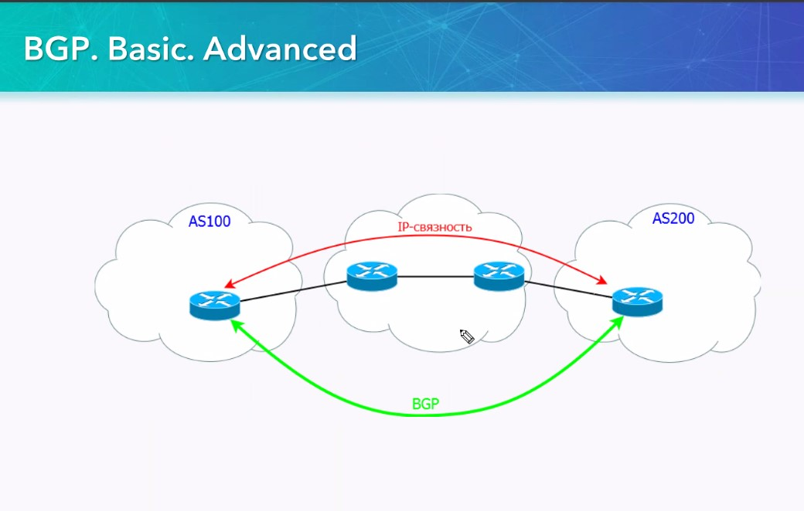

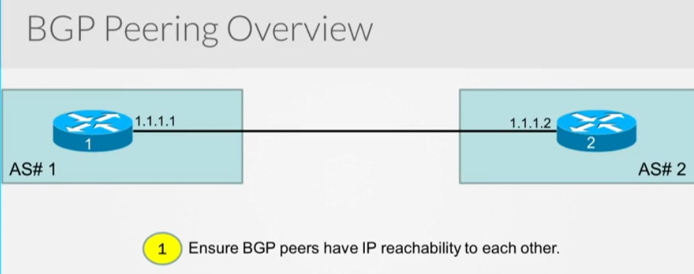

При этом самая распространенная ошибка при настройке BGP - забыли проверить ip-связность между пирами BGP. BGP  даже не почешется, если между пирами есть какие-то еще R, которые знать ничего не знают про сети, из ip-адресов которых идут анонсы BGP. Перед началом BGP обмена - доложен выполняется 3-way handshake с пиром:
- Syn
- Syn-Ack
- Ack

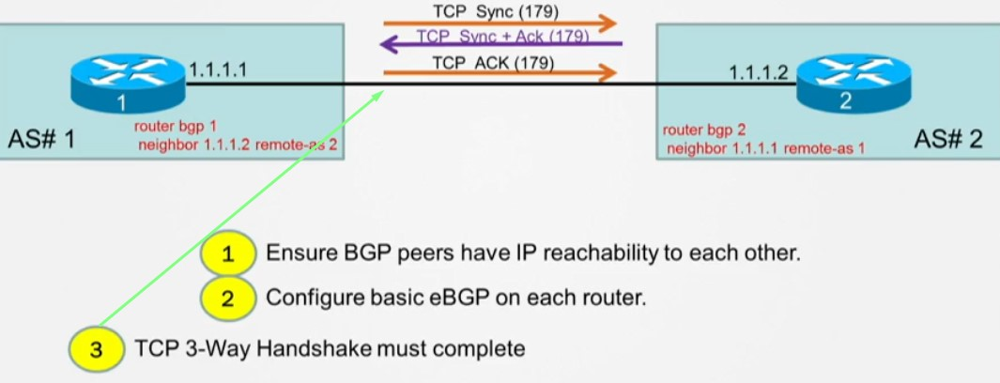

и, на этом, первом этапе, BGP нечего делать и никакие BGP - пакеты даже не начнут отправляться в сеть, если:
- на SRC нет маршрута до пира
- промежуточные R не знают конкретных пиров, и не могут передать им трафик. При этом есть следующая тонкость: BGP не может использовать default маршрут/нулевку. Таким образом если между пирами и ходит пинг или работает telnet на основании нулевки, пиринг не поднимется. Таким образом, на самих пирах, так и на всех промежуточных R-R-R необходимо обеспечить маршруты в конкретные сети, или даже до конкретных пиров.
- существуют промежуточные ACL, которые запрещают TCP-обмен (например заперещено все кроме icmp)

___Задание пиров___ - представлено на рисунке ниже. Данный вариант - для eBGP, но для iBGP - также требуется задать пиров, только там номера AS будут одинаковыми.


Кто первый начнет процесс обмена TCP - рассмотри чуть позже.

После установки TCP-сессии, произойдет установление пиринга:

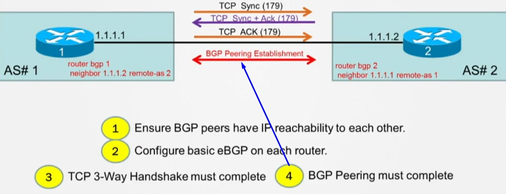

На этом этапе согласуются различные параметры, происходит обмен номерами AS, к которым принадлежат пиры. После этого начнется обмен BGP (NLRI - network layer reachability information)


Ну и наконец, после получения NLRI начнется процесс выбора лучших путей


В случае если у нас есть маршрут до какой-либо сети, например 9.9.9.9 от другого пира, начнется процедура сравнения соответствующих BGP Path attributes. В таблицу маршрутизации попадет тот маршрут, чей атрибут будет признан лучшим в этом процессе.

### Cостояние пиринга/смежности ###

Есть определенные условия для поднятия пиринга: необходимо чтобы "совпадали показания учатников/пиров" (___Sanity Check___):
- ip-адреса источников: при начале TCP на 179 порту, BGP контроллирует от кого идет обмен, сравнивает его с тем ip-адресом, который указан в локальных настройках пира. Если трафик идет от друго-го пира, то " мама мне запрещает общаться с тобой" и Syn+Ack не будет отправлен. Настройки BGP позволяют задавать источник BGP трафика


<details>
  <summary>Пример подмены update-source IF</summary>
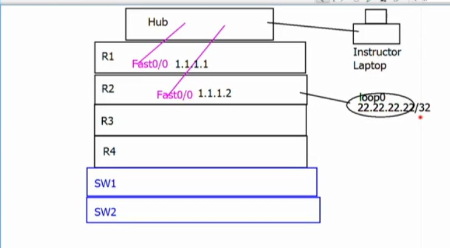

```
R1
router bgp 1 
 neighbor 1.1.1.2 remote-as 2

R2
router bgp 2 
 neighbor 1.1.1.1 remote-as 1
 neighbor 1.1.1.1 update-source Loopback0
```
Видны попытки начать TCP, но с учетом того, что R1 ждет ip-трафик от 1.1.1.1, ответа Syn+Ack - нет. Из лога видно больше: R1 даже не пытается ответить на SYN, так как BGP видит что пакет пришел с какого-то левого ip.
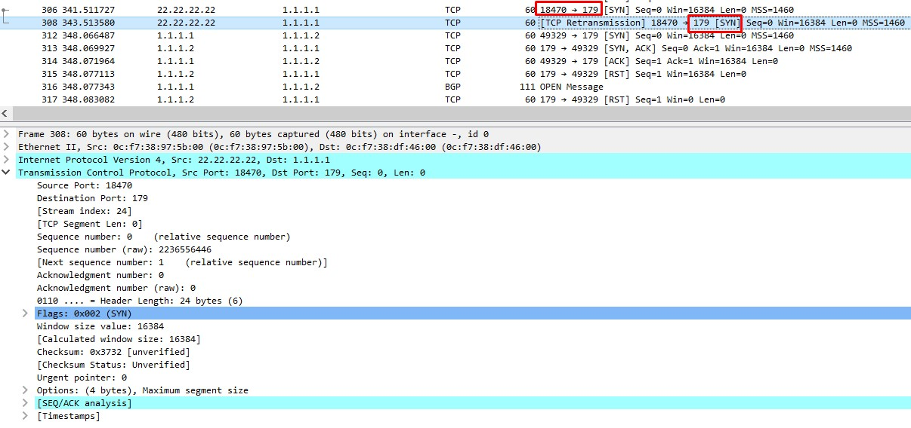

С R1 также идут попытки поднять пиринг с R2, даже дело доходит до OPEN    


но, R2 отправляет RST и пытается поднять свою TCP с адреса 22.22.22.22


</details>

- номера AS: во время установки пиринга, пир пришлет номер своей AS, и если он не совпадает с тем, который прописан в настройках пира BGP, то соседства не будет.


<details>
  <summary>Пример Wrong AS</summary>
*May 29 16:22:32.694: %BGP-3-NOTIFICATION: received from neighbor 1.1.1.1 passive 2/2 (peer in wrong AS) 2 bytes 0002
R2#
*May 29 16:22:32.695: %BGP-5-NBR_RESET: Neighbor 1.1.1.1 passive reset (BGP Notification received)
*May 29 16:22:32.696: %BGP-5-ADJCHANGE: neighbor 1.1.1.1 passive Down BGP Notification received
*May 29 16:22:32.697: %BGP_SESSION-5-ADJCHANGE: neighbor 1.1.1.1 IPv4 Unicast topology base removed from session  BGP Notification received
</details>

- настройки аутентификации
- уникальные BGP Router-ID
- одинаковая BGP версия (текущая - ver. 4)

Процесс BGP может существовать только для одной AS на R. R - не даст запустить другую AS, если уже одна создана

При этом процесс BGP-пиринга проходит через несколько состояний:
- IDLE - изначальное состояние соседства
- CONNECT - слушаем порт 179, но ничего не отправляем
- ACTIVE - отправляем SYN и ждем ответа соседа
- OPENSENT** - BGP начинает работать, обменивается сообщениями OPEN. Отправляется номер своей AS, и на получателе проверяется его совпадение с локальными настройками пира.
- OPENCONFIRM ** - сообщение OPEN получено - если все хорошо и AS совпадает. Если AS не совпадает - назад отправляется ERRORMESSAGE/NOTIFICATIONMESSAGE, и процедура поднятия пиринга начинается с самого начала, с TCP. NOTIFICATIONMESSAGE - основное сообщение, в котором говорится почему пиринг не может быть поднят.
- ESTABLISHED - все настройки согласованы и сессия BGP работает


### Сообщения BGP ###
- OPEN - соглаосвание нмоеров AS, Hold Time, RID
- NOTIFICATION - для разрыва BGP - сессии
- UPDATE - основные сообщения, с кусками маршрутной информации BGP
- KEEPALIVE - выполняет 2 функции:
   - оповещение что сосед еще жив 
   - подтверждение на UPDATE. Если не получаем подтверждением, сбрасываем соседство
- ROUTE REFRESH - запрос маршрутов, без перезапуска BGP (маршрутизация бедет выполняться по старой ьаблице маршрутизации).

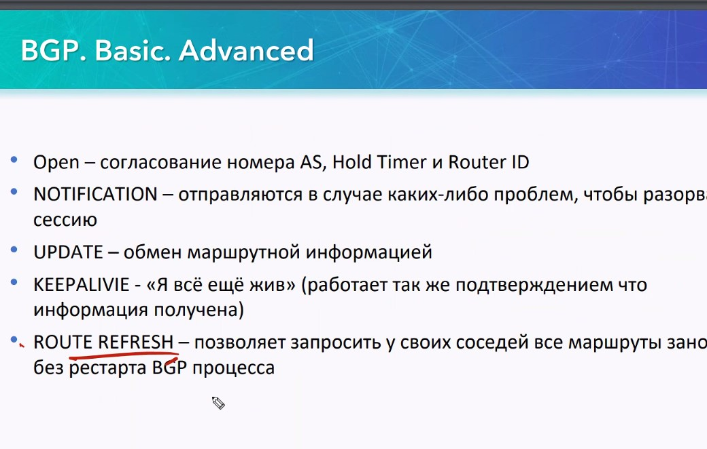

- На первом этапе работает протокол TCP
- На втором этапе работает протокол BGP, происходит обмен между вручную настроенными соседями, с подтверждением keepalive


## Маршрутная карта BGP ##

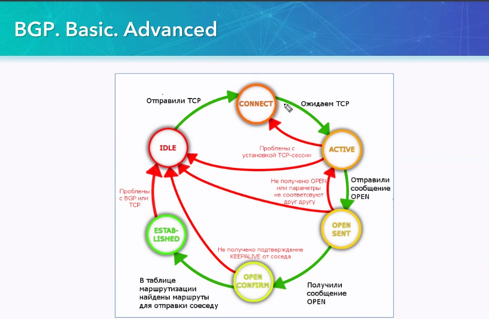

если от соседа keepalive нет, то разрываем соседство

## Концепция обработки маршрутов BGP ##


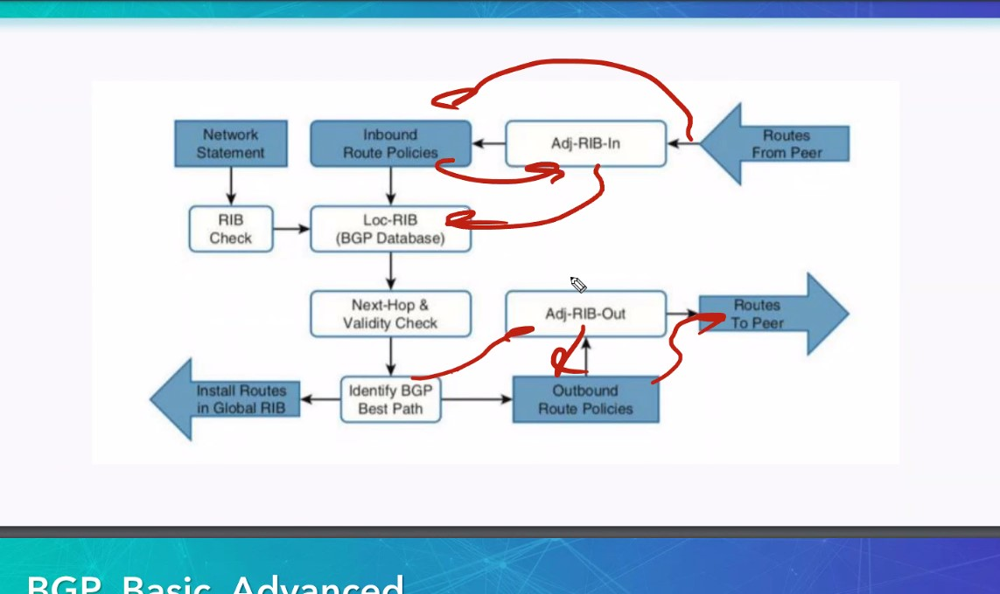

Маршруты в LOC-RIB могут попасть к нам:
   - Статические/известные маршруты  (directly/static)/через проверку BGP RIB Check
   - Adj-RIB-In - входящие от соседей маршруты
LOC-RIB/FIB - BGP Database, база данных существующих маршрутов

из LOC-RIB маршруты в таблицу маршрутизации попадают:
   - через проверку 
      - next-hop (маршрут в текущей таблице маршрутизации)
      - validity Check
   - Выбор лучшего пути (только одного). Лучший путь 
      - попадает в таблицу маршрутизации
      - табличку маршрутов для соседа (на основании которой готовится информация для соседа)


