OTUS 20210521

# BGP #


маршруты в Loc-RIB могут попадать 2 путями (из разных источников):
   1. Маршруты connected/redistribute  попадают в RIB через RIB check (наличие маршрута в таблице маршрутизации)
   2. Маршруты приходящие от соседей: проверка может быть либо по Inbound Route Policy, либо на наличие AS в записях Ripe.

Маршруты из Loc-RIB проходят проверку: 
   - ___Next-Hop___ - есть ли маршщрут к next-hop
   - ___Validity Check___ - маршрут некорректный по каким-то признакам
Происходит выбор лучшего (BGP Best Path) - NWLLA OMNI. Данный маршрут проходит как в таблицу маршрутов так и направляются в таблицу маршрутов-кандидатов на отправку соседям.

## Атрибуты BGP  ##

В BGP нет метрик, и поэтому какие-то способы управления можно выполнить только через атрибуты. Основные используемые атрибуты: 
- AS-Path
- Local Preference
- Weight
- MED
- Router-ID
- IP-адрес
- природа возникновения маршрута (i/eBGP или IGP)

Повторим еще раз: атрибуты делятся на:
- Известные/Опциональные (___Well-Known/Optional___)
- Обязательные/Необязательные (___Mandatory/Discretionary___)
- Транзитивные/Нетранзитивные (___Transitive/Non-transitive___)

Сочетаются они только 4 способами:
- Well-known(или обязательные) - их всегда должны понимать ВСЕ производители:
   - mandatory - обязательно есть в NLRI
   - discretionary - могут не быть в NLRI: например ___local preference___ рассказывает что какой-то путь во-вне более приоритетный для всех пиров iBGP внутри AS

   

- Optional(или Опциональные) - может не поддерживаться всеми реализациями BGP и обрабатываются по-своему при передаче соседям:
   - transitive  - если не знаем его, то обязательно передаем соседям с пометкой ___PARTIAL___
   - non-transitive - если не знаем его, то не передаем соседям.

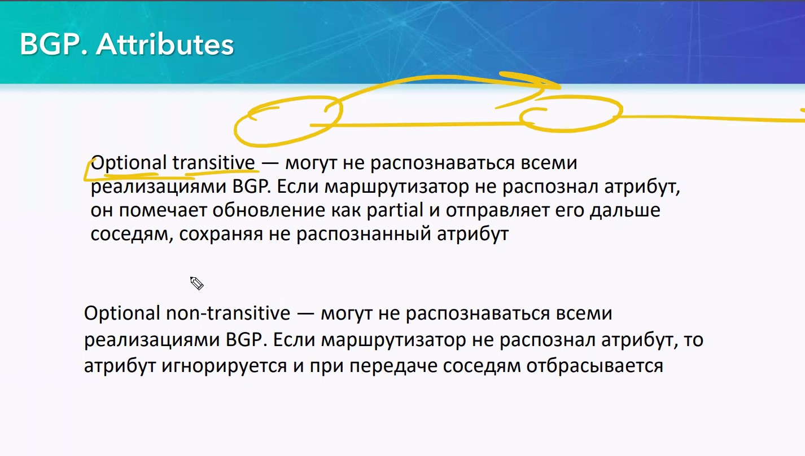

Ну и сводная табличка:


Origin - как именно был получен маршрут

### Атрибут AS-Path ###

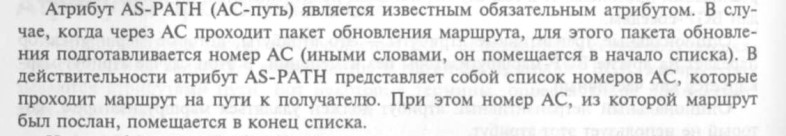


Описывает путь до сетей назначения
- перечисление через запятую номера AS (работает по логике RIP)
- Обнаружение петель (найди себя и если нашел - отбрось маршрут)
- Влияет на BGP-маршрут, который будт видеть neighbor и тем самым, совместно с local-path (см. ниже), позволяет задавать конкретного ISP для прохождения трафика, при наличии соседства с несколькими ISP (часть из которых нежелательно использовать по какой-либо причине).


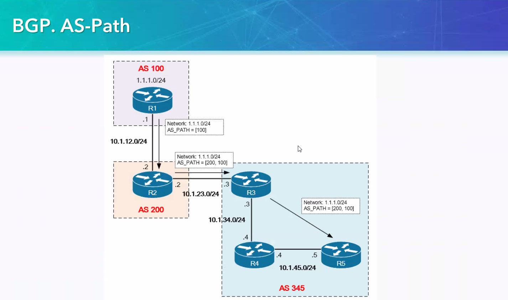

Нюанс: 
- в рамках одной AS (iBGP), AS-Path меняться не будет, поэтому трафик до 1.1.1.1 может вернуться обратно (в рамках iBGP), поэтому есть потребность в защитных механизмах.
- ухудшать можно только номером своей AS, чтобы не подставить кого-то другого.
- Может получиться ситуация, когда у какой-то другой AS даже такой AS-Path не будет самым плохим и поэтому трафик все равно будет завернут в нашу AS черезнежелательного провайдера.
- Некоторые ISP срезают AS-PATH с помощью входящих фильтраций и введенные значение не повлияют на результат: AS-PATH ухудшить не получится.

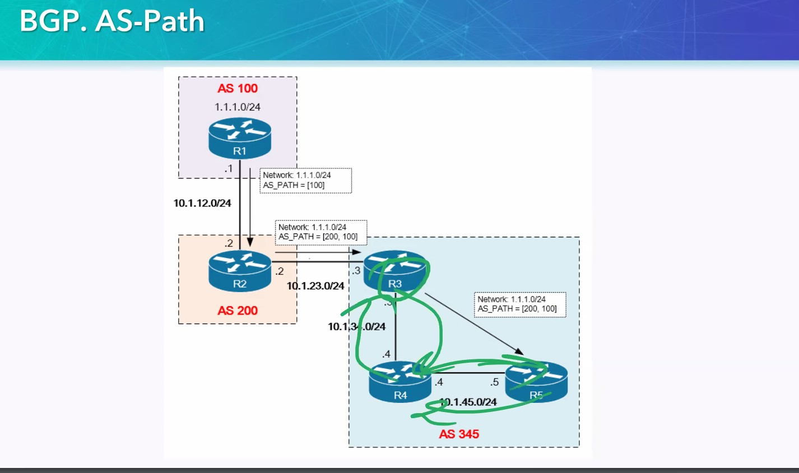

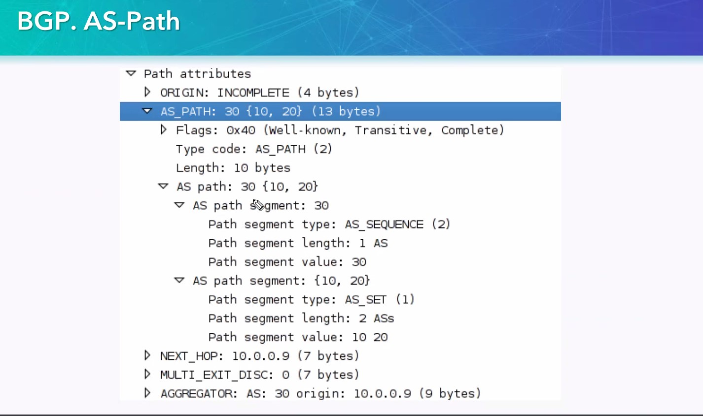

Настройка также идет через route-map
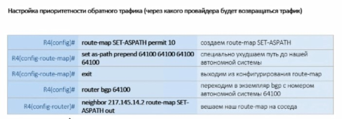

на GW - бордере к нежелательному ISP, направление ___OUT___
```
route-map RIGHT-NO-TRAF permit 10
 set as-path prepend 65010 65010 65010 65010

router bgp 65010
neighbor 134.15.15.1 route-map RIGHT-NO-TRAF out
```
В результате такого насилия над as-path, наш сосед начинает считать, что до AS 65010 - очень и очень далеко. AS 65040 выкидывает этот маршрут даже из таблицы BGP, и оставляет только через левого ISP - AS 65020


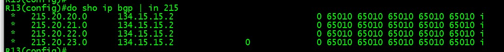


### Атрибут ___Next-hop___ ###

Ранее был рассмтрен пример, когда префиксы из другой AS расползались по AS за счет OSPF и на всех R, кроме бордеров. У таких префиксов была AD 200. Ситуацию можно изменить, используя атрибут ___Next-HOP___.  Его поведение для iBGP не совсем обычное: в рамках iBGP одной AS, Next-hop  меняться не будет. Итак, краткие условия предыдущей задачки:
- организована совместная работа iBGP и какого-либо IGP внутри нескольких AS
- существует статика маршрута на всех R в соединяющую подсеть через бордер-R
- заанонсировать в рамках работающего процесса iBGP ```neighbor 50.0.4.1 next-hop-self```. R5 заменит ip next-hop анонсируемого префикса своим IP.

R5:
```
router bgp 65010
 bgp log-neighbor-changes
 network 215.20.20.0
 neighbor 50.0.2.1 remote-as 65010
 neighbor 50.0.2.1 update-source Loopback0
 neighbor 50.0.3.1 remote-as 65010
 neighbor 50.0.3.1 update-source Loopback0
 neighbor 50.0.4.1 remote-as 65010
 neighbor 50.0.4.1 update-source Loopback0
 neighbor 50.0.4.1 next-hop-self
 neighbor 172.10.10.1 remote-as 65020
```
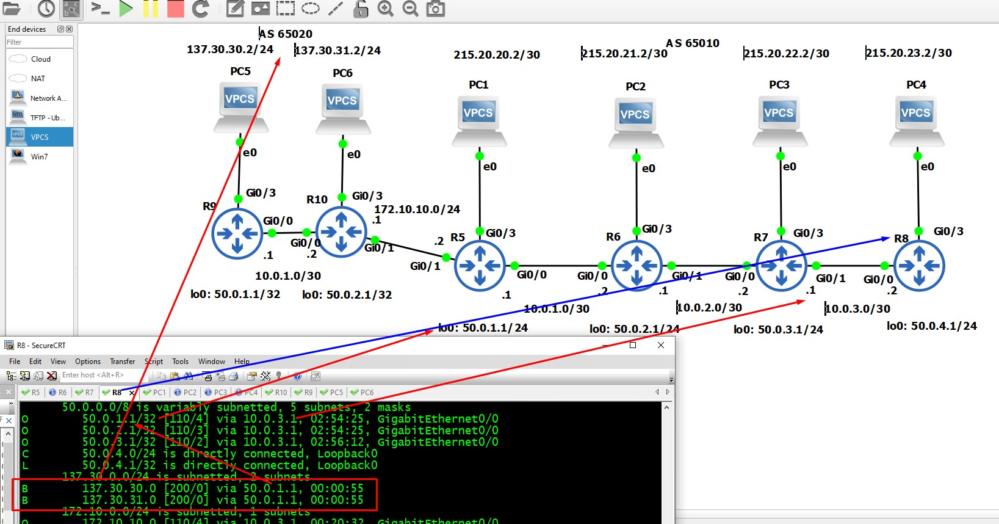

Не забываем про еще одну подляну: проверять доступность нужно из анонсируемых префиксов. Т.е. пинг из внутренних подсетей не пройдет, так как мы их жестко не имеем право анонсировать в BGP.

Для eBGP - такой проблемы не будет

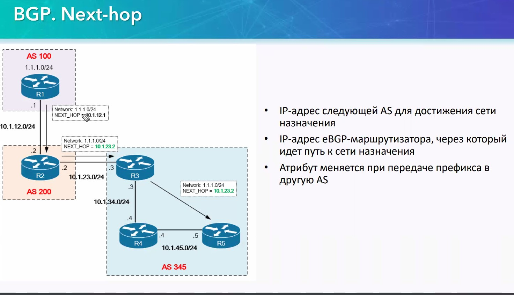

Иногда возникает рекурсивная маршрутизация (маршрута конкретного нет, но есть опосредованные маршруты, которые будут ссылаться один на другой через next-hop)


Демонстрация того, что Next-hop не поменяется
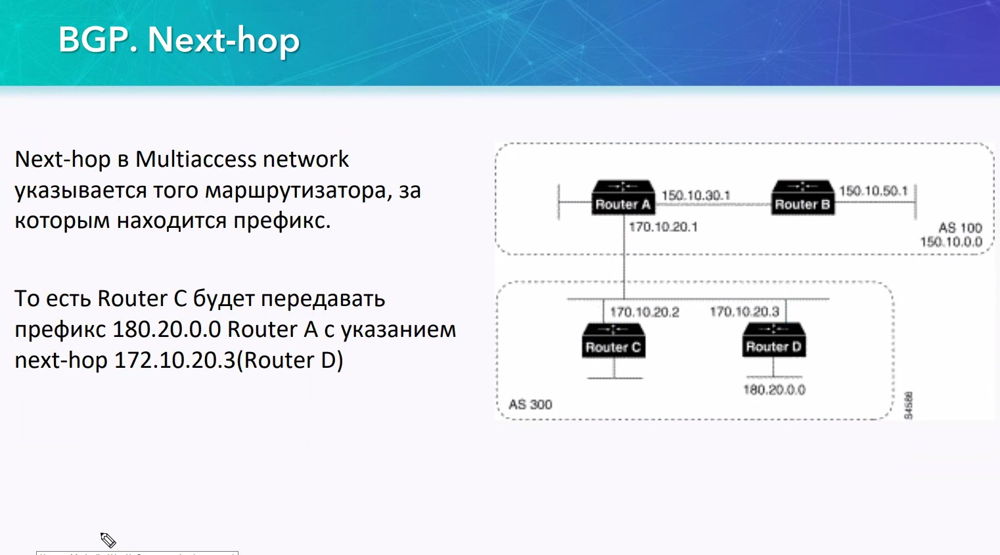

### Атрибут Local Preference ###
Чем выше значение - тем лучше.

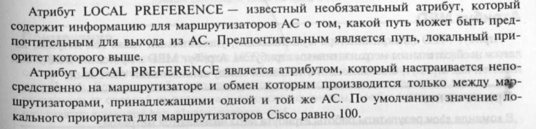

Работает внутри одной AS, только внутри iBGP. По eBGP - не работает.  Настроив Local Preference на R2, мы сможем задать приоритет входящим обновлениям и заставить весь исходящие трафик выходить через R2

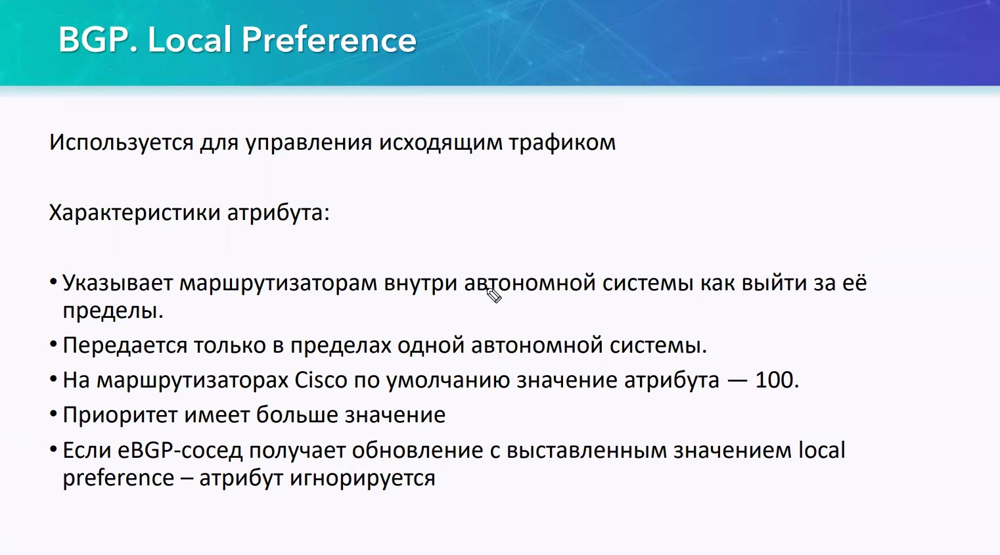


В лекции 26 есть пример с WEIGHT (надо настраивать на всех RRR AS), так вот: local preference  - удобнее, чем WEIGHT. Если у нас 10000 абонентов, надо на всех RR настраивать Weight, чтобы разрешить выход либо через правый, либо через левый линкИ. 


Делается при помощи route-map (как и WEIGHT): на бордере говорим, что маршруты от AS 65020 лучше, чем все остальные. Все остальные RR настроятся автоматически. 


Итак, на BORDER-е настраиваем:
```
route-map LEFT-BEST permit 10
 set local-preference 150

router bgp 65010
neighbor 172.10.10.1 route-map LEFT-BEST in
```

Особенности: 
- вес поменялся у всех маршрутов
- мы не управляем маршрутами других AS - влиять на этот параметр мы можем только через AS-Path (заставив другие AS думать что до нас очень и очень далеко добраться - смотри настройку выше)


Демонстрация работы - пересмотреть заново, попробовать как оно работает с нуля