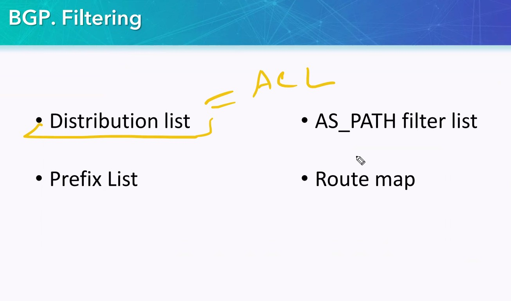
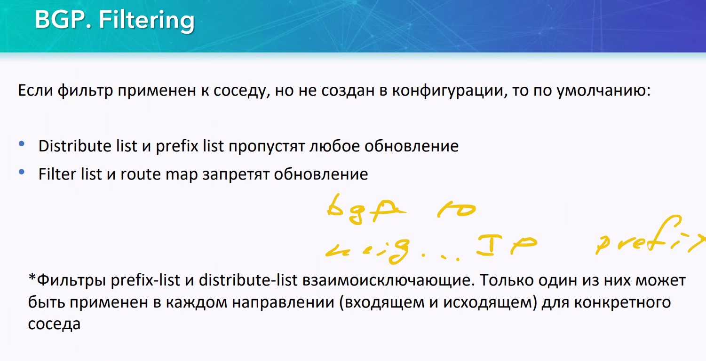
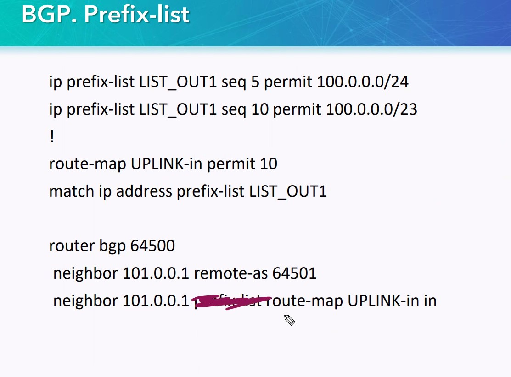
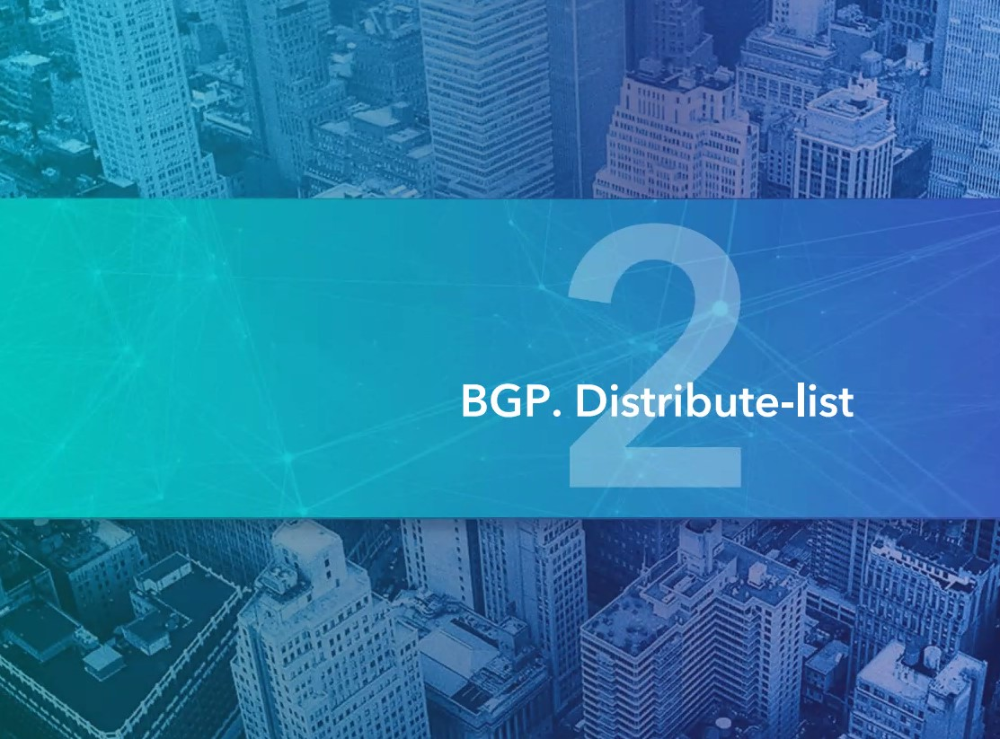
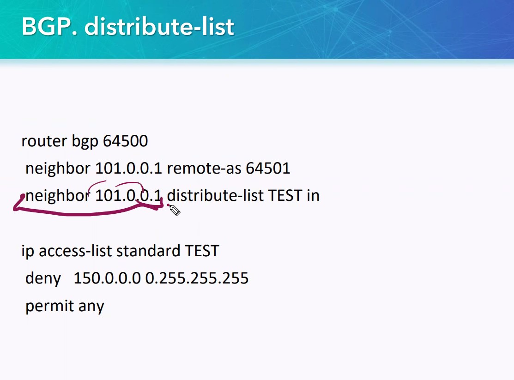
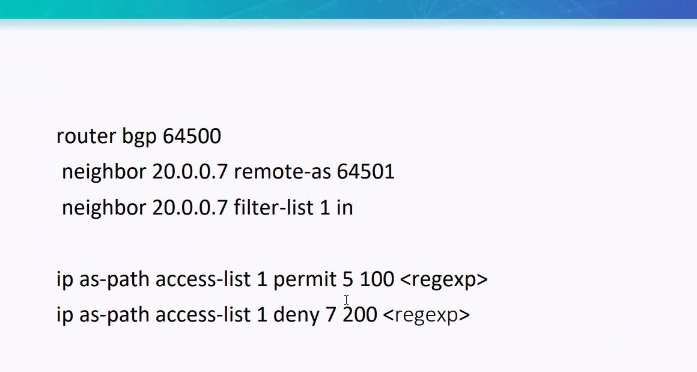
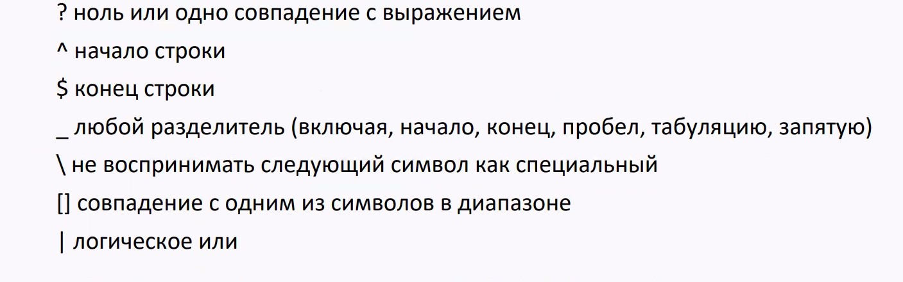
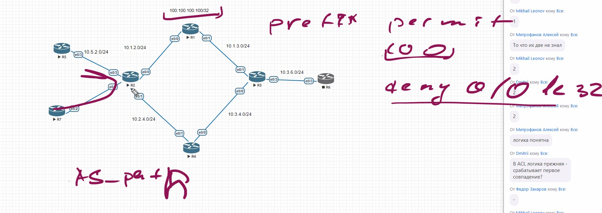

OTUS 20210528

# BGP. Advanced #

- Фильтрафия
- Управление маршрутов


Сегодня будем говорить про фильтрацию: 
- получение  входящих маршрутов от соседей
- фильтрация при отдаче маршрутов соседям


Итак, фильтрация в обе стороны:
- Distribution list
- Prefix list
- AS_PATH filter list - работает только дляфильтрации атрибута AS_PATH, в нем мы можем запретить какую-то AS
- Route map: не совсем для фильтрации, 
   - match
   - set



Фильтрация:
- может быть для peer-group, и это удобно.
- накладывается на UPATE-сообщения
- при изменении фильтров, на старых IOS (старее 15) необходимо очищать изменения (как и на виртуализации)


Таблица фильтров


необходимо тестировать, так как порядок срабатывания во входящих и исходящих фильтрах может отличаться от приведенного.

## Применение фильтрации ##



- сначала создаем листы, потом привязываем
- на входящие можно вешать prefix, на исходящие - distribute, вместе - нельзя.
- distribute - не используем

### Prefix-list ###
- создаются с шагом 5
- удалить можно весь ```no ip prifix-liusx XXX```


После создания preflist, настраиваем фильтрацию в контексте BGP:
- задаем соседа
- задаем коменду prefix-list с именем листа
- задаем направление фильтрации ___out___

Если prefix-list пустой, то фильтрации не будет и будет пропущено все, но если будет хоть один ACE, то в конце неявно будет установлен deny any.

Приведенный ACL будет:
- разделять трафик по маске 0/24 и 1/24 - обратный трафик будет идти по конкретному пути (разделение входящего  тарфика по левому и правому линкУ) - 25 маску уже нельзя. 24 маску в IPv6 - можно


С применением route-map:


 - сосед
 - route-map XXX
 - направление IN

 Разрешаем только апдейты от соседей 100.0.0.0/24 и 100.0.0.0/23

 Если надо будет использовать несколько prefix-list , то из маожно записать в один route-map. В нашем примере - надо дополнительно дописывать prefix-list

 ### Distributr-list ###



 Настройка аналогичная, но если ACL - сложный (wildcard), то можно запутаться - удобно его использовать для дебага.




### AS-PATH  ###


Конструкция - аналогичная



- сосед / название данного ACL XX
- разрешить или запретить
- регулярное выражение


ругелярки:



пример регулярки


## Практика ##

Блокировка трафика stub-зоны на R2, справа у которой iBGP



## Агрегация ##


