OTUS 20210528

# BGP. Attributes #


Виды атрибутов

- Хорошо известные (их знают все реализации BGP, и могут передаваться соседям как обязательно, так и передаваться только если реализация об этом атрибует знает)


- Опциональные (не обязательно все реализации BGP их нзанют, и могут передаваться, а могут и не передаваться)
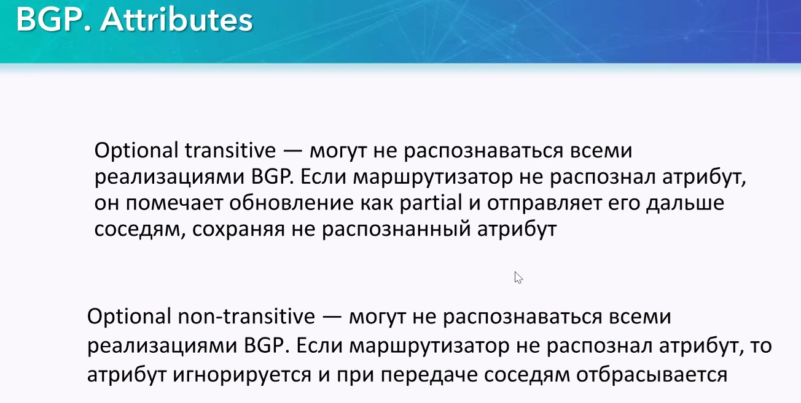

Итак, еще раз табличка:


## BGP Origin ##

Говорит о том, как откуда этот префикс взялся в материале для исходящих маршрутов
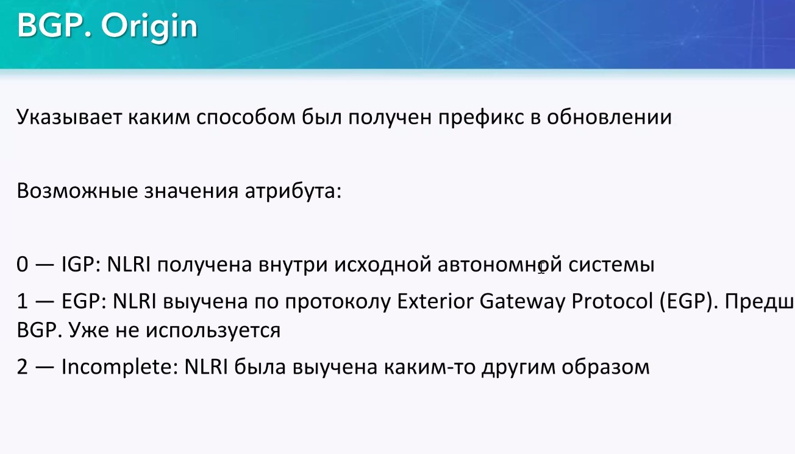


- 0 = i - входящий маршрут от IGP (маршруты. которые были заданы ключевым словом ```network```, или префикс транслировался с уже присвоенным атрибутом через нашу AS)
- 1 = e - входящий маршрут от EGP (этот протокол уже практически не используется)
- 2 = ? - BGP не уверен откуда этот маршрут

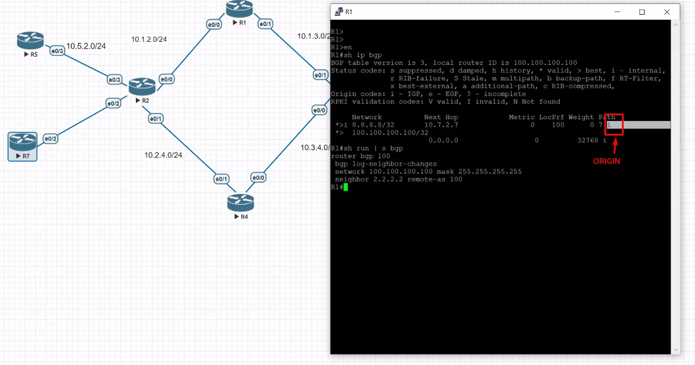

Также код можно задать вручную (как у входящего, так и у исходящего)

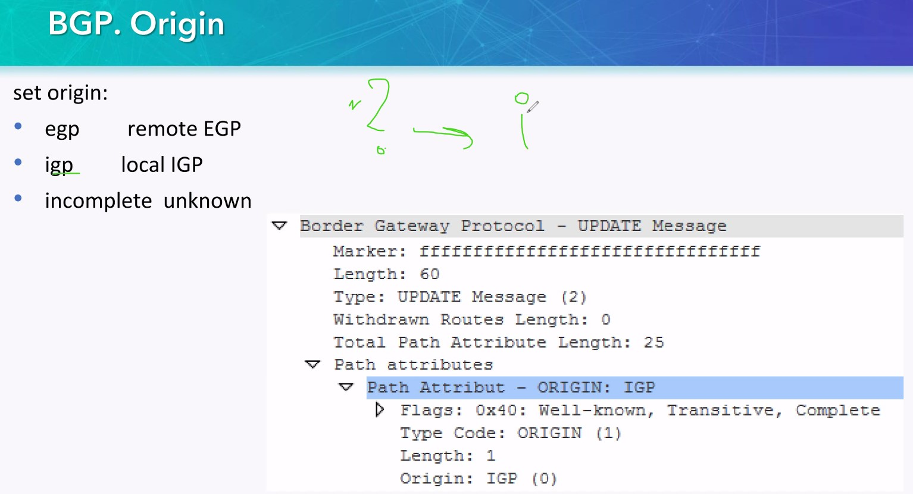

## BGP Aggregate ##

Необходимо, в случае возможной агрегации. Агрегация - значит что какой-либо набор подсетей находится за каким-либо пиром

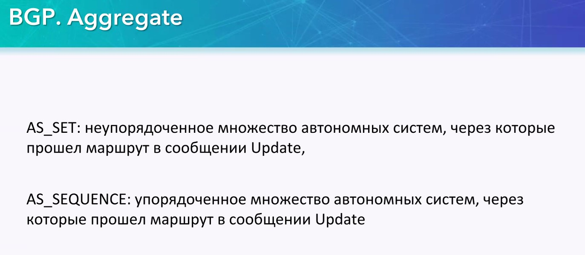

AS_SEQUENCE - Пиру даем понять, что запись AS необходимо воспринимать как последовательную запись AS, и это относится как к неагрегированному, так и к агрегированному AS-PATH

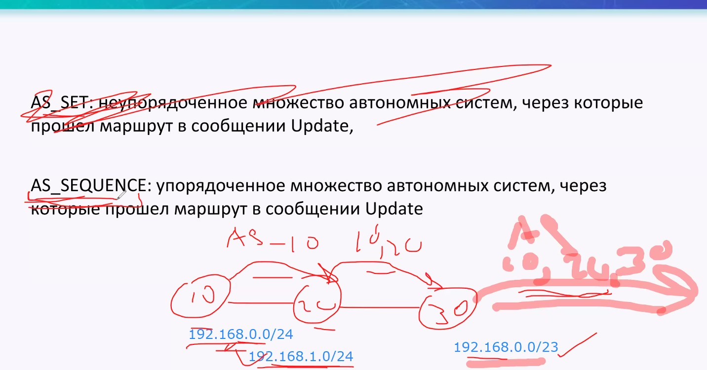

AS_SET - Возникает дополнительно к AS_SEQUENCE: даем пиру понять, что в агрегированном апдейте путь не может быть точным, так как специфик пути возможно располагаются параллельно.


Настройка

Выполняется в контексте BGP


as-set - всегда задается вручную, но только для тех апдейтов, которые не содержат суммарного маршрута, там это просто не сработает. Агрегируют магистральные провайдеры

summary-only - анонс суммарного маршрута, без специфичных маршрутов


## Atomic Aggregate/AGGREGATOR ##

помимо AS-Path, в UPD с агрегацией направляется флаг, который говорит что была агрегация. 


В связку с atomic aggregate устанавливается атрибут ___AGGREGATE___. В этом случае видно: кто произвел агрегацию

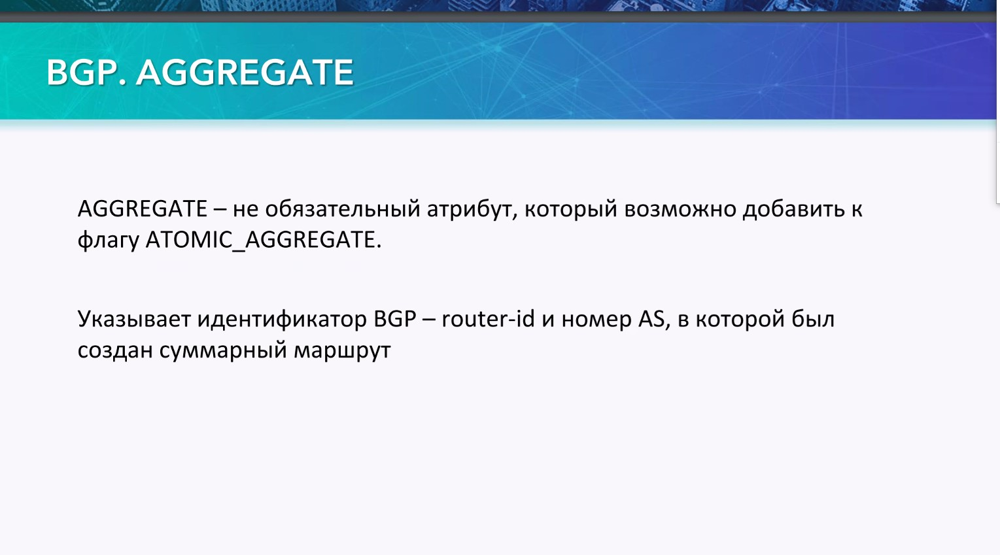

## MED [Multi Exit discriminator]  ##
___Опциональный & нетранзитивный___, только между пирами разных AS (сосед не передает MED соседа своему соседу), то есть передача MED через AS не разрешена, срезается автоматически.  Аналог веса/приоритета в IGP. Рекомендуется не использовать данный атрибут. По-умолчанию MED = 100. Чем меньше, тем - лучше. Сравнивается этот атрибут, только если он получен из одной и той же AS

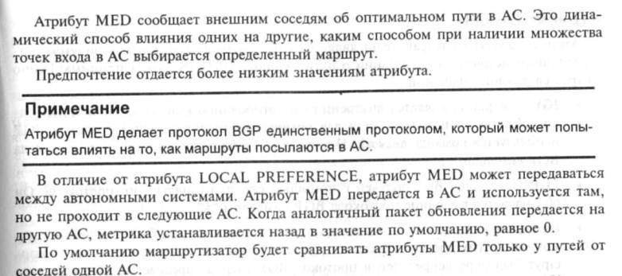


Local Preference - приоритетнее MED и если на входе AS34 он будет задан, то на MED никто внимания не обратит.

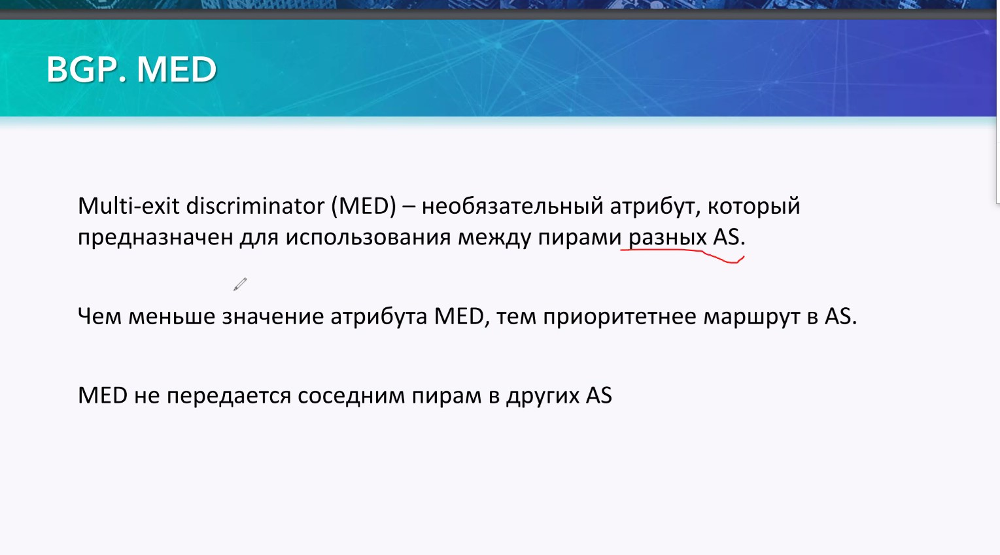


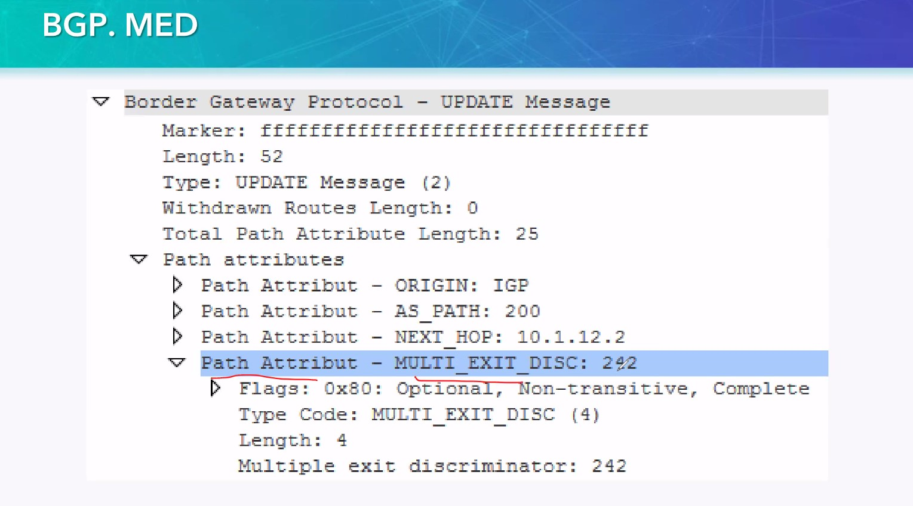

Настройка

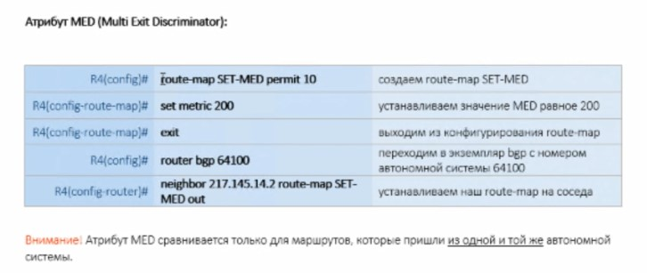

## WEIGHT ##

Необязательный (нет в таблице атрибутов), специфичный для Cisco, локальный для каждого R. Необходим для приоритезации префиксов. Настраивается только локально, не передается соседям ни iBGP, ни eBGP. Надо настраивать на всех R, где необходимо. Чем больше - тем лучше (аналог: статический маршрут всегда выиграет у динамического машрута). по-умолчанию вес принимаемого маршрута ___0___

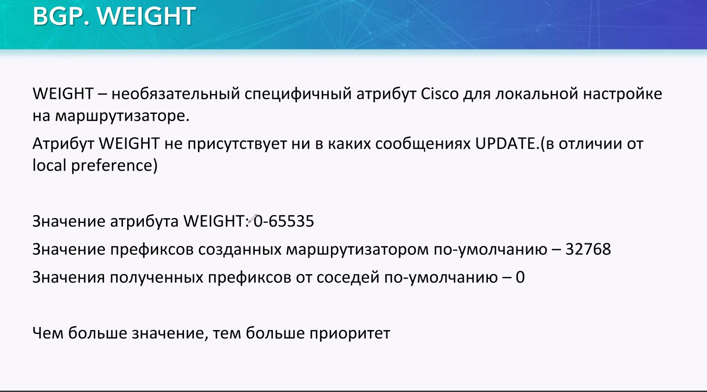

weight 
- маршрута заданного network = 32768
- полученного от соседа = 0

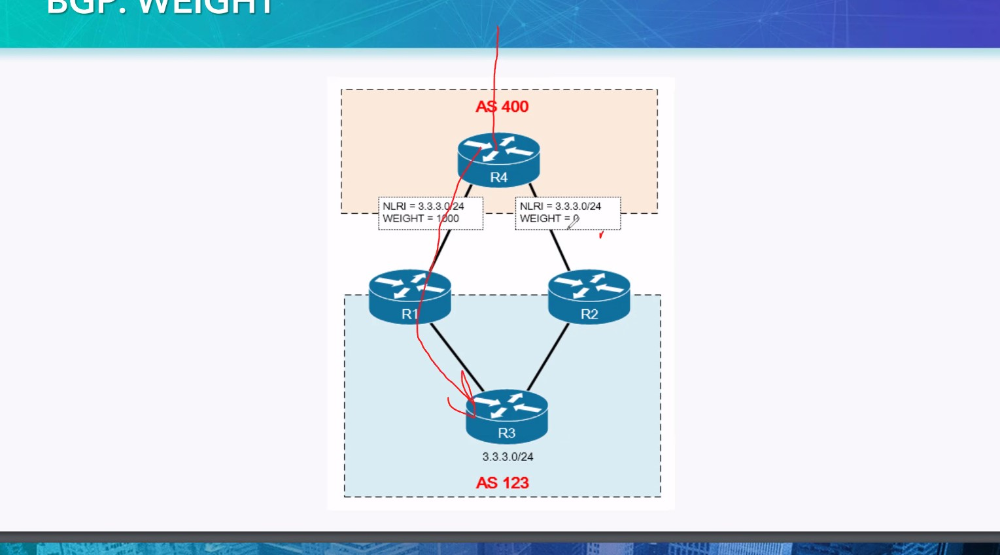


Для задания надо:
- проверить через какого nei мы получаем маршрут до более приоритетной AS (скажем с этой AS у нас широкий 40Gbit канал).
- задать ___на всех R нашей AS___ ```weight``` данного соседа - 
- сделать сброс
```
neighbor 50.0.1.1 weight 100
do clear ip bgp 50.0.1.1
```

Результат - значения в таблице BGP и новая таблица маршрутизации (в таблицу маршрутизации был вброшен маршрут помеченный как '<'). Причем WEight 100 получили все маршруты, которые прилетели от данного соседа.


Еще вариант задачки, когда веса отличаются для разных подсетей назначения

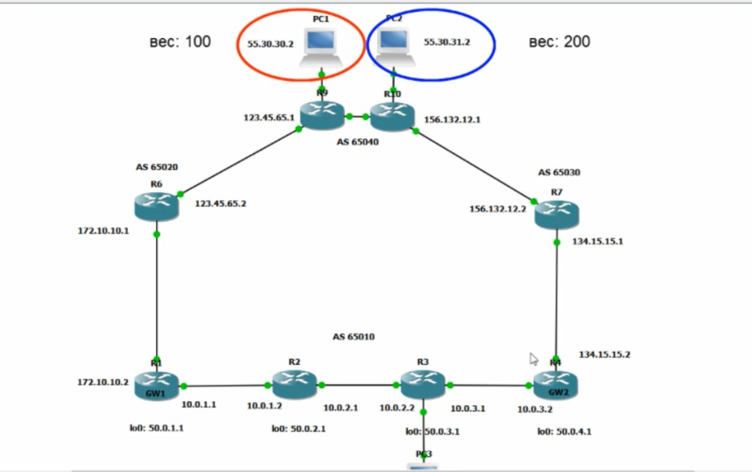

Решить эту задачку помогут ```route-map```


Так делают ```route-map``` в OSPF


А так будет сконфигурирован route-map, который входящему с соседа 50.0.1.1 префиксу 55.30.30.0/24 задаст вес 150:
- задаем prefix-list ___WEIGHT___
- задаем route-map 
   - 10 условие - на совпадение WEIGHT
   - 20 условие - на все другие маршруты
- вешаем route-map на neighbor 50.0.1.1

```
ip prefix-list WEIGHT seq 5 permit 55.30.30.0/24

route-map MAP1 permit 10
match ip address prefix-list WEIGHT

set weight 150

route-map NAP1 permit 20
set weight 0

router bgp 65010
neighbor 50.0.1.1 route-map MAP1 in
```

Допустим надо направить трафик до:
- 55.30.30.2 через левую ветку
- 55.30.31.2 - через правую
То надо собрать route-map следующим образом:

```
ip prefix-list WEIGHT-L seq 5 permit 55.30.30.0/24
ip prefix-list WEIGHT-R seq 5 permit 55.30.31.0/24

route-map LEFT permit 10
match ip address prefix-list WEIGHT-L
set weight 150
route-map LEFT permit 30
set weight 0

route-map RIGHT permit 10
match ip address prefix-list WEIGHT-R
set weight 150
route-map RIGHT permit 30
set weight 0

R5
router bgp 65010
neighbor 50.0.4.1 route-map RIGHT in

R6
router bgp 65010
neighbor 50.0.1.1 route-map LEFT in
neighbor 50.0.4.1 route-map RIGHT in

R7
router bgp 65010
neighbor 50.0.1.1 route-map LEFT in
neighbor 50.0.4.1 route-map RIGHT in

R8
router bgp 65010
neighbor 50.0.1.1 route-map LEFT in
```

## Community ##
DM 02:38:03