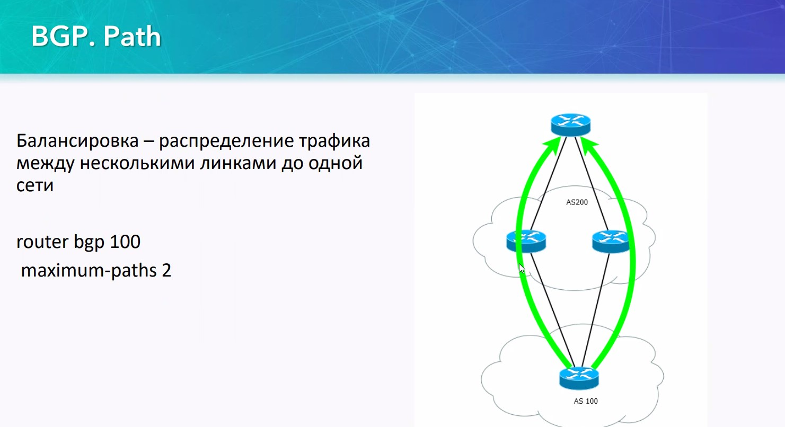
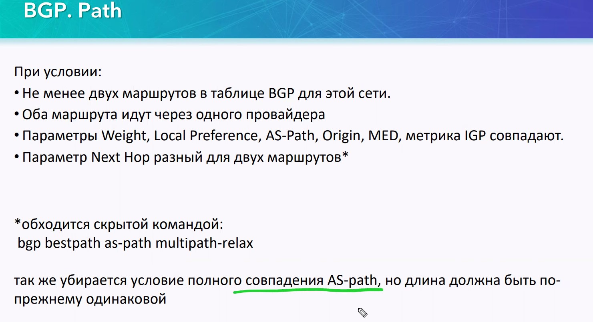
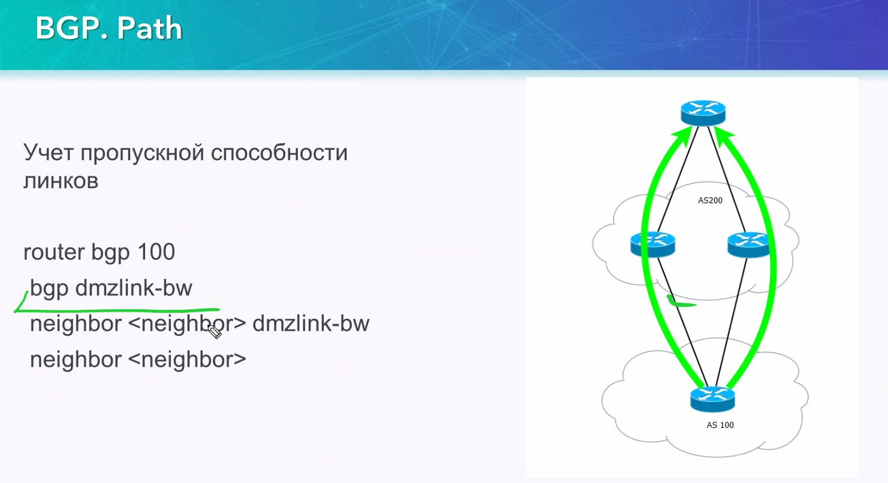
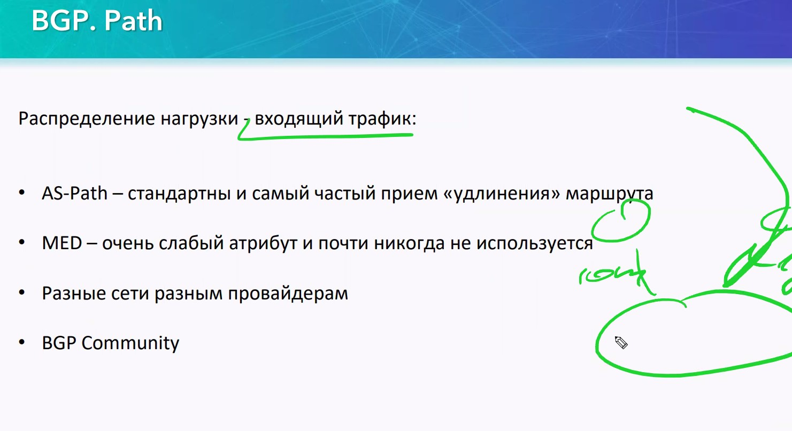

OTUS 20210528

# BGP. Path #


Анонсируем сеть 100.0.0.0/23 из AS 64500. так как маршрутов много, падение пути - не вызовет польного отказа доступности анонсируемой подсети


## критерии выбора маршрута для таблицы маршрутизации ##


1. Weight - работает по-умолчанию
2. next-hop: connected - самый лучший маршрут, поэтому выигрывает
3. local preference - для всей AS. самый приоритетный атрибут, но работает только в iBGP.
4. AS_PATH - работает для eBGP, для iBGP - AS - одна
5. Origin Code - откуда был получен префикс
   5.1 - IGP (вну. прото маршр-ции в  одной AS)
   5.2 - EGP - старый, не встречается
   5.3 - incomplete - если ничего другого не сработало
6. MED - распространяется мажду соседими AS
7. eBGP лучше, чем iBGP (iBGP может создавать лишнюю петлю):
   - AD eBGP 20
   - AD iBGP 190
8. Выбор пути через ближайшего IGP-соседа (тут речь идет про OSPF или другие протоколы) - надо задать дополнительно ```maximum path```

Если все совпало:


- Взять самый старый маршрут eBGP (для iBGP не работает)
- Использовать маршрут чреез пира с минимальным BID
- Использовать соседа с минимальным IP

## Балансировка ##



настройка 
```
router bgp 100
maximum-path <2-32>
```
32 - у старших моделей

Балансировка будет хорошо/предсказуемо работать, если
- Есть несколько маршрутов в таблице BGP
- Оба маршрута через одного ISP. Если у ISP разные AS, но на некоторых моделях можно включить балансировку ```bgp bestpath as-path multipath-relax```
- Все параметры должны совпадать
- Next-hop должен быть разным



Учет пропускной способности линкОв для балансировки:



```
router bgp 100
bgp dmzlink-bw
neighbor <IP> dmzlink-bw
neighbor <IP>
```
требуется доп. настройка BW на IF

## Распределение нагрузки ##



Для управления входящим трафиком:
- дополнительно добавляем в PATH, удлинняя его чтобы вышестоящий провайдер думал что этот путь хуже
```
route-map AS-PEER permit 10
 set as-path prepend 100 100 100 100 100

router bgp 100
 neighbor 1.1.10.2 remote-as 2
 neighbor 1.1.10.2 route-map AS-PREP out
```
Чаще уже провайдеры блокируют этот способ

- MED - смотрели
- разные сети
- BGP Community - посмотрим на лабе

## BGP Group Template ##

Вводитькоманды надо для каждого пира


Заменить эти команды можно:


Этим самым мы формируем 1 таблицку Adj-RIB-OUT и копируем для всех соседей, что экономит ресурсы.

На случай, когда требуется выделить какого-то одного пира из всей группы, придумали:


- template peer-session - создание шаблона для первого этапа, установки пиринга
- peer-policy - логика update

