OTUS 20210525

# BGP #

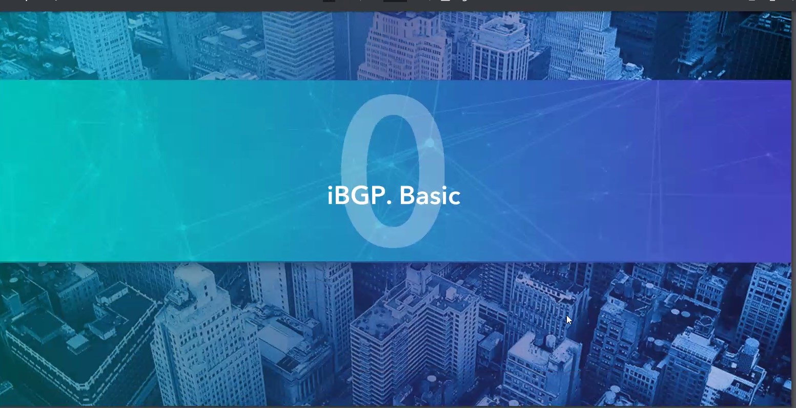

iBGP нужен:
- фильтрация транзитных маршрутов
- резервирование линков к нескольким ISP
- подключение клиента с несколькими R

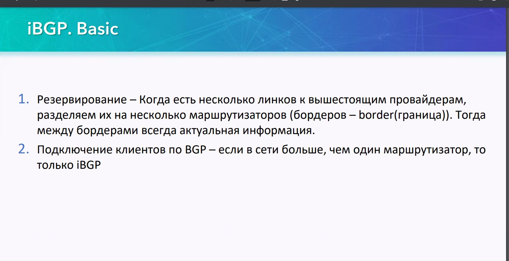


## iBGP advanced ##
различия iBGP и eBGP
- не работает AS-Path
- не меняется адрес следующего хопа


- full-mesh используется обязательно
- возможно подключение через R с ненастроенным BGP

Кольцо маршрутизации в iBGP - может привести к тому, что трафик идущий против потока обновлений может зациклиться. Полносвязная топология исключит линки, которпые могут вызвать зацикливание


пунктир - виртуальные сессии между соседями, за счет того что работает ip-свзяность между ВСЕМИ R


## iBGP, next-hop ##

В iBGP next-hop  как правило задается на GW, указывая его самого как  адрес выхода из AS, что может вызвать проблемы:
- внутри iBGP next-hop не меняется и R, которые получат анонс подсети могут не знать маршрут до ISP.

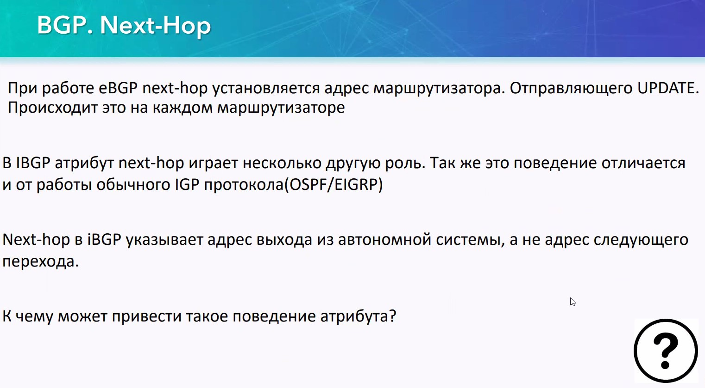


___Выход___
- статика
- объявление next-hop-self себя самого (адрес ISP GW подменяется на ip того роутера, который является промежуточным/соседом) ___ip___ - ip-адрес соседа, как при настройке BGP. Чаще всего используется на бордерах, которые объявляют себя GW для всех остальных RRRR в iBGP AS.


## Multihop ##

Смотри лекцию 22. Поднятие соседства через промежуточный R, и через Lo IF


Префиксы Lo1 доступны через lo 0, но трафика между L1 не будет:
- некорректно указано обратный маршрут на R2
- R2 не знает никаких, кроме обознченных маршрутов, а iBGP - не способ построения туннеля, а способ предоставления информации о маршрутах, поэтому трафик между L1 - не пойдет

Выход из этой запутанной ситуации - поднять соседство всех со всеми ___full-mesh___. Рекомендуется соседство строить Lo, так как он постоянно включен. При этом надо на забыть
```
neigh <ip> update-source lo0
```

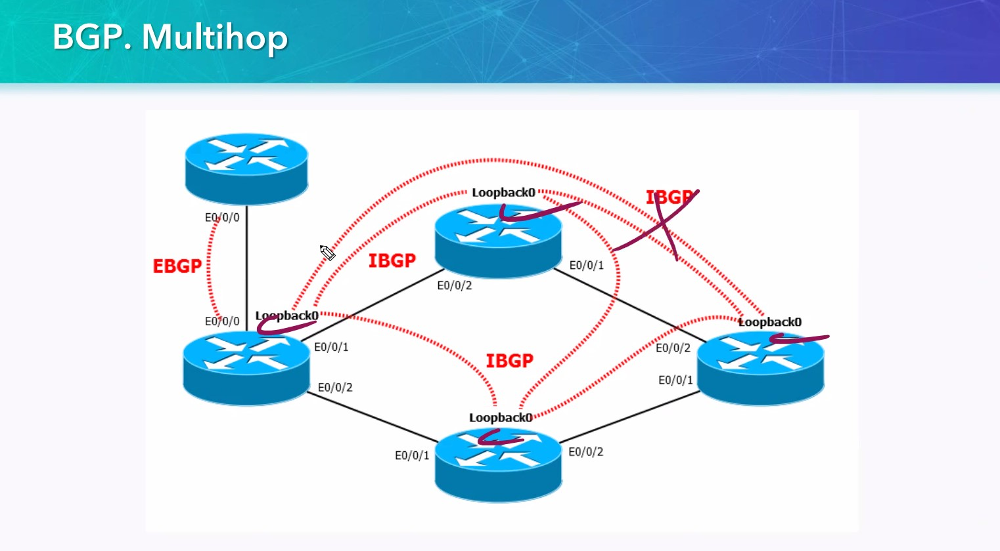

Для eBGP можно аналогично вклчить соседство через неработающих R, с аналогичными проблемами.

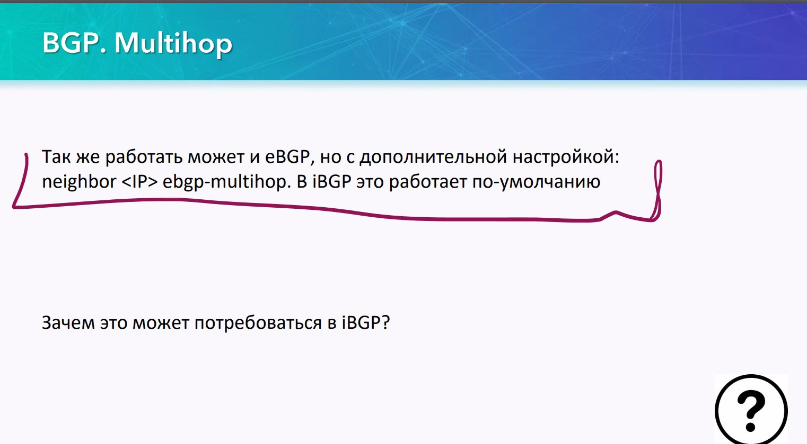

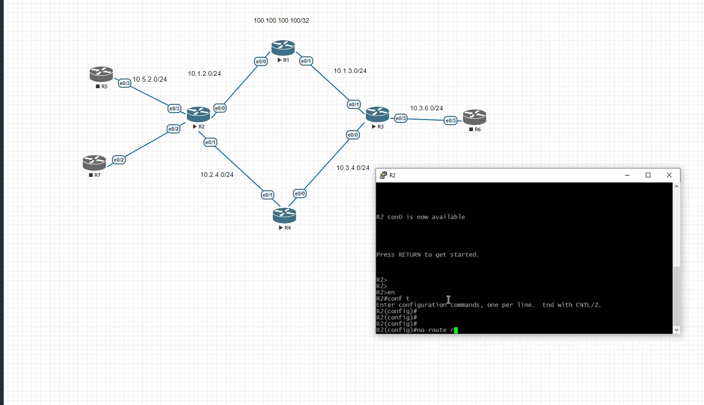


## Route Reflector ##

СМ конфиг R23 [04-R23](/LECTURES/MODULE03/Lecture24/labs/configs/04-R23.txt)


___Reflector___ - аналог DR OSPF, он служит чтобы все R устанавливали iBGP-сессию с ним
- RR-client - тот кто работает по правилам RR
- non RR-client - тот кто работает по равилам iBGP


На RR-server приходят 3 типа UPD
- 1 тип - от eBGP-соседа (между соседями такого upd нет)
- 2 тип - для non RR-server - перенаправляется RR-server на своих соседей.
- 3 тип - от RR-Client на всех остальных, с кем есть соседство
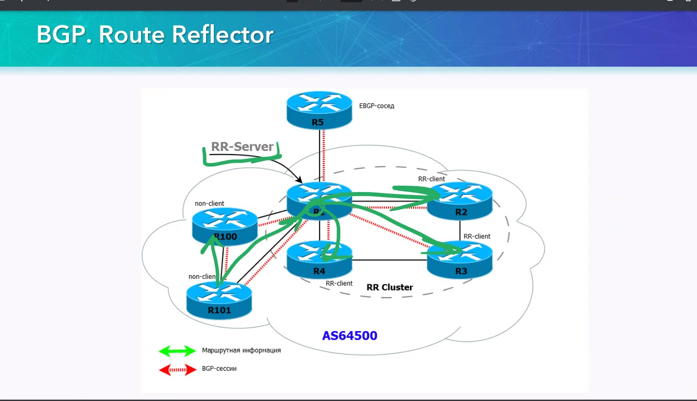

Можно и так:

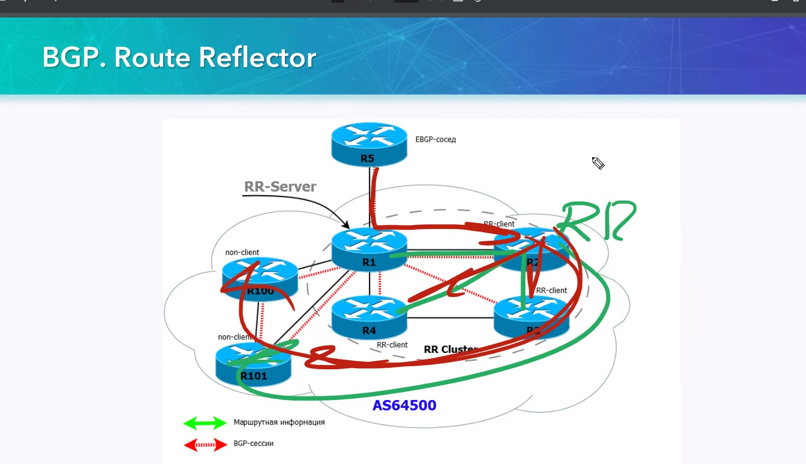

Если RR упадет, то все может развалиться и рекомендуется 2 RR

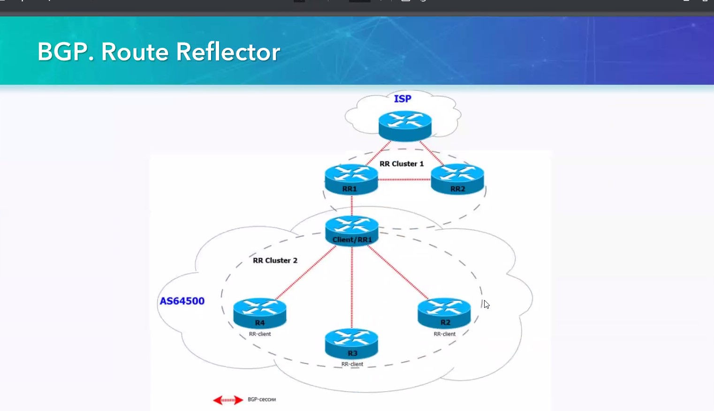
Понятие клиента и не-клиента, может быть дополнено тем, что R может одновременно совмещать в себе несколько ролей, и RR - образует некий кластер, в котором он является RR-server

При работе RR может возникнуть петля. Чтобы этого избежать, нужно использовать параметр ___originator ID___, в нем указывается ID клиента и при получении пакета с 

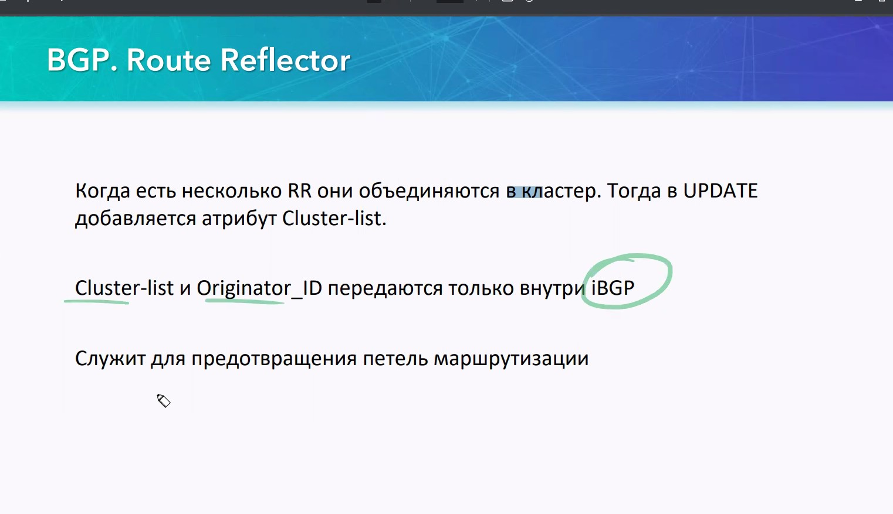

Также надо использовать cluster-list чтобы избежать петель

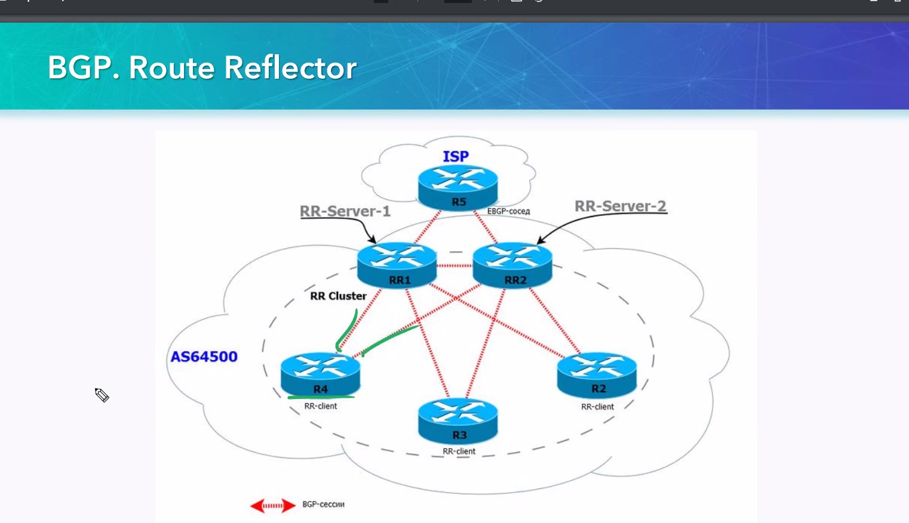

Когда несколько кластеров:


1. Cluster_list - режет петли между кластерами
2. Originator-ID - режет петли в кластере

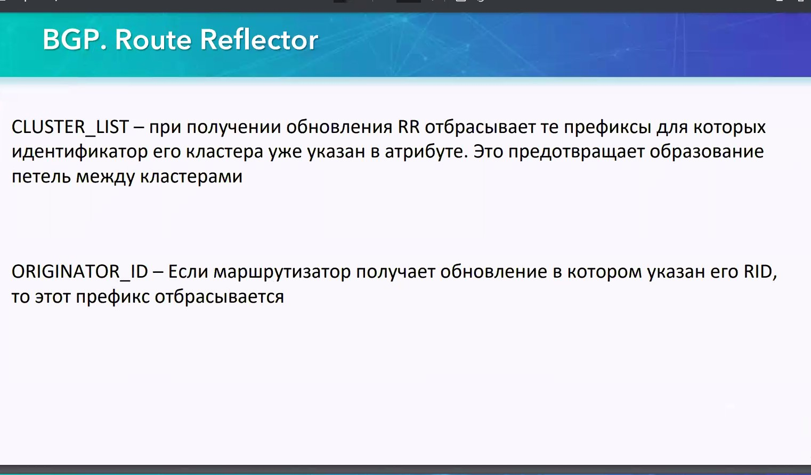