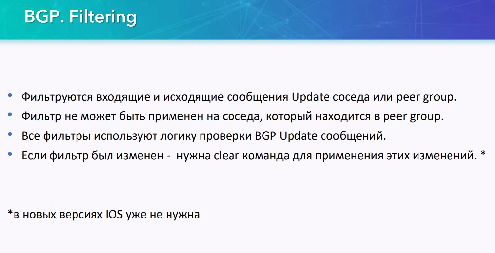
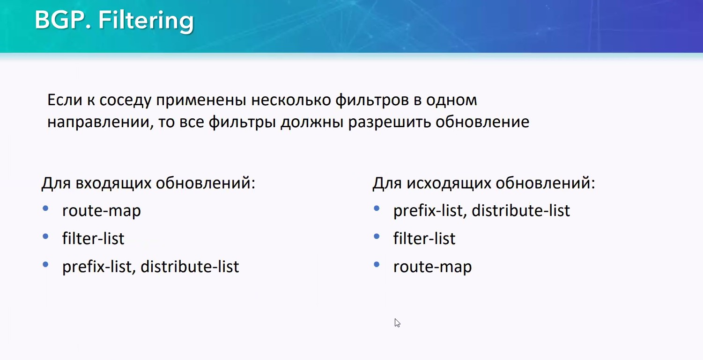
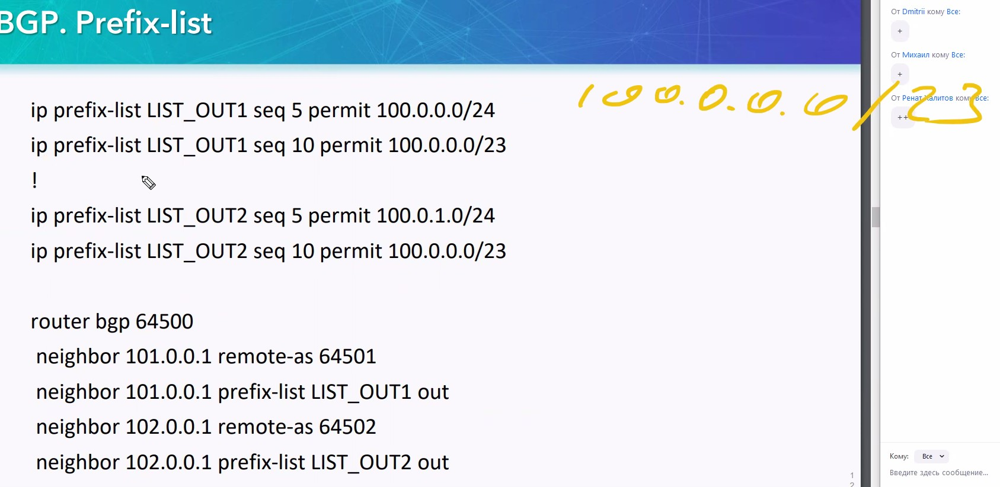
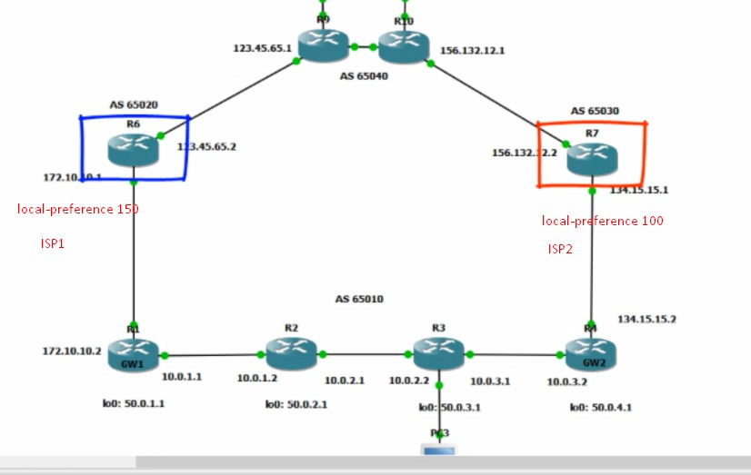
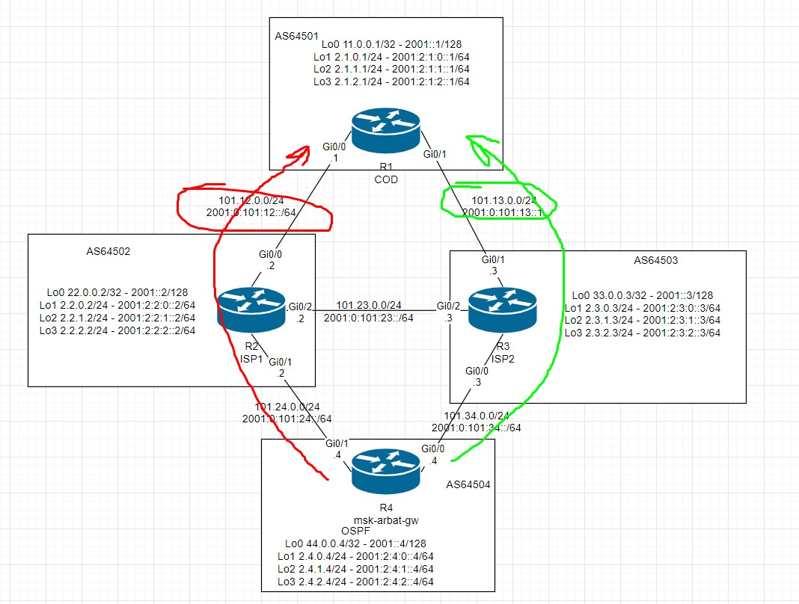
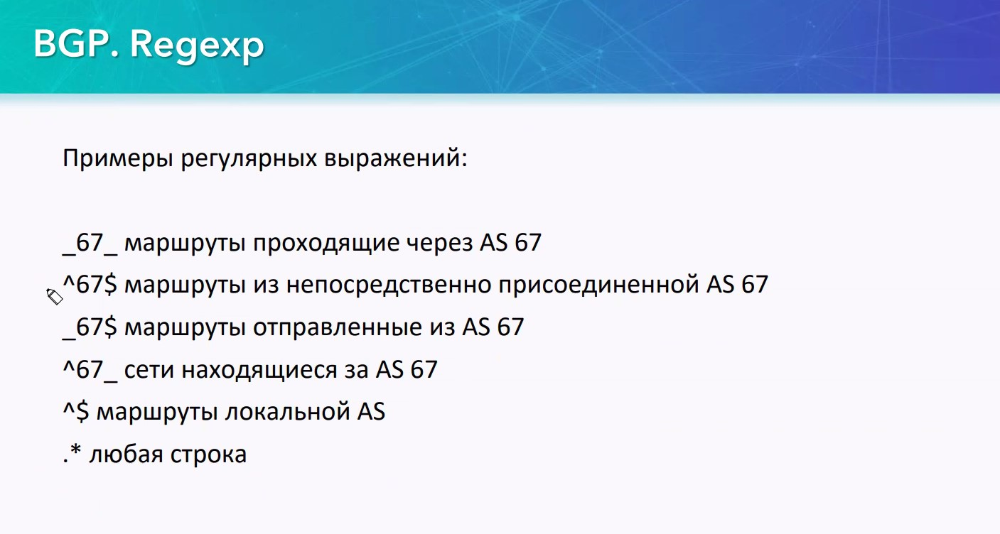
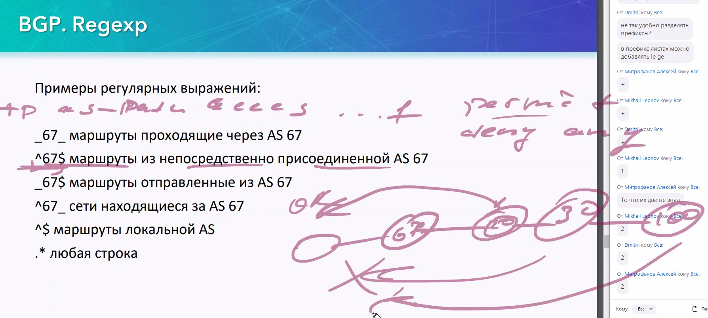
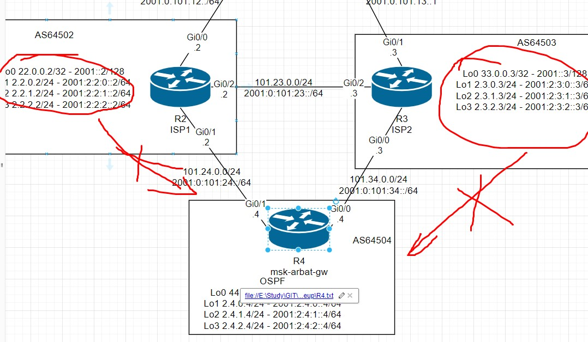
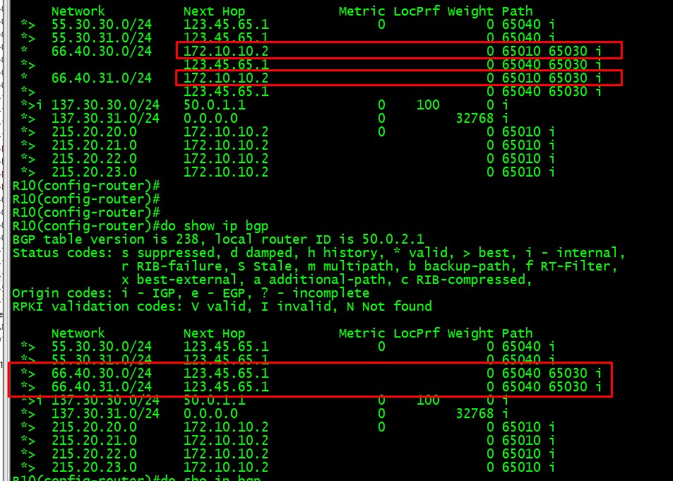

OTUS 20210528

# BGP. Advanced #

- Фильтрафия
- Управление маршрутами


## Фильтрафия ##
Сегодня будем говорить про фильтрацию: 
- получение  входящих маршрутов от соседей
- фильтрация при отдаче маршрутов соседям

Фильтрация крайне необходима, если мы хотим работать без аварий, например:
- без фильтрации наша AS может стать транзитной зоной (можно попасть на деньги при транзите чужого трафика через дорогие линкИ)
- можно легко огрести full-view и наш R тупо сдохнет
- легко заанонсировать 0.0.0.0 пришедший от ISP1 на другого - ISP2. 

Поэтому анонсировать надо только префиксы, которые зародились, доступны в нашей AS, трафик сетей, который генерируется у нас:
- сети наших клиентов
- сети наших партнеров, с которыми у нас бесплатный пиринг/стык
- наша собственная AS, у которой хозяин - наша организация (провайдеро-независимые адрса). Не каждый провайдер захочет с нами пириться: с его стороны все пиринги давно настроены админами, которые уже уволились )))


Итак, фильтрация в обе стороны:
- Distribution list
- Prefix list - фильтрация конкретных сетей в направлениях IN/OUT (на соседа/к соседу). Используем тогда, когда ___точно знаем___ что будем фильтровать. То есть знаем точный префикс.
- AS_PATH ACL - более емкий способ, работает для фильтрации атрибута AS_PATH, в нем мы можем разрешить/запретить какую-то AS или даже вообще все префиксы, которые не генерим мы сами.  
- Route map: не совсем для фильтрации, 
   - match
   - set


Фильтрация:
- может быть для peer-group, и это удобно.
- накладывается на UPATE-сообщения
- при изменении фильтров, на старых IOS (старее 15) необходимо очищать изменения (как и на виртуализации)



Таблица фильтров


необходимо тестировать, так как порядок срабатывания во входящих и исходящих фильтрах может отличаться от приведенного.

## Применение фильтрации ##


- сначала создаем листы, потом привязываем
- на входящие можно вешать prefix, на исходящие - distribute, вместе - нельзя.
- distribute - не используем

### Prefix-list ###
Префикс-листы – это просто привычные нам сеть/маска, и мы указываем разрешить такие маршруты или нет.
- автоматически создаются с шагом 5 (последний - неявный ACE deny any), выбираем префикс или несколько, которые надо разрешить или запретить
- удалить можно весь prefix-list командой ```no ip prifix-list XXX```

Синтаксис команды:
```
ip prefix-list {list-name} [seq {value}] {deny|permit} 
{network/length} [ge {value}] [le {value}]
```
- ___list-name___ – название списка. Ваш КО. Обычно указывается, как ___name_in или name_out___. Это подсказывает нам на входящие или исходящие маршруты будет действовать (но, конечно, на данном этапе никак не определяет).
- ___seq___ – порядковый номер правила (как в ACL), чтобы проще было оперировать с ними.
- ___deny/permit___ – определяем разрешать такой маршрут или нет
- ___network/length___ – привычная для нас запись, вроде, 192.168.14.0/24.
- ___ge или le___ - Как и при настройке NAT, это означает «greater or equal» и «less or equal». То есть вы можете задать не только один конкретный префикс, но и их диапазон.
   - ```0.0.0.0/0 le 32``` - означает любые подсети с любой длиной маски (меньшей или равной 32 (0-32))
   - ```ip prefix-list NetDay_OUT permit 10.0.0.0/8 ge 10 le 16```- выберет следующие маршруты:
10.0.0.0/10, 10.0.0.0/11, 10.0.0.0/12, 10.0.0.0/13, 10.0.0.0/14, 10.0.0.0/15, 10.0.0.0/16

На картинке пример хитрого разрешения анонсов ISP-пирам 101.0.0.1 и 102.0.0.1 только указанных подсетей, в результате чего произойдет разделение трафик по маске 0/24 и 1/24 - обратный трафик будет идти по конкретному пути (разделение входящего  тарфика по левому и правому линкУ) - 25 маску уже нельзя. 24 маску в IPv4 - можно


Еще раз повторим приведенный механизм настройки фильтрации в контексте BGP: 
- Задаем pref-list
- Входим в контекст BGP ipv4/ipv6 
- neighbor сопоставляем ```prefix-list <list>``` в направление фильтрации
   - ```in```
   - ```out```

Если prefix-list пустой, то фильтрации не будет и будет пропущено все, но если будет хоть один ACE, то в конце неявно будет установлен deny any.


Еще пример:
R5
```
ip prefix-list ALLOW_ACCESS seq 5 permit 215.20.22.0/24

router bgp 65010
neighbor 172.10.10.1 prefix-list ALLOW_ACCESS out

do clear ip bgp 172.10.10.1 out
```

в результате чего в исходящую таблицу BGP из 172.10.10.2 анонсируется только префикс 215.20.22.0. Если применить аналогичный prefix-filter и на R8, то все префиксы кроме разрешенного пропадут из BGP-анонсов.


При этом если другой пир, который может знать этот маршрут - будет его отдавать и может понадобится дополнительная фильтрация и на этого пира, чтобы наш маршрутизатор, получив такой анонс, не добавил маршрут в свою BGP-таблицу.

### Prefix-list + route-map ###

Для клиента, который пирится с провайдером и которому не нужен full-view. Чтобы не задымиться от прилетающего full-view. Это более навороченный и усовершенствованный способ - с применением route-map:
- фильтрация 0.0.0.0 от конкретной AS
- перебивание редистрибученного (incomplete) маршрута и
- перебивание next-hop (например подменить R5 на R7)
- перебивать AS-PATH
- менять Local Preference
- делать практически все, что угодно

Синтаксис:
```
route-map {map_name} {permit|deny} {seq} 
  [match {expression}]
  [set {expression}]
```
- map_name – имя карты
- permit/deny – разрешаем или нет прохождение данных, подпадающих под условия route-map
- seq – номер правила в route-map
- match – условие подпадания трафика под данное правило.
- expression
   - Критерий - Команда конфигурации
   - Network/mask - match ip address prefix-list
   - AS-path - match as-path
   - BGP community - match community
   - Route originator - match ip route-source
   - BGP next-hop address - match ip next-hop
- set – что сделать с отфильтрованными маршрутами expression:
   - AS path prepend - set as-path prepend
   - Weight - set weight
   - Local Preference - set local-preference
   - BGP community - set community
   - MED - set metric
   - Origin - set origin
   - BGP next-hop - set next-hop

На примере ниже, разрешаем только апдейты о входящем направлении от соседей 100.0.0.0/24 и 100.0.0.0/23


 - сосед
 - route-map XXX
 - направление IN

Если надо будет использовать несколько prefix-list , то их можно записать в один route-map. В нашем примере - надо дополнительно дописывать prefix-list

 Пример: настроим наши border's так, чтобы левый ISP1 - 150, правый ISP2 - default (100), тем самым по-умолчанию трафик пойдет через левый ISP1. Используем Local Preference: чем выше значение параметра, тем выше приоритет маршрута.




```
### Разрешим префиксы от AS 65020
ip as-path access-list 1 permit ^65020$

### Создаем prefix-list (ACL)
ip prefix-list DEFAULT-ONLY seq 10 permit 0.0.0.0/0
ip prefix-list DEFAULT-ONLY seq 20 deny 0.0.0.0/0 le 32

### Создадим route-map на 2 условия, в результате выполнения local-preference станет 150. А если просот прилетит нулевка, то local-preference не трогать - это делается для BORDER R8-ISP2

route-map FILTER-DEFAULT permit 10
 match ip address prefix-list DEFAULT-ONLY
 match as-path 1
 set local-preference 150

 route-map FILTER-DEFAULT permit 20
 match ip address prefix-list DEFAULT-ONLY

### Вешаем на соседа R5-ISP1
router bgp 65010
neighbor 172.10.10.1 route-map FILTER-DEFAULT in

### Вешаем на соседа R8-ISP2
router bgp 65010
neighbor 172.10.10.1 route-map FILTER-DEFAULT  in

### На ISP1, ISP2 должен быть анонсирован префикс 0.0.0.0
router bgp XXXX
network 0.0.0.0 mask 0.0.0.0

и объявлен статический маршрут
ip route 0.0.0.0 0.0.0.0 null0
```

Результат:


Правда чтобы добиться симметричности обратного маршрута пришлось потравить AS-PATH из R8, что не очень правильно (2_AS-PATH_Route-MAP.txt), как мне кажется.

Еще пример:



```
ip prefix-list LEFT_IN seq 5 permit 101.12.0.0/24
ipv6 prefix-list LEFT_IN_v6 seq 5 permit 2001:0:101:12::/64


ip prefix-list RIGHT_IN seq 5 permit 101.13.0.0/24
ipv6 prefix-list RIGHT_IN_v6 seq 5 permit 2001:0:101:13::/64

route-map ISP1_IN permit 10
match ip address prefix-list LEFT_IN
set local-preference 50
route-map ISP1_IN permit 20
set local-preference 100
exit

route-map ISP2_IN permit 10
match ip address prefix-list RIGHT_IN
set local-preference 50
route-map ISP2_IN permit 20
set local-preference 100
exit

route-map ISP1_IN_v6 permit 10
match ipv6 address prefix-list LEFT_IN_v6
set local-preference 50
route-map ISP1_IN_v6 permit 20
set local-preference 100
exit

route-map ISP2_IN_v6 permit 10
match ipv6 address prefix-list RIGHT_IN_v6
set local-preference 50
route-map ISP2_IN_v6 permit 20
set local-preference 100
exit


router bgp 64504
 address-family ipv4
  neighbor 101.24.0.2 route-map ISP2_IN in
  neighbor 101.34.0.3 route-map ISP1_IN in
 exit-address-family
 address-family ipv6
  neighbor 2001:0:101:24::2 route-map ISP2_IN_v6 in
  neighbor 2001:0:101:34::3 route-map ISP1_IN_v6 in
 exit-address-family
```
Объяснение:
- Задали prefix-list ipv4 и ipv6, которым выделили интересующие левые и правые аплинки COD. В конце ACL неявное deny для остального. То есть под действие route-map подпадут 101.12.0.0/24 и 2001:0:101:12::/64 соответственно.
- В созданных картах маршрутов ISP1_IN мы разрешили прохождение маршрутной информации (permit), подпадающей под созданный prefix-list (match ip address prefix-list LEFT_IN). Для этих анонсов установим local preference в 50 – ниже, чем стандартные 100 (set local-preferеnce 50). То есть они будут менее «интересными».
- В конечном итоге привяжем карты к конкретным BGP-соседям в адресном пространстве ipv4 и ipv6 (neighbor 101.24.0.2 route-map ISP2_IN in и т.д.).

 ### Distribute-list ###


 Настройка аналогичная, но если ACL - сложный (wildcard), то можно запутаться - удобно его использовать для дебага.


### AS-PATH ACL (access-list) ###


Конструкция - аналогичная
- сосед / название данного ACL XX
- разрешить или запретить
- регулярное выражение


регулярки:


пример регулярки




- ```.``` - любой символ, включая пробел
- ```*``` - ноль или больше совпадений с выражением
- ```+``` - одно или больше совпадений с выражением
- ```?``` - ноль или одно совпадение с выражением
- ```\``` - не воспринимать следующий символ как специальный
- ```[ ]``` - совпадение с одним из символов в диапазоне
- ```|``` - логическое или
- ```^$``` - атрибут AS-PATH - пустой, то есть только локальные маршруты, которые зародились в нашй AS
- ```_``` - пробел либо другой разделитель: 
   - ```_65030$``` - все префиксы у которых AS-PATH, заканчиваются на 65030; 
   - ```_200_``` - Маршруты проходящие через AS200
   - ```^200_``` - Префиксы прошедшие за AS 200
- ```$``` - конец строки
   - ```_200$``` - префиксы, которые прилетели к нам откуда угодно, но у которых родительская AS200
- ```^``` - начало строки: 
   - ```^65030$``` - все префиксы, из соседней AS, у которых AS-PATH четко 65030



Например надо отфильтровать входящие маршруты от AS64501, AS64503 которые зародились в самих AS64501, 64503. Иными словами срежем анонсы от самих соседей R2, R3. Таким образом получим все транзитные интернетовские маршруты, но не будем получать локальные.



Настройка нашего R 4 (конфиг file://E:\Study\GIT\Myotus-networks\LECTURES\MODULE03\Lecture23\labs\configs_BGP_linkmeup\R4.txt):
```
ip as-path access-list 123 deny ^64502$
ip as-path access-list 123 deny ^64503$
ip as-path access-list 123 permit .*

router bgp 64504
 address-family ipv4
  neighbor 101.24.0.2 filter-list 123 in
  neighbor 101.34.0.3 filter-list 100 in
 exit-address-family
 address-family ipv6
  neighbor 2001:0:101:24::2 filter-list 123 in
  neighbor 2001:0:101:34::3 filter-list 100 in
 exit-address-family
```

Еще пример, настройка R5 - запрет локальных исходящих префиксов:
```
### ip as-path с регуляркой
ip as-path access-list 1 permit ^$

### вешаем фильтр на исходящие анонсы в сторону нужного соседа-ISP
router bgp 65010
neighbor 172.10.10.1 filter-list 1 out

### перегружаем маршруты на соседа
do clear ip bgp 172.10.10.1 out

### просмотр
do sho run | sec as-path
```


В результате транзтные маршруты через нашу AS на ISP-R10 исчезли




## Практика ##

Блокировка трафика stub-зоны на R2, справа у которой iBGP


## Агрегация ##


