# OTUS 20210615
# Безопасность, ААА

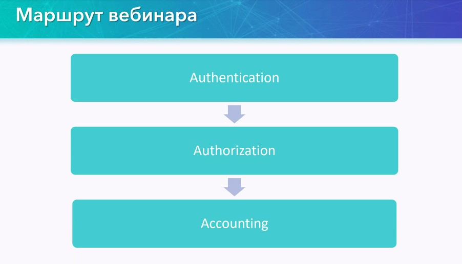

## Authentication ##

- Односторонняя - проверяет одна сторона (проверка сертификата сайта), сам сайт нас не проверяет
- Двухсторонняя - проверяют обе стороны (клиент проверяет сервер, сервер - проверяет клиента по логину/паролю или сертификату)

Элементы системы аутентификации (1-е 4 термина)
- Субъект - кто проходит
- характеристика субъекта - их отличительная черта
- хозяин системы аутентификаии - кто несет ответственность и контроллирует работу
- механизм аутентификации - принцип работы системы
- механизм управления доступом, предоставляет какие-то права  субъекту в системе

В переводе на образы:

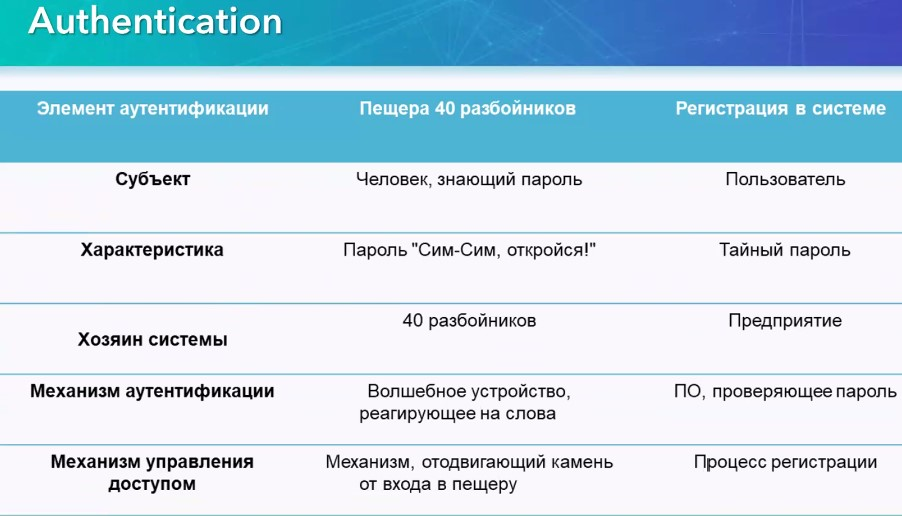

Используемые системы АУ
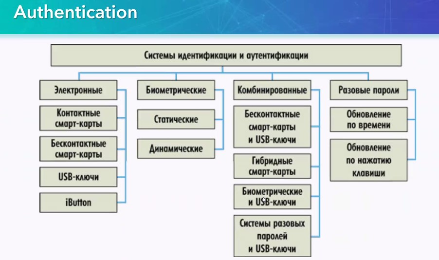

- Электронные
- Биометрические
   - Статич - отпечатки, роговица
   - динамич - походка, голос
- Комбинированые (смесь предыдущих видов)
- Разовые пароли

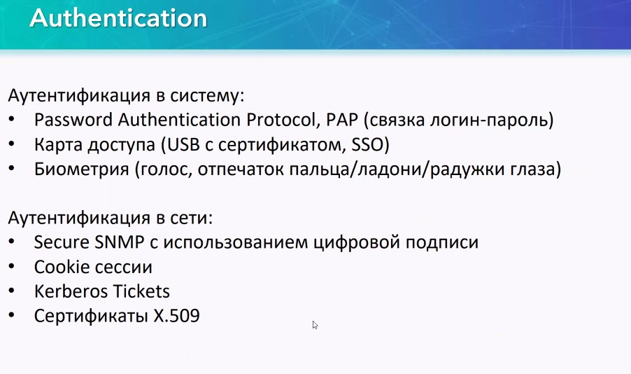

- PAP (логин+пасс)

Для устройств можно использовать вторую часть

Идентификация - процесс сопоставления некоего набора информации (факторов аутентификации) с зарегистрирванными в системе идентификаторами. Аутентификация - процесс подтверждения


## Авторизация ##

Назначение прав доступа к ресурсам или системам, настройка вплоть до разрешений на выполнение каждой команды

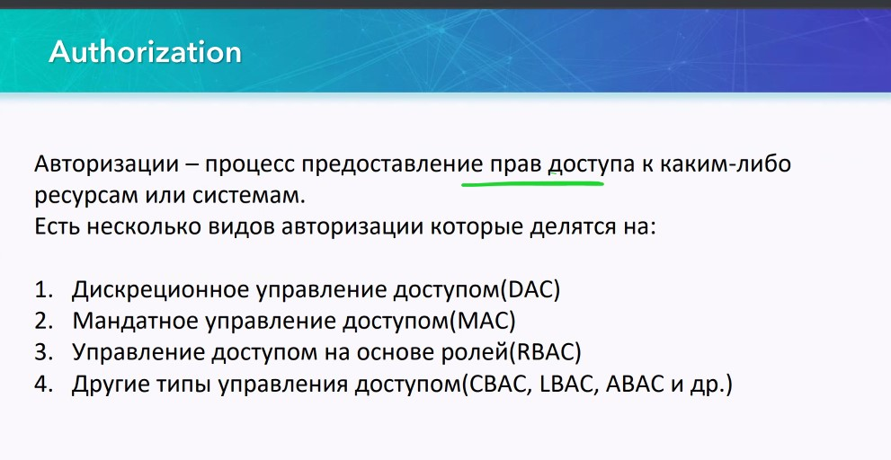

DAC

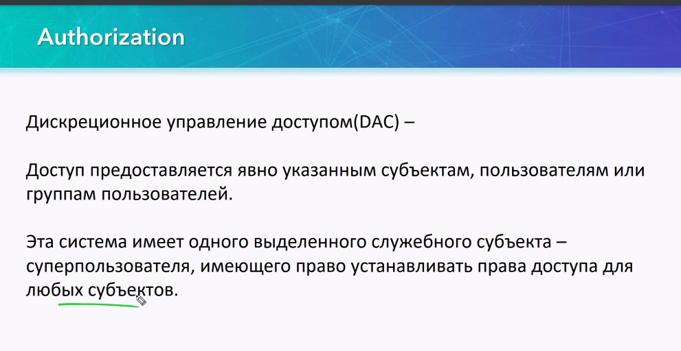

MAC


RBAC

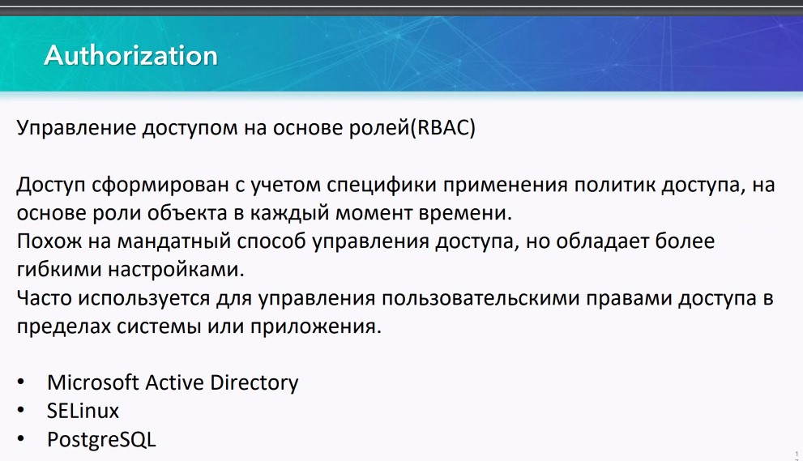

## Accounting ##

Помогает отслеживать действие пользователя


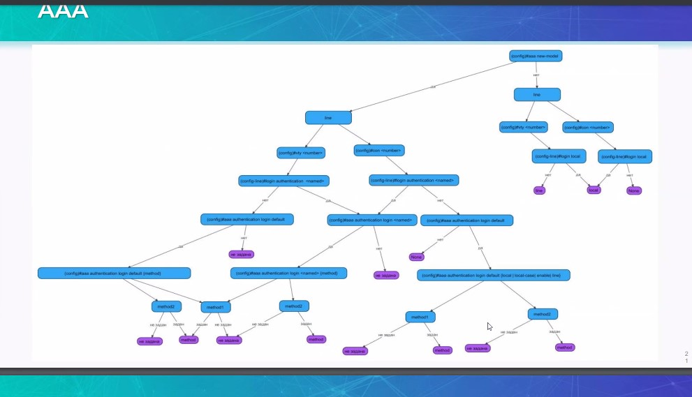

Без AAA

речь про Line, не забываем пароль на enable
   - vty -> login local
   - console -> login local

```
configure terminal
no ip domain lookup
hostname <Name>
enable secret <class>
line con 0
password <cisco>
exit
line vty 0 15
password <cisco>
login
exit
```
или так:
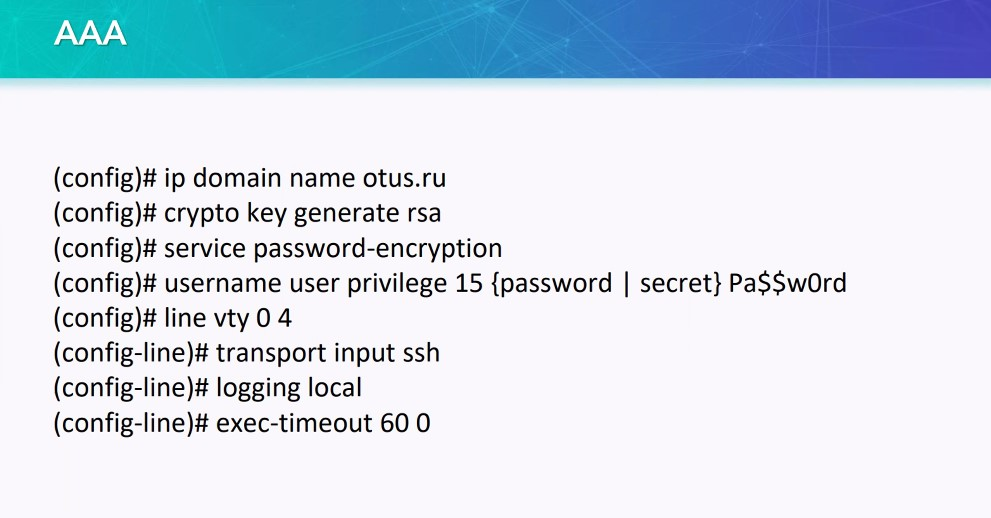


С ААА ```aaa new-model```

aaa - очень гибкая структура, на основании списков, на каждую линию - свой список аутентификаций 
- локальная база
- RADIUS сервер


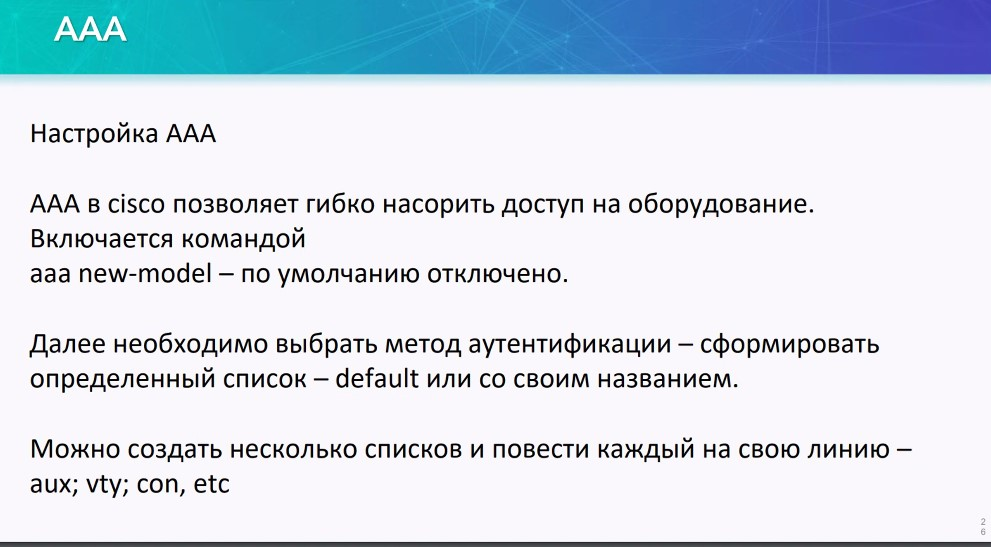


методы
- Local - локальная БД, через Username
- Local-case, чувствительный к регистру при вводе логина Локальная БД
- Enable - ввод пароля при входе в #
- Line - ввод пароля при входе в линию и пользовательский режим
- None - аутентификации не требуется
- Group - использование сервисов AAA
   - TACACS
   - RADIUS

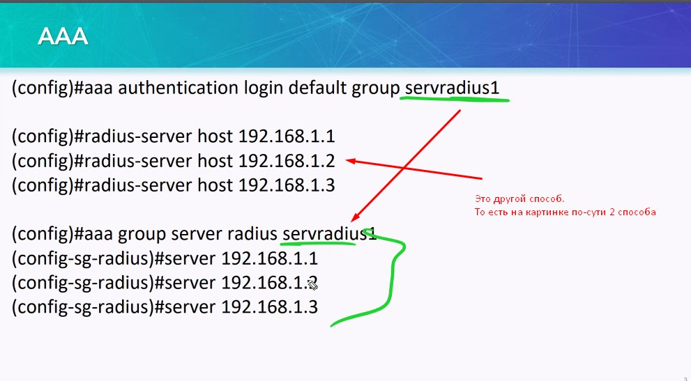

Если RADIUS сервер доступен, то в Local мы не попадем


строчка ```key X YYY``` - каждый раз происходит отправка этой строчки при аутентификации железки на RADUIS (можно настроить для группы, индивидуально для железки и т.п.). RADIUS обмен идет в открытом или частично зашифрованном виде

Включение Авторизации:
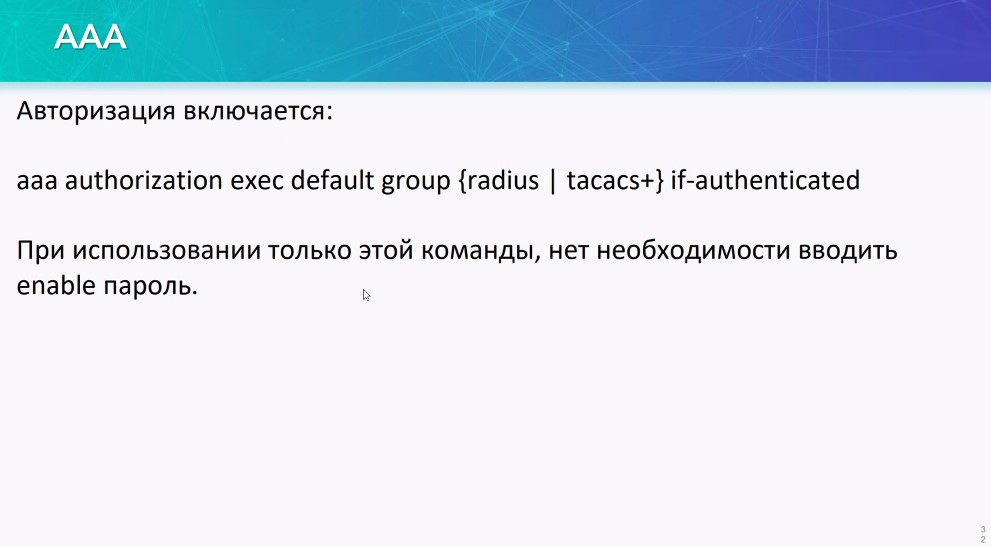


Дальше - только при использовании TACACS+
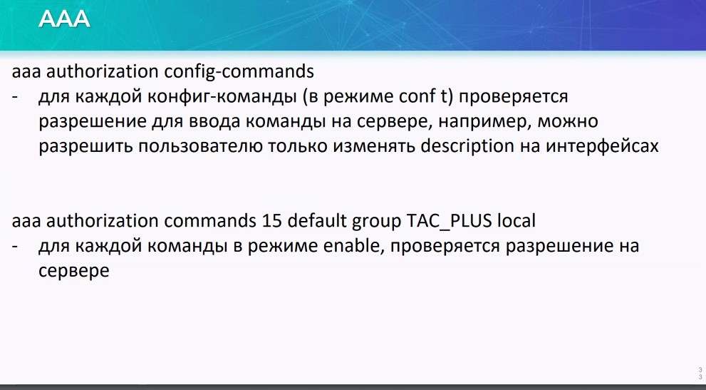

Accounting - вся информация по входу, вводимым командам, перезагрузкам, системная информация о железке. Еще раз: работает только с TACACS+ (платный)
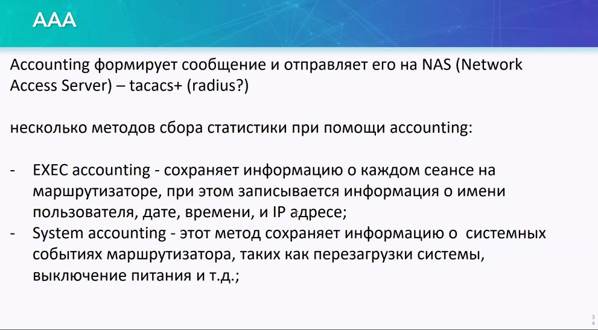


Типы логирования: их всего 3. Сервис - IPSEC, BGP, OSPF, STP и любой другой протокол


Рекомендации


Примеры настроек
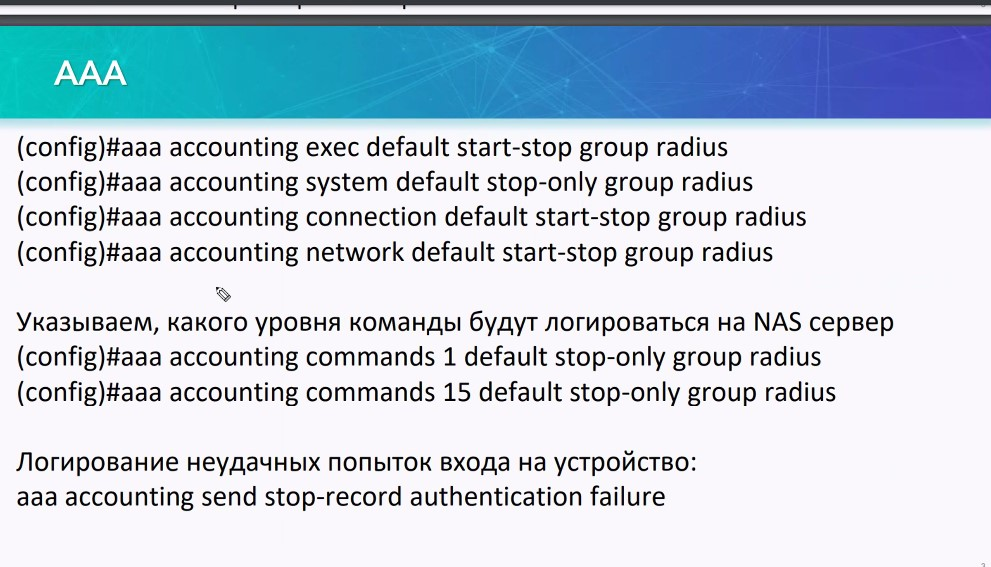

Неудачные входы можно также логгировать 


Если нет TACACS+
- нарезать пользователей с определенным уровнем привилегий
- задать уровень привилегий


Пример
 
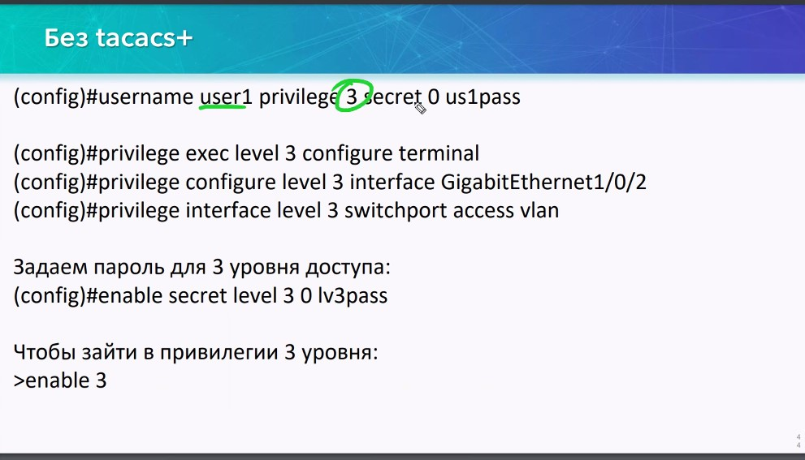