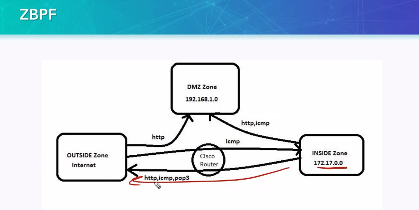
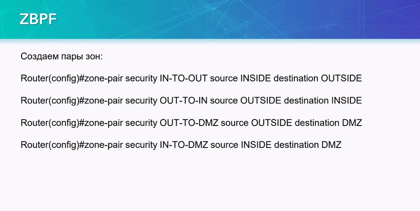
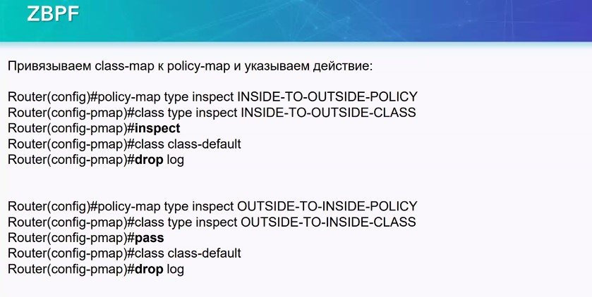

посмотреть: https://blog.dtulyakov.ru/2015/06/url-cisco-ios.html

Второй вариант настройки, с разнесением ACL по IF - экономнее для ресурсов RR

## CBAC ##
Промежуточная техника между ACL и ZBPF

ZBPF взял многое из CBAC

- Создание списка инспекции на ряд протоколов
- Создаем ACL для блокирования OUT направления
- Вешаем инспекцию в направлении OUT (можно и IN) и Access-group  на OUTSIDE IF

## ZBPF ##

сделан чтобы убрать внешние ACL у CBAC.

Создается таблица DMZ и таблица с LAN и связывает эти зоны между собой.

Класс трафика, с которыми работает ZBPF

ZBPF поддерживает инспекцию приложений

Пример

Внимание, с зоной SELF - нужно быть очень внимательным, туда попадают все IF. Свой IF исключаем из self в последнюю очередь.

___Создаем зоны___

В данном конфиге мы сразу потеряем железку, так как если MGM loo в SELF, то взаимодействие между зонами не настроено

___Создаем паря зон___

___Создаем определения трафика (class-map)___ 
- ACL
- class-map связываем с ACL

Вместо ACL можно задать конкретные протоколы

___Cоздаем policy-map - действие над трафиком___

class-defailt надо дропать с логом

inspect и pass - разные вещи.

___Вешаем POLICY на пару зон___

___Вешаем зоны на IF___

ПРОВЕРКА:

