# OTUS 20210625

# DMVPN #


Фаза 3 - улучшена суммаризация маршрутов.

Каждый протокол маршрутизации имеет особенности  при работе в Фазе 2
- EIGRP
- OSPF
- BGP

проверка работы DMVPN

``` sh dmvpn```

Особенности работы EIGRP 


Обязательно отключаем split-horizon 

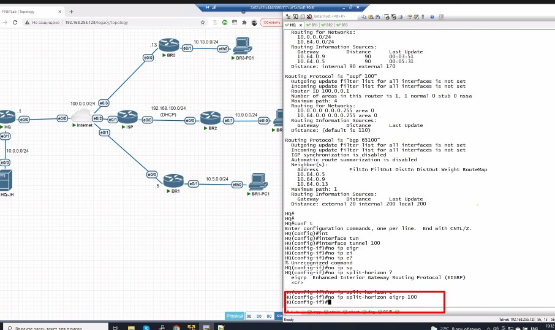

все пакеты через HUB. Картинка ниже - иллюстрация особенности EIGRP - он заменяет SRC через ```next-hop self``` и это поведение надо отключить

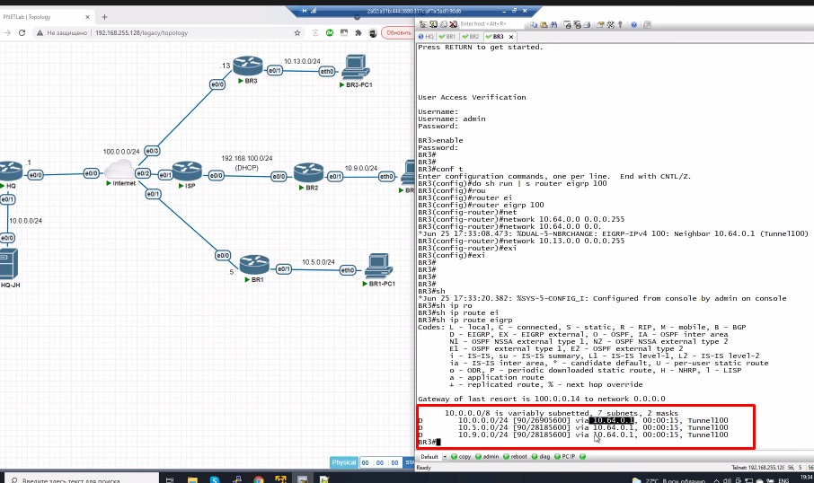


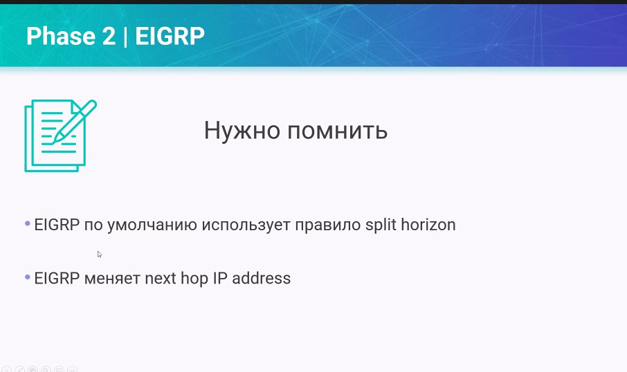

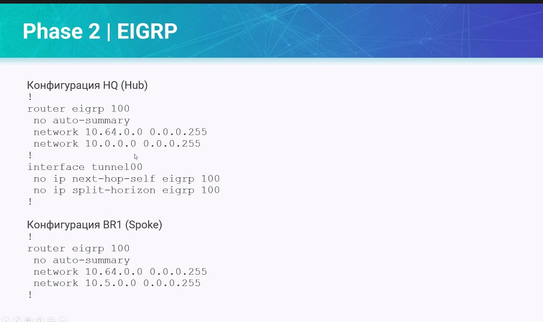

Особенности работы OSPF

Надо разбить на AREA
- AREA 0 - в нее все туннели
- Подсети споуков - в AREA 

Включаем OSPF на всех RRR


И по-умолчанию получаем ошибку. Это происходит потому что Tunnel - канал p-t-p и он офигивает от того, что у него постоянно меняется сосед. Надо поменять тип туннеля на HUB и spoke. Рекомендуется через Broadcast
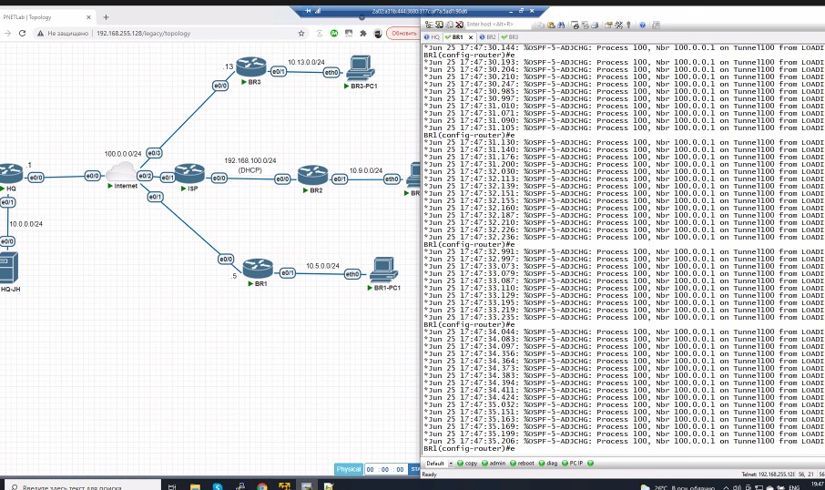


И опять все через HUB, потому чот задавали p-t-multipoint

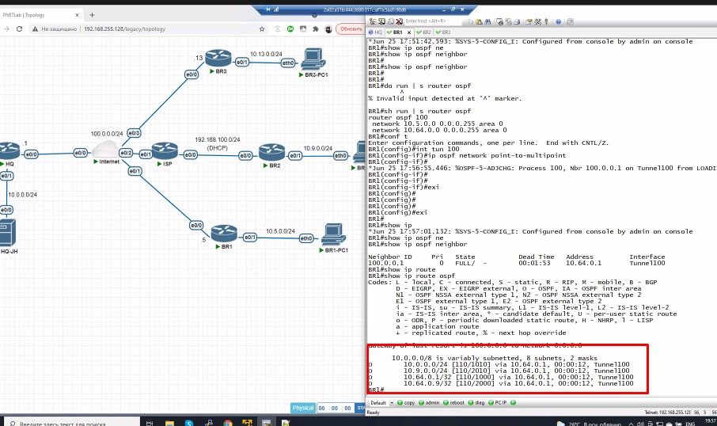


Также на HQ надо настроить DR

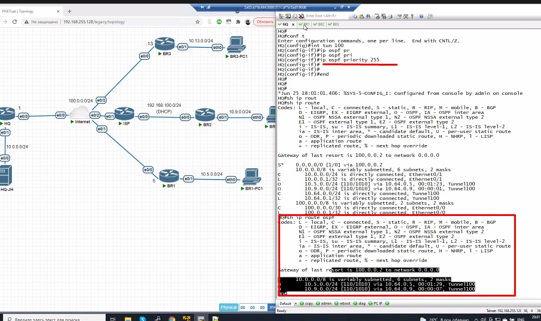

Пример с BGP

Для iBGP  Все пиры -  в одну зону
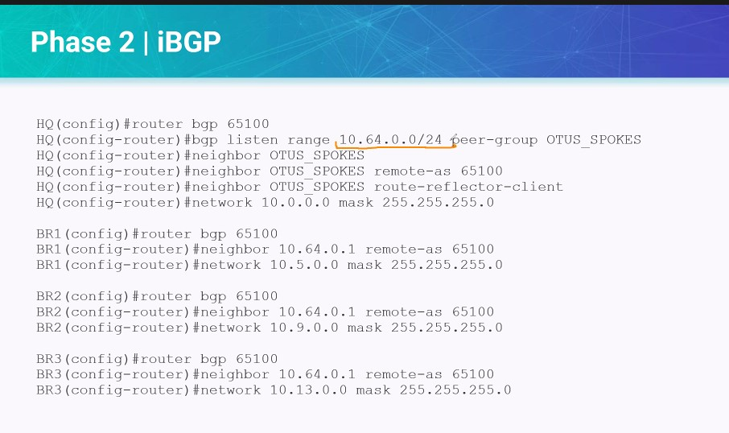

Для eBGP лучше так

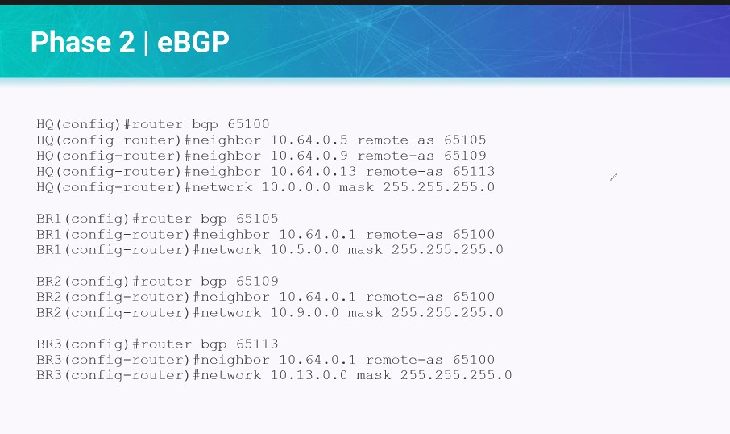

## Phase 3 ##

Фаза 3 учитывает:


Как и ранее, на фазе 2, - пакет Resolution Request от филиал 10 сначала заглядывает в филиал HQ и только потом перенаправляется в 224. (изначально в таблице маршрутизации только 0.0.0.0 0.0.0.0 HQ)


NHRP Resolution Request дойдет доHQ и будет перенаправлен в филиал
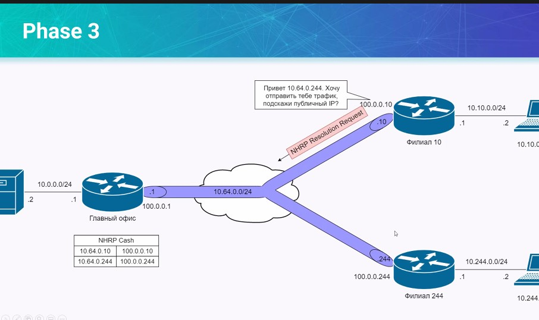

Филиал уже ответит NHRP Response. В конце концов туннель построится. И таблица маршрутизации наполнится соседями.


Дополняется фаза 2
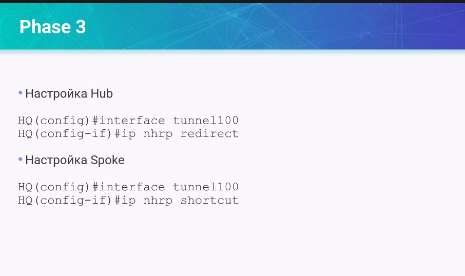

Итого

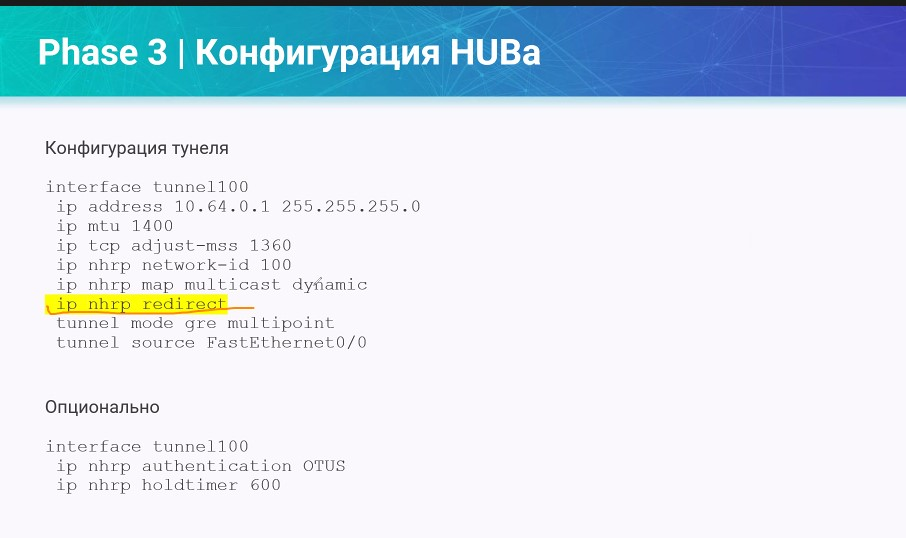

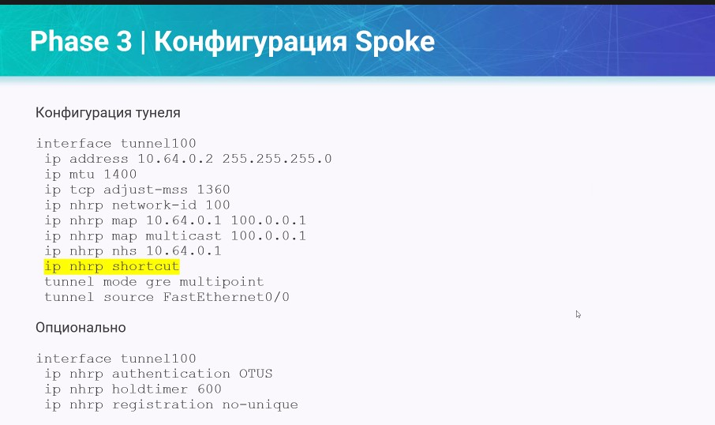

преимущество фазы 3 - суммирование маршрутов


EIGRP

Рекомендуется для маленьких сетей


OSPF

не очень рекомендуется к использованию, LS-протокол, все должны знать всех


BGP

Можно сделать через peer-группы

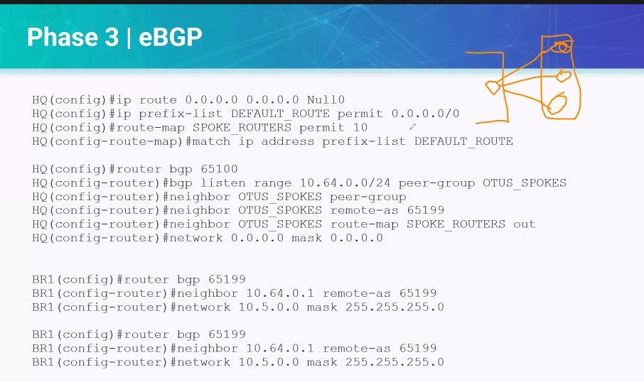


Варианты дизайна

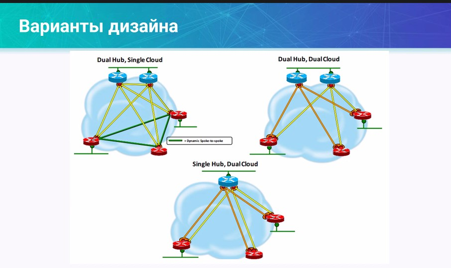


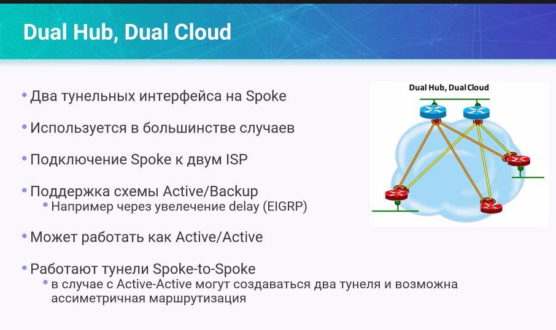

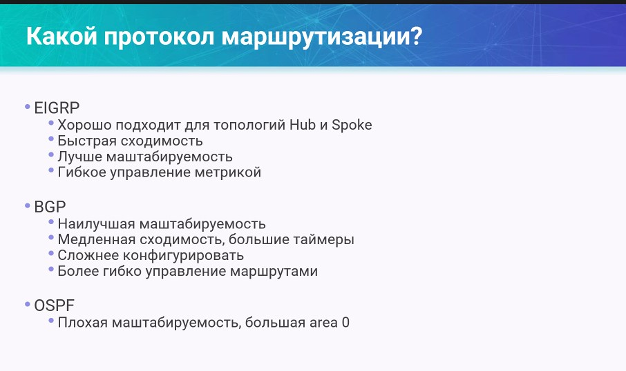

DMVPN - legacy, но много кто ее использует. Cisco доработала, сделала iWAN, еще развитие = SDWAN.