20210702 IPSEC GRE


Когда ACL разрастается до 20-50 строк, то управлять IPSEc на IF уже не удобно.

Старый способ настройки:
- 1-я фаза
ACL - это список адресов SRC, который будет шифроваться, а также возможно задание дополнительных параметров


- 2-я фаза
   - TS - задание алгоритмов шифрования, хэширования и т.п. (будет настроена 2-м шагом)
   - привязываем Crypto-map к карте


## 2 варика работы IPSEC ##


предпочтительность использования определяется:
- 1-й варик - IPSec будет работать с любым трафиком
- 2-й вариант - чаще используется: IPSec работает с Unicast трафиком

### разбор первого варианта
Строим IPSEC, а внутри  - GRE

- 1-я фаза, lifetime - сутки
- ACL - разрешаем только ___GRE___, не IP-адреса внутри (как правило надо настраивать и ответный список, на случай если инициатором сессии будет удаленный хост)
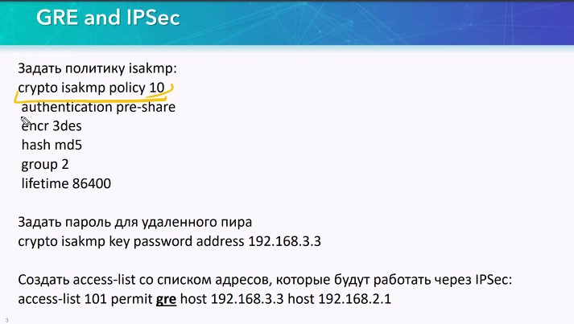

2-я фаза
- mode transport - экономия 20 байт
- про keepalive не рассказывали, тонкость в виртуализации - есть для DMVPN
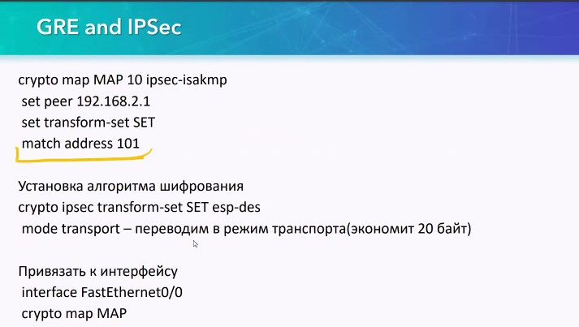

## Проверка ##

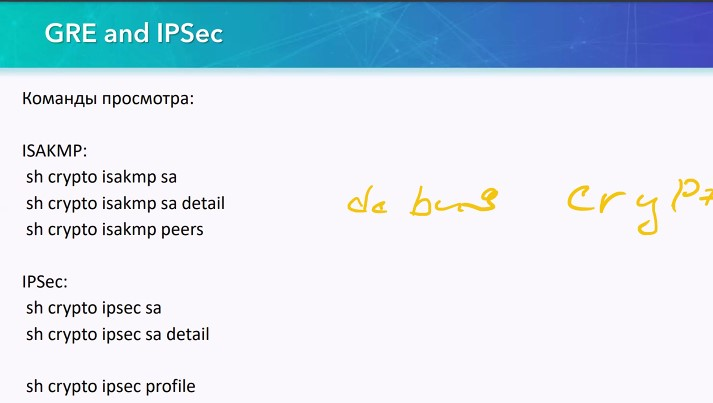


## Практика ##

Туннели IPSec надо строить с туннели

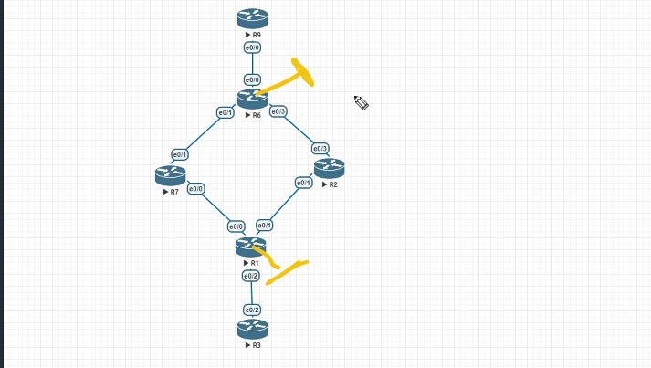

новый способ настройка
- 1-я фаза (ISAKMP - 500 порт или 4500, когда из-за NAT) - с двух сторон
cry isa pol 10
auth pre-share
encryption - оставляем default, можно не настраивать
exit
crypto isa key <pass> <remote_IP>

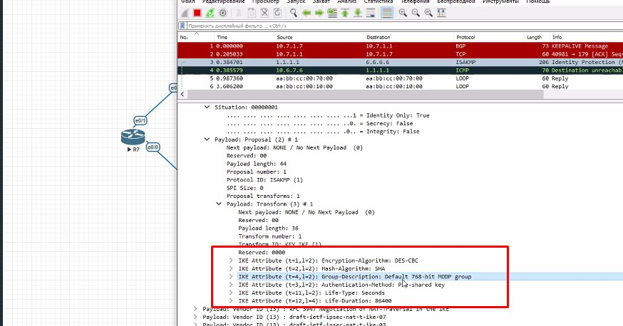

- 2-я фаза - с двух сторон, указывам 
cry ipsec tran ENC_ALG esp-aes 128
 mode <tran/tunn>; tunnel - default
 exit

crypto ipsec profile <OTUS>
 set transform-set ENC_ALG
 exit
  
int t0
 tunnel so lo0
 tunnel dest 6.6.6
 tunnel protect ipsec profile <OTUS>
 ip add <10.6.1.6 255.255.255.0>

sho cry isa sa

ACTIVE - сессия не работает

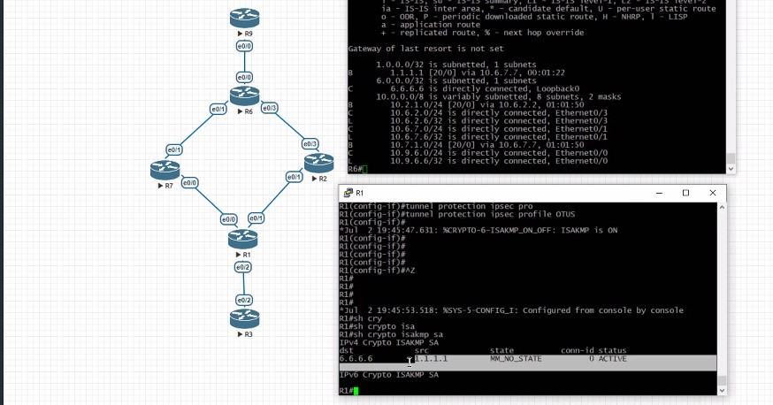

clear cry isakmp - поднялась после перезагрузки, маршруты не симметричные

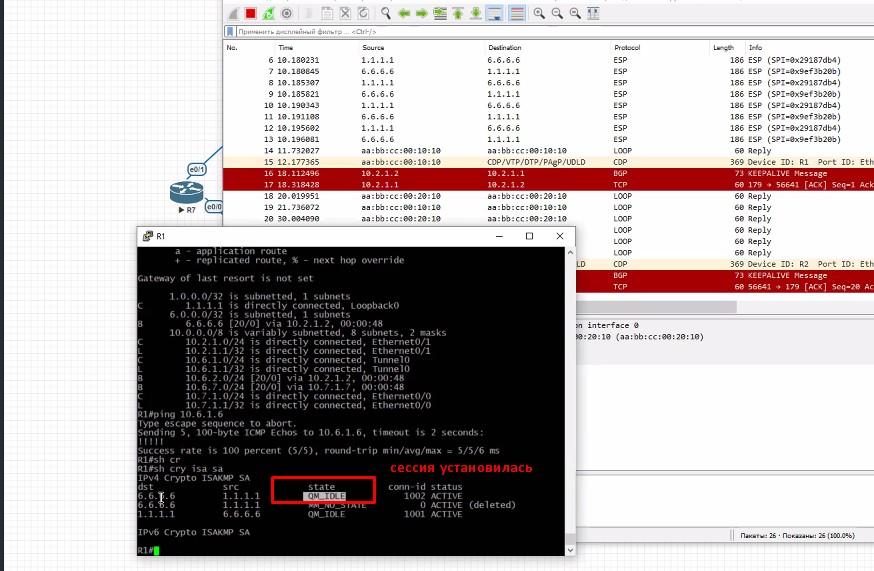

## Настройка по сертификатам ##

Cisco получилось запустить только с CA на Cisco

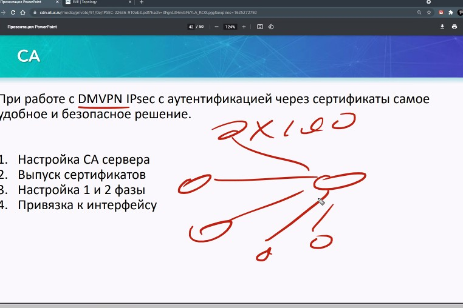
- сервер
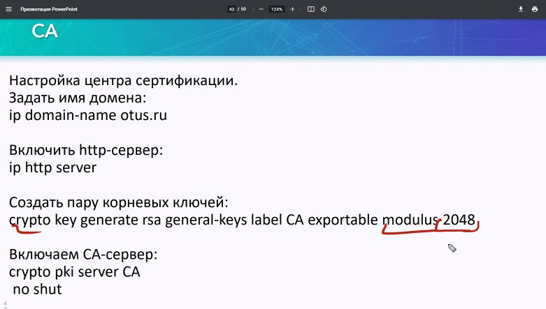
-клиент
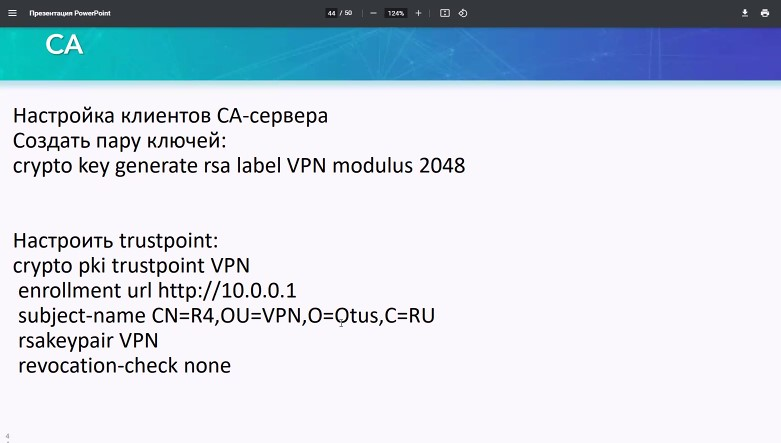

минимальная длина ключа 4096, обязательно настроить ntp.
rsakeypair - имя ключевой пары, созданное выше
- Клиент/запрос корневого серта


VPN - наш TP

просмотреть запросы от килентов ```sho cry pki server req```


На CA - также запросить сертификат на самого себя.
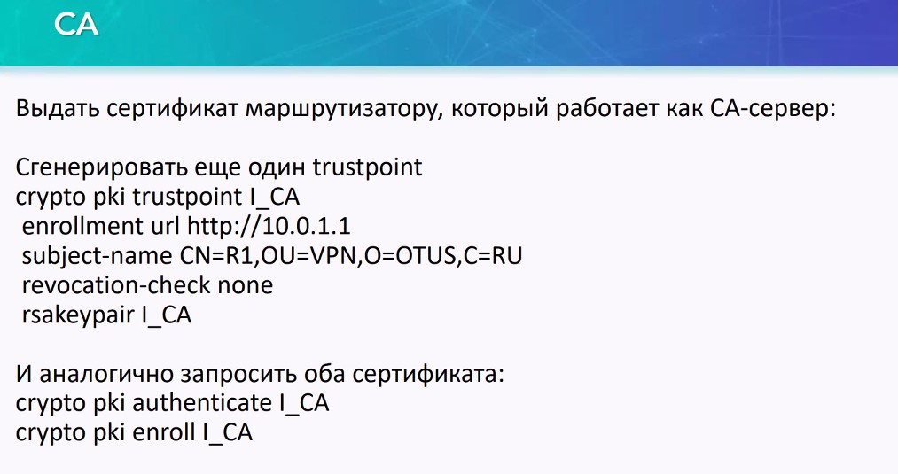

Настройки
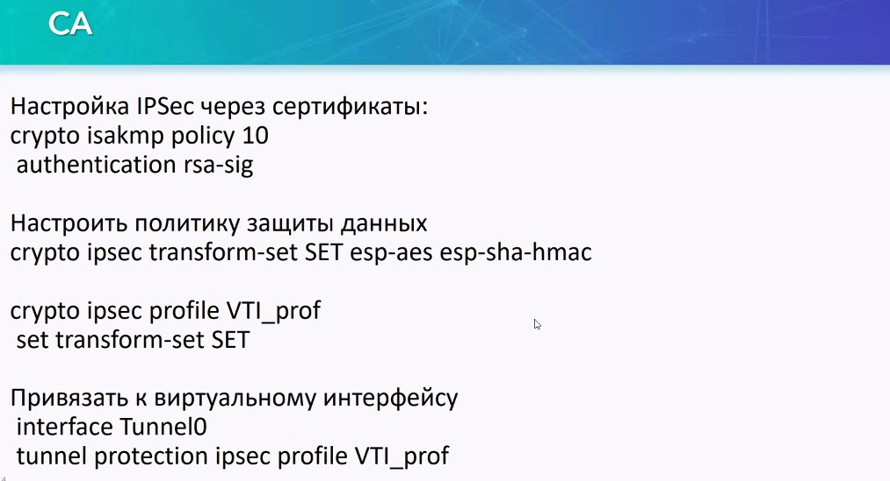

Одобрение длительное, может до 5 минут


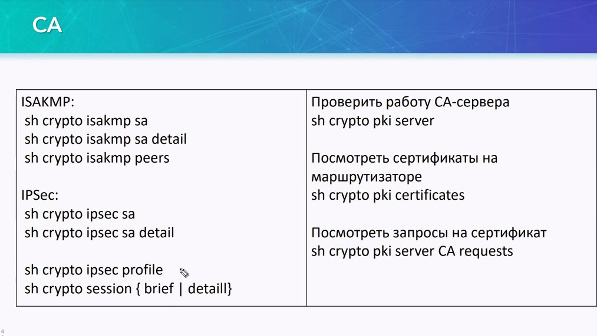


по линуксу можно вот это, в виде игры https://overthewire.org/wargames/bandit/
и еще вот https://linuxjourney.com/

