20210709 Ansible

С точкми зрения Ansible вывод может быть нечитаемым, но для ПК - то, что надо

Установка: centos 8.3

установка модуля для подключения по SSH
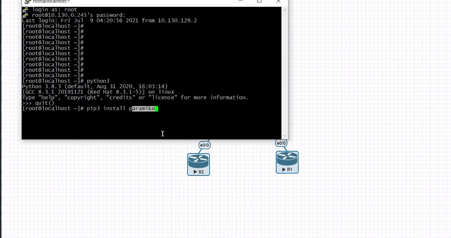

Описание хостов - файл cisco.ini - объект ___INVENTORY___
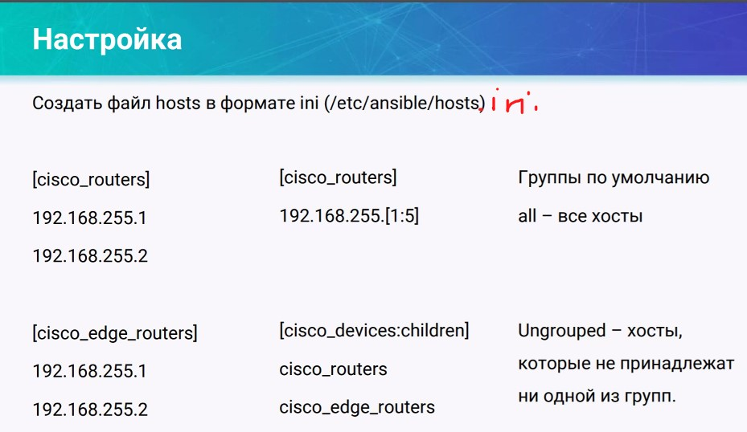

Описываем все группы устройств, но обращаемся к ним по имени родительской группы.

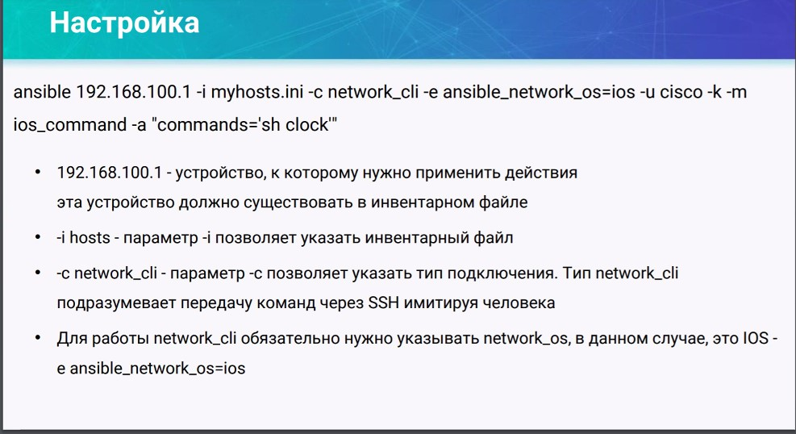

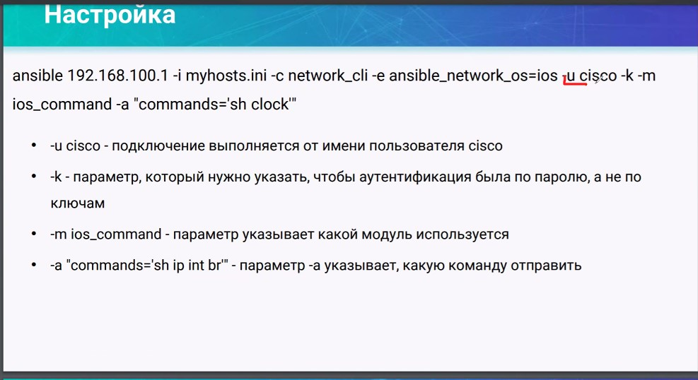

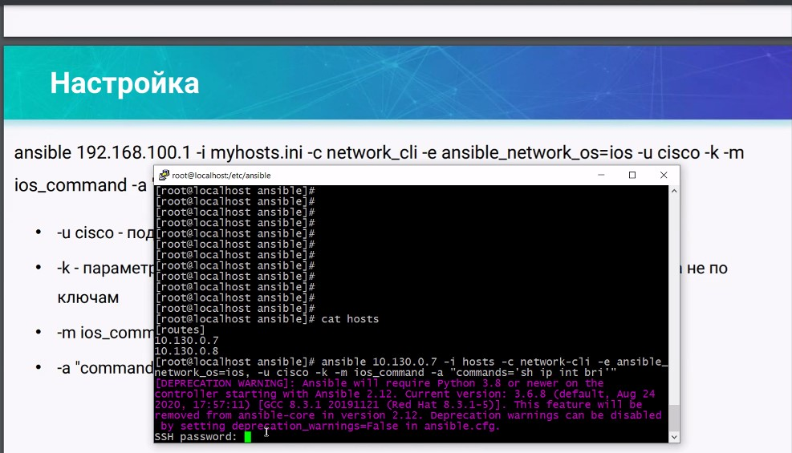

результат

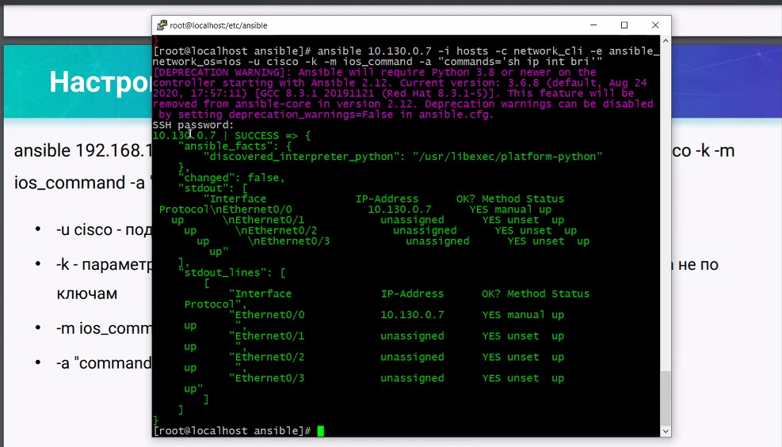

Дополнительно заносим параметры в файл hosts.ini

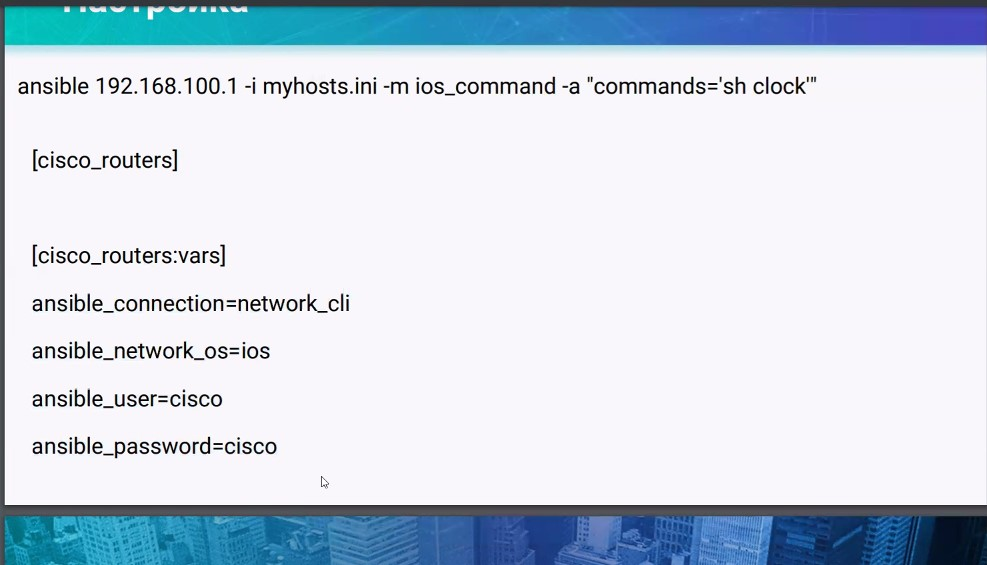

Результат - вызов module ad-hoc

## Ansible.cfg ##

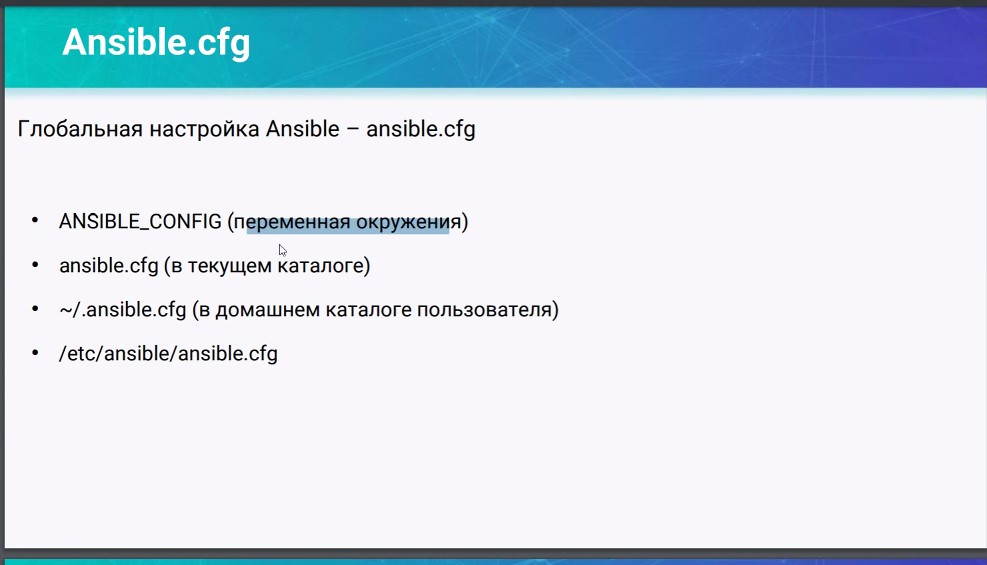

В файле указываются дополнительные настройки по-умолчанию:

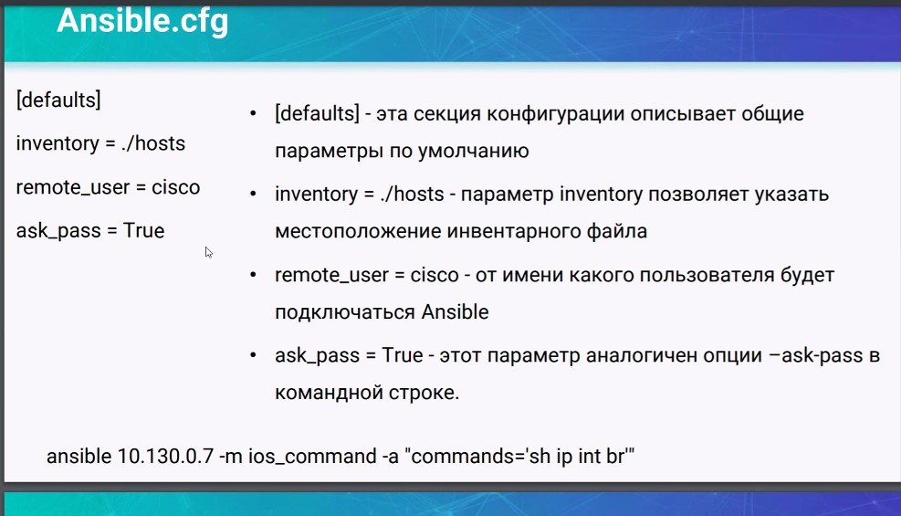

Можно указать что сделать с "фактами" explicit и с запретом на подключение без импорта fingerprint ssh подключения

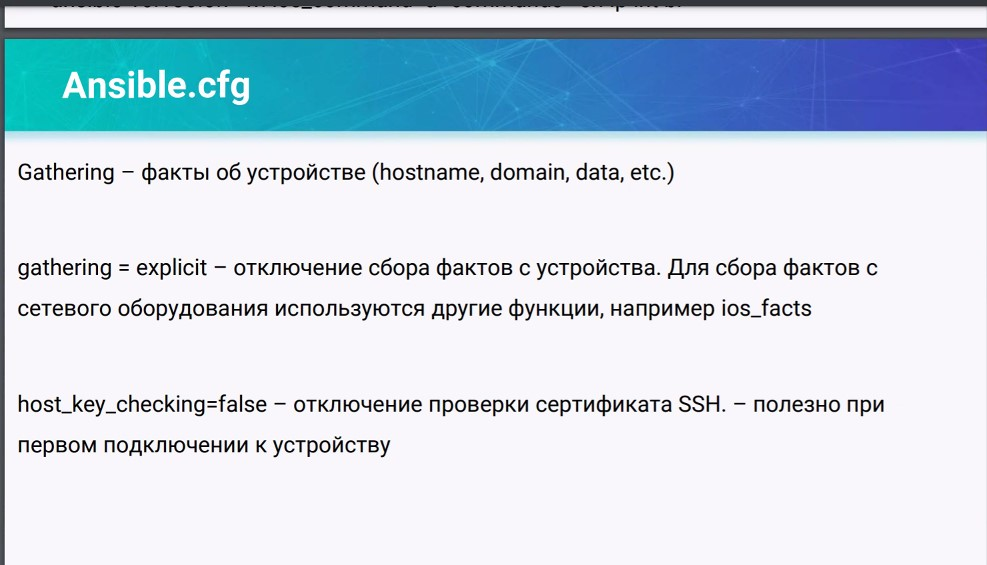

## Модули ##

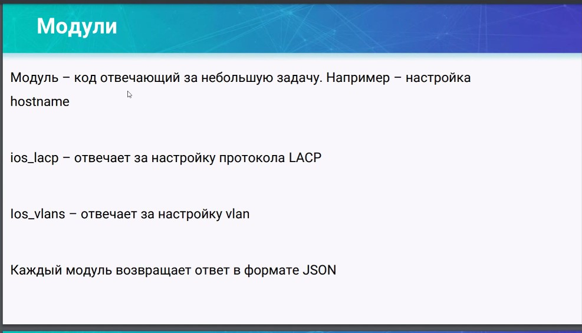

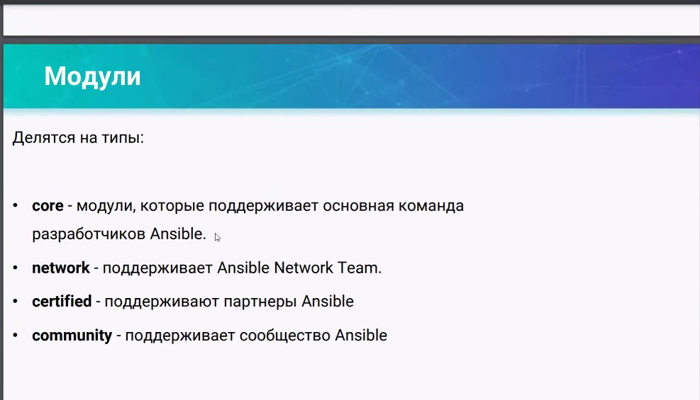

- core - пишут RedHAT
- network - домашние заготовки
- certified - сам производитель
- community - 

docs.ansible.com

AWX tower - создание некоего репозитория с типовыми task для выполнения разных действий сотрудниками предприятия.

