# OTUS 20210226
# Базовая настройка сетевых устройств и концепция коммутации
CCNA - разбит на 3 части, но на курсе рассматриваем только Module 2

## Базовая настройка устройств
- ШАГ1: тест-POST ПЗУ, CPU
- ШАГ2: Запуск ПО загрузчика (только полсче успешного POST)
- ШАГ3: Инициализация ЦПУ
- ШАГ4: Инициализация ФС на флэше
- ШАГ5: Ищется и загружается ОС - IOS и передает ей управление


Загрузчик ищет IOS во флэше (IOS.bin), запускается первый найденный , если не определено в переменных.

После загрузки IOS - пытаемся найти в NVRAM конфиг (config.text)

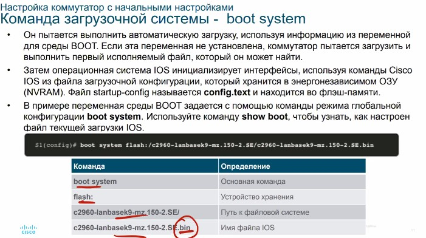

Просмотр ```show boot```

## Первоначальная настройка коммутаторов

Индикаторы переключение между индикаторами - кнопкой ___MODE___
- syst - есть ли питание и нет ли ошибок
- rps - индикация состояния резервного БП
- stat - режим состояния порта, надо смотреть доки. чтобы определиться с состоянием цвета
- duplex - режим дуплекса
- SPEED - текущая скорость порта
- PoE - состояние PoE порта, есть ли потребитель


## Восстановление системы после сбоя
1. Подключаемся консольником
2. Ребут по питанию, перед включением - притопить MODE
3. После того как загрузится и позеленеет/пожелтеет MODE, кнопку можно отпустить и вуаля: мы в ___rommon___ или ___switch___
4. В режиме rommon - свой набор команд, смотреть доку.

## Настройка доступа для управления коммутатора
1. Подключаемся консольником
2. Вводим штатный набор команд
```
configure terminal
no ip domain lookup
hostname <Name>
enable secret <class>
line con 0
password <cisco>
exit
line vty 0 15
password <cisco>
login
exit
banner motd #Restricted access#
service password-encryption
int vlan 99
ip address <IP_MASK>
ipv6 address 2001:db8:acad:99::1/64
no shut
exit
ip default-gateway <GW_IP>
end
```

После этого настраиваем интерфейс управления ___SVI___ (по-умолчанию все порты в VLAN1) для MGM VLAN,например 99. SVI ___vlanXX___ будет в down, пока мы не назначим какой-то из активных портов этому VLAN. Кроме Ipv4, надо настроить ipv6
```sdm prefer dual ipv4-and-ipv6``` - для старых IOS

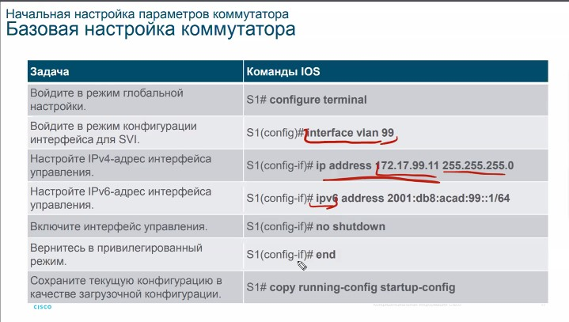
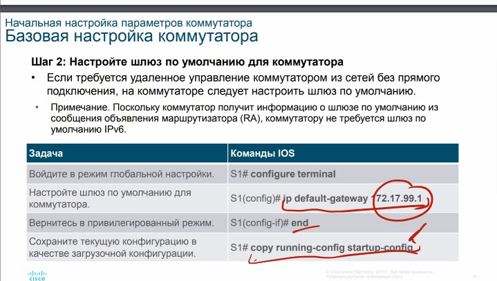

Проверка 
```
sho ip int br
```

## Настройка портов коммутатора
На 2960 представленные ниже 2 параметра могут "собраться" автоматически, автосогласование
- half-duplex, full-duplex
- speed: 10/100/1000/10000
По-умолчанию, автосогласование включено, что может привести к проблемам, вручную надо настраивать внимательно и обязательно с обеих сторон, автоматически канал не поднимется, если настроить только с одной стороны

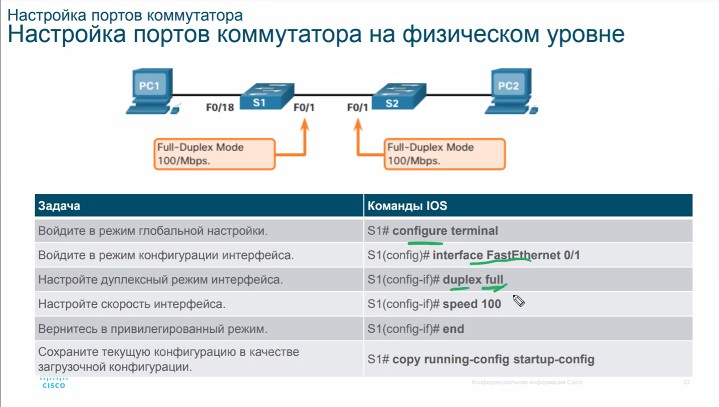

AUTO-MDIX - речь про cross, cross-over, rollback распиновку. На современных коммутаторах ```mdix auto``` - в автомате

Проверка:
```
show run 
show start
show flash
show ver
show hist
sho ip int br <IF>
sho ipv6 int <IF>
show mac-address-table / show mac address-table
show interfaces
```

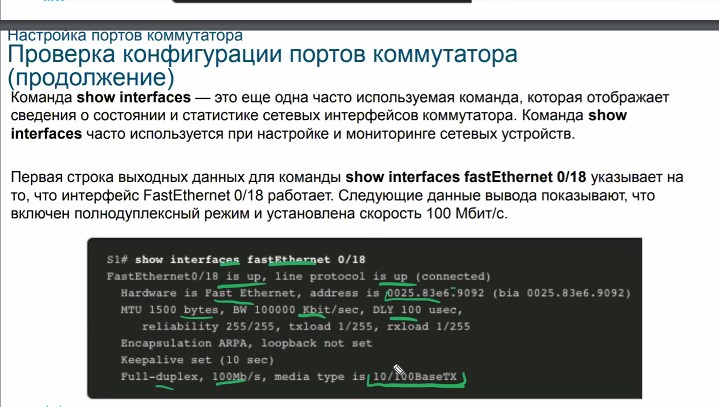

up/up:
-1-й up  - проверка аппаратной части (физика кабеля, порта)
-2-й up - проблема на протокольном уровне (например не взлетел LACP)

Также можно просмотреть ошибки на IF:


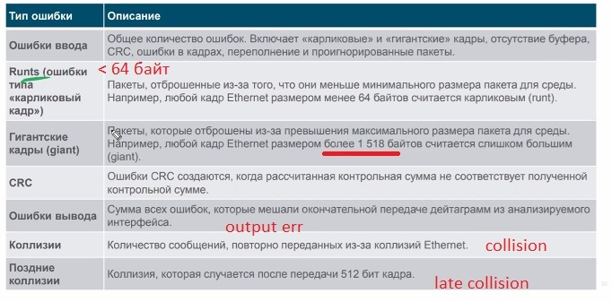


## Удаленное подключение

- telnet/23, TCP - трафик не зашифрован, может встречаться вариант, когда не разрешена криптография на устройствах, прошивки с отключенным ___K8-npe___. Данная прошивка не будет поддерживать никакую крипту: IPSEC и т.д.
- SSH/22, TCP - трафик зашифрован. Использовать стараться его. Прошивка с индексом ___K9___

1. Проверить наличие ___K9___ в названии прошивки
2. Наятройка 
   - host
   - ip domain name
3. Создание пары ключей RSA 
   - crypto key gen rsa modul 2048
4. Задание 
   - enable pass
   - enable secret
5. Включить SSH на vty (Virtual TeletYpe)
   - tran in <ssh/telnet/all>
   - login local - использование локальной базы
6. включить использование
   - ip ssh ver 2

проверка 
```
show ip ssh
```


## Базовая конфигурация маршрутизатора

```
configure terminal
no ip domain lookup
hostname <Name>
enable secret <class>
line con 0
password <cisco>
login
exit
line vty 0 15
password <cisco>
login
exit
banner motd #Restricted access#
service password-encryption
exit
end
```

```service password-encryption``` - очень опасно шифровать этиим параметром пароли login, так как они легко ломаются через google.

## Топология двойного стека
У R могут быть разные IF (Eth, Serial)
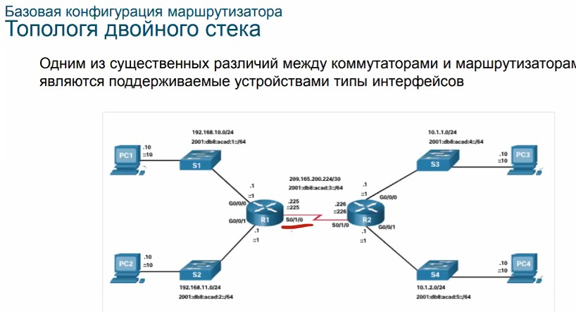

## Настройка IF на К
- надо настроить по-крайней мере 1 IF^
   - ip/mask
   - descr
   - no shut

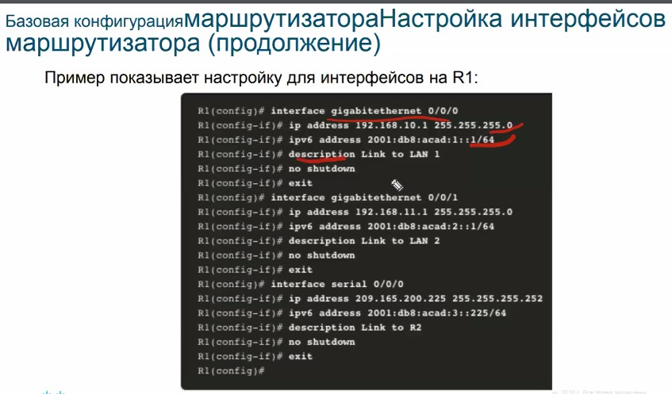

## Loopback
- Loopback - внутренний, виртуальный IF, не может быть никак привязан  физическому порту.
- При создании сразу up/up
- доступен когда поднимается сеть на К
- удобно использовать для MGM
___пересмотреть___

проверка
```
sho ip int br
sho ipv6 int br
sho ip int
show runn
show run interf <IF>
sho ip route
sho ipv6 route
```


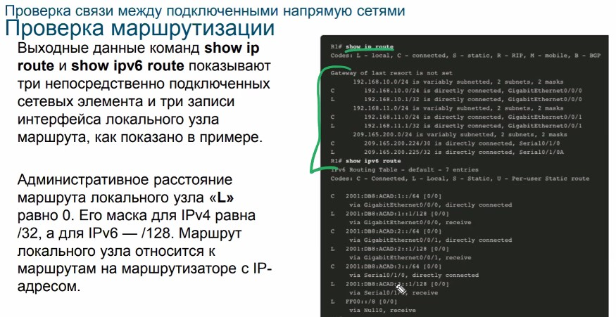

- С - connected
- L - link, конкретный линк, которым включены в конкретную сеть

## Фильтрация
Вывод команды может быть отяильтрован через символ потока ___|___ и добавление ключевого слова
- section
- include
- exclude
- begin

Сочетания клавиш/сокращенных нажатий:

https://github.com/fazzzan/Specialist/tree/master/CCNA70_LABS01/Module02

количество строк выводимых на экран
```
terminal length 100
```

буфер истории
```
terminal history size
```


Организация
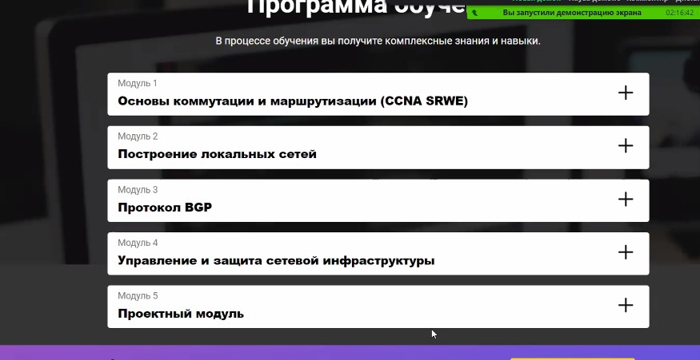

модуль1 - netacad
модуль 2,3,4 - авторский otus

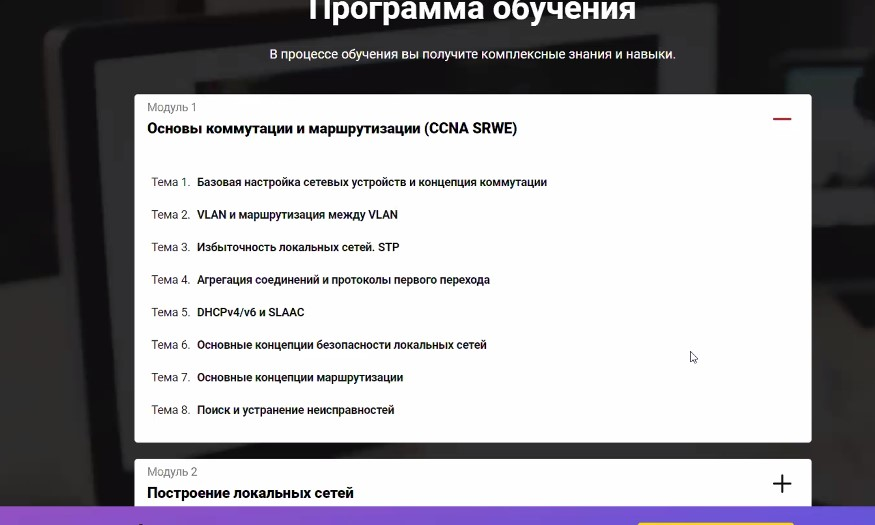

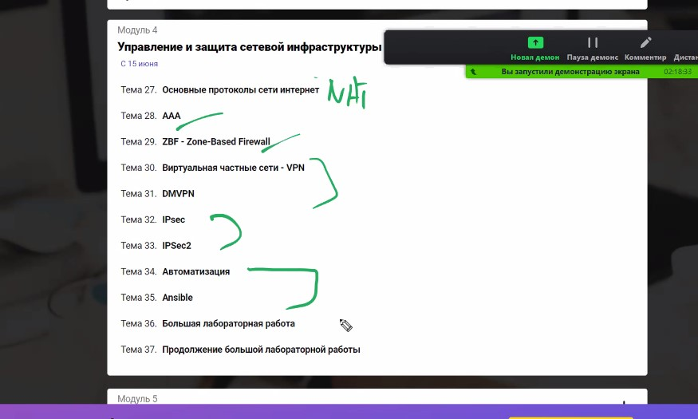