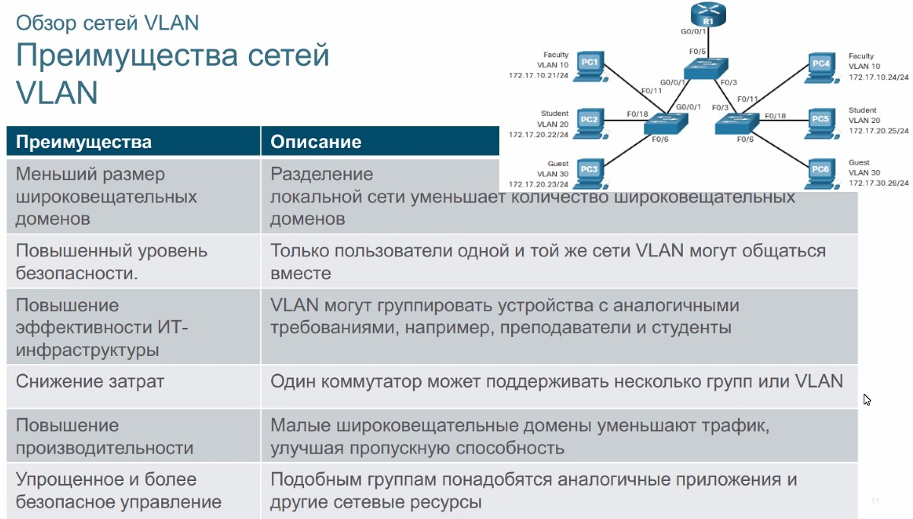
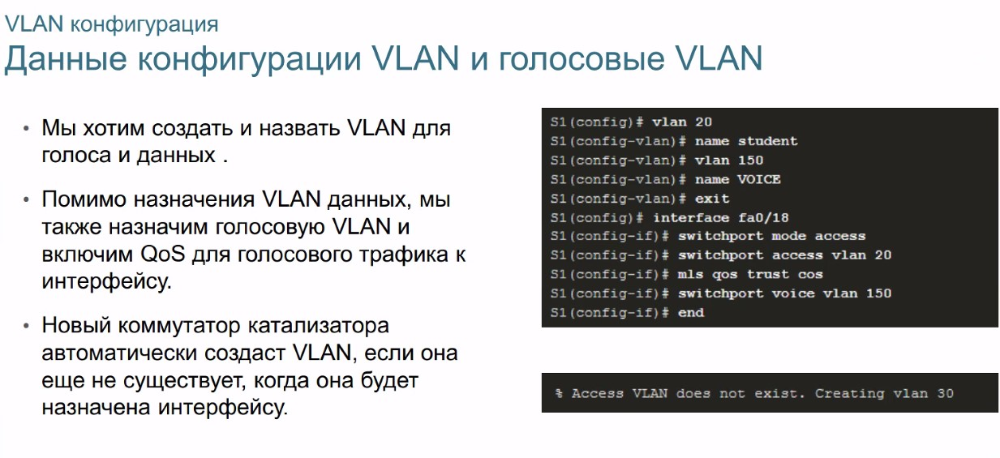
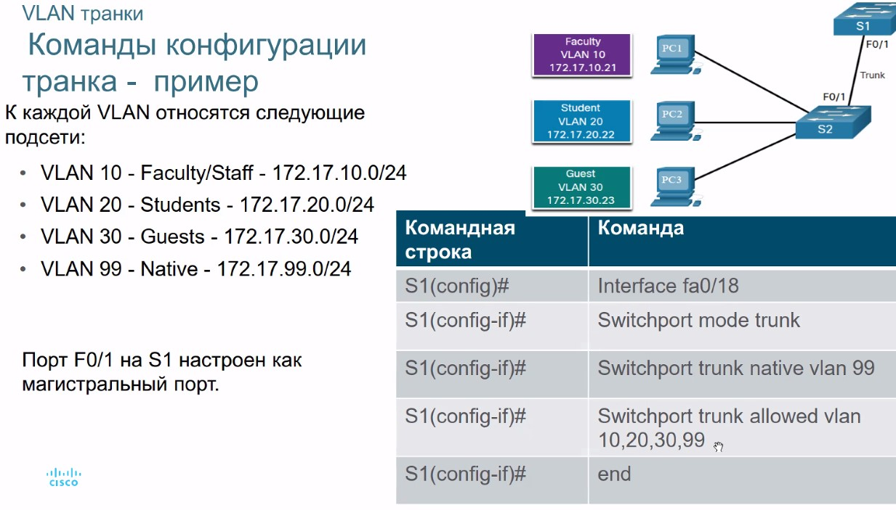
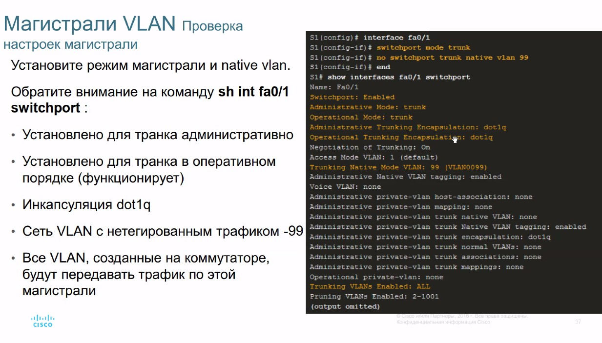
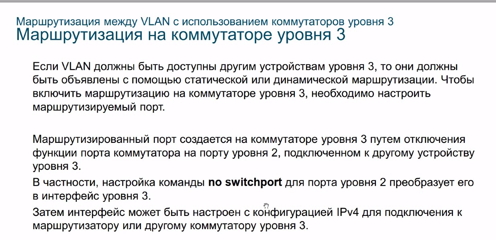
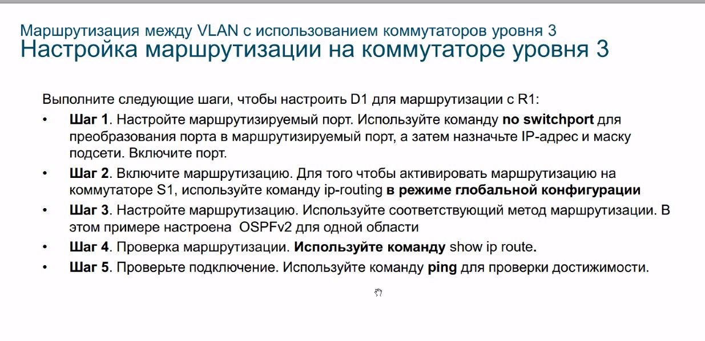
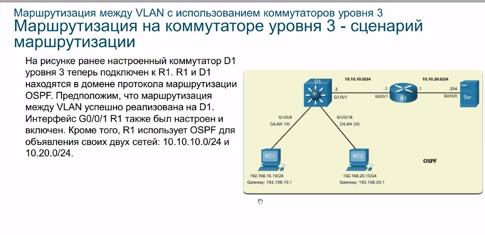
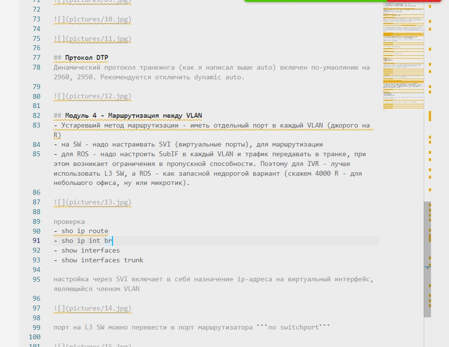

# OTUS 20210305
# VLAN, Inter-VLAN routing


## VLAN
VLAN - "костыль" L2 (L2 не позволяет объединить большое число узлов в сеть CSMA). Максимально количество узло в LAN сети - 300 хостов


VLAN - по сути разбиение на L2-уровне. Тут может быть хитрость: если надо гулять только в 1 VLAN (без inter-vlan маршрутизации), можно подсеть размазать по несколким VLAN, при этом BC трафик будет изолирован



Преимущества представлены выше:
- меньший размер BC
- Улучшен уровень безопасности (изнутри пользователь ограничен правилами ACL, куда он может войти)
- Повышение эффективности (группировака хостов по ролям)
- Производительность (снижение BC трафа)
- Упрощенное администрирвоание (одинаковые группы, близкие правила)

Доп. работы:
- VLAN 1, VLAN 1008-1005 - default существующие на оборудовании. 
- VLAN1 - выступает по-умолчанию native, и для безопасности - надо переопределять native VLAN.
- Выделить MGM трафик в отдельный VLAN

Voice vlan
- настроить приоритет QoS
- получить сеть с задержками < 150 мс

## Транк Cisco - 802.1Q
Uplink'и, в которых разрешено прохождение потоков с разными тэгами. 802.1Q добавляет метку к кадру. Был еще Cisco (ISL), но он не прижился. Тэг добавляется на SW: хост про тэг в большинстве случаев ничего не знает. При отправке хосту - тэг удаляется, FCS пересчитывается и выплевывается в физику.


native vlan - хорошо рассмотрен тут: http://xgu.ru/wiki/Native_VLAN

"Из соображений безопасности (например, для защиты от VLAN Hopping) рекомендуется в транке выполнять тегирование даже для native VLAN. Включить тегирование фреймов для native VLAN глобально можно с помощью команды vlan dot1q tag native, просмотреть текущий статус тегирования можно используя команду show vlan dot1q tag native. "

## Конфигурация VLAN
- 0-1000-1005 - хранятся на vlan.dat (во флэше, поэтому при очистке чужого SW - удаляем vlan.dat)
- 1006 - 4095 - хранится в конфиге 
- Протокол VTP - опасный протокол, который перебивает VLAN на соседних коммутаторах. VTP 2, 3 версий - работают с разными диапазонами

Создание VLAN и привязка его к порту. Рекомендуется сначала все порты перегнать в VLAN-отстойник, скажем 10001


голосовые VLAN, с навешиванием QoS:



-проверка:
- ```show vlan summ```

Чтобы вернуть порт в vlan по-умолчанию


Параметры порта:
- access
- dynamic auto
- dynamic desirable
- trunk

## Магистральные транки
Транки - надо проставлять с 2 сторон в принудительном порядке, не рассчитывая на режм auto порта. По-умолчанию все VLAN разрешены на trunk-порту, поэтому надо allowed vlan редактировать. Редактировать список VLAN лучше копипастом, и при редактировании - ставить отложенную перезагрузку






## Пртокол DTP
Динамический протокол транкинга (как я написал выше auto) включен по-умаолянию на 2960, 2950. Рекомендуется отключить dynamic auto.


## Модуль 4 - Маршрутизация между VLAN
- Устаревший метод маршрутизации - иметь отдельный порт в каждый VLAN (джорого на R)
- на SW - надо настраивать SVI (виртуальные порты), для маршрутизации
- для ROS - надо настроить SubIF в каждый VLAN и трафик передавать в транке, при этом возникает ограничения в пропускной способности. Поэтому для IVR - лучше использовать L3 SW, а ROS - как запасной недорогой вариант (скажем 4000 R - для небольшого офиса, ну или микротик).


проверка
- sho ip route
- sho ip int br
- show interfaces
- show interfaces trunk

настройка через SVI включает в себя назначение ip-адреса на виртуальный интерфейс, являющийся членом VLAN


порт на L3 SW можно перевести в порт маршрутизатора ```no switchport```







текст

