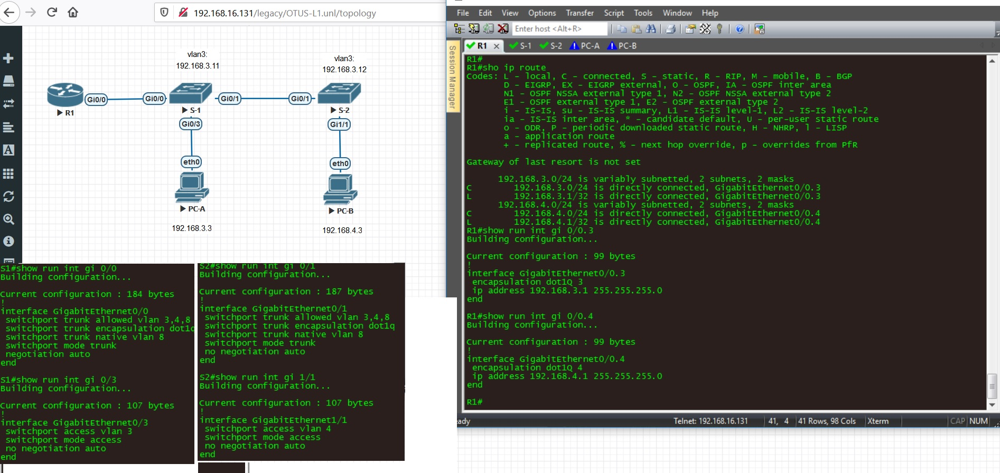

# Lab - Configure Router-on-a-Stick Inter-VLAN Routing

## Задание: [docx](4.2.8_Lab_Configure_Router-on-a-Stick_Inter-VLAN_Routing.docx)

- Настроить Router-on-a-Stick Inter-VLAN Routing;
- На маршрутизаторе R1 необходимо настроить SubIF’s 3, 4 с инкапсуляцией Dot1Q, для обработки трафика с VLAN 3, 4 - соответственно;
- На коммутаторах S1, S2 настроить MGM VLAN 3 для обучпечения доступа к оборудованию не по дефолтному VLAN
- На коммутаторах S1, S2 настроить VLAN’s 3, 4, 7, 8 для обеспечения работоспособности соответствующих access и trunk-портов;
- Обеспечить синхронизацию времени на оборудовании
- Разобраться в технологии ROS, IVR
- Разобраться в базовых элементах защиты коммутаторов от НСД и атаки native-vlan, путем задания конкретных разрешенных VLAN и переопределения NATIVE VLAN на trunk-портах

## Решение:
### 1. Базовая настройка оборудования
- Общие:
   - timezone, hostname, banner, no ip domain lookup, clock set
- Безопасность
   - SSH
   - защита привилегированного режима secret с алгоритмом scrypt
   - задание username admin
   - service password enсryption
   - добавление таймстампа в логи
   - логгирование успешных/неуспешных входов
   - задание временных пауз при логине
   - запрет на вход после 3 неудачныхъ попыток и его обход для ip 192.168.3.3
   - вход в line con 0 с использованием локального пользователя admin
   - вход по SSH ver2 в line vty 0 4 с использованием локального пользователя admin
   
___ПРОВЕРКА___: ```show run```, ```show run | in user```, ```show log```

### 2. Настройка Switch1,2
- VLAN
   - Создание базы VLAN
   - Настройка MGM vlan3
- Все порты командой range
   - перевод портов в access
   - Задание неиспользуемого vlan 7 на всех портах
   - выключение всех портов командой shut
   - отключение автосогласование на портах ```не сработало в GNS3```
- Включение нужный access портов
   - сброс нужных портов в defult
   - перевод порта в access
   - задание соответствующего vlan
   - включение портов
___ПРОВЕРКА___: ```show ip int br```, ```show run | in interfa|switch```

### 3. Специфичная настройка Switches:
- Задание default GW
- Настройка trunk портов на свичах с указанием разрешенных VLAN и переопределением native

___ПРОВЕРКА___: ```show vlan```, ```show int trunk```

### 4. Специфичная настройка Router:
- Создание SubIF, назначение соответствующих тэгов и ip-адресов
- Включение основного IF

___ПРОВЕРКА___: ```show ip int br```, ```show ip route```, ```do ping 192.168.3.11 / 12```

### 5. Назначение ip адресов рабочим станциям

Выполняется встроенной командой

### 6. проверка работоспособности
___ПРОВЕРКА___: ```ping 192.168.3.1```, ```ping 192.168.3.3```, ```ping 192.168.4.3```

### Графическая схема:



Фйлы с настройками оборудования и описанием команд:
- [R1](cfg/R1)
- [S1](cfg/S1)
- [S2](cfg/S2)

Выводы:
Задание выполнено. Достигнута ip-связность узлов сети как внутри vlan, так и между VLAN-ами
