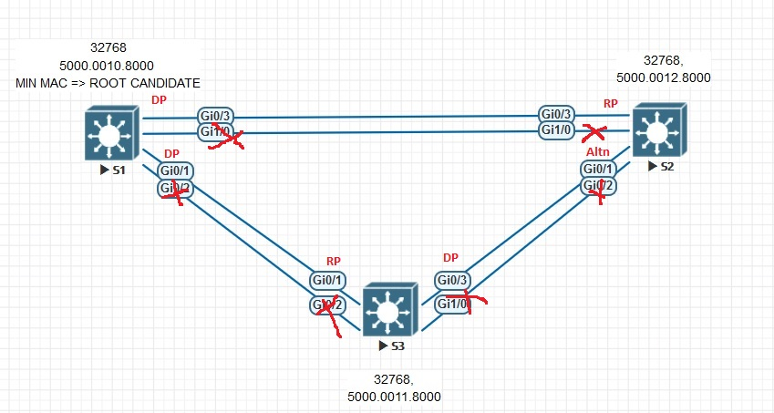

# Развертывание коммутируемой сети с резервными каналами

###  Задание:
1. Создание сети, настройка основных параметров устройств
2. Выбор корневого моста
3. Наблюдение за процессом выбора протокола STP порта, исходя из стоимости портов
4. Наблюдение за процессом выбора протокола STP порта, исходя из приоритета

###  Решение:
1. Графическая схема до начал работы, с нанесенной информацией о текущем приоритете и MAC-адресе коммутатора

### Просмотр приоритета и MAC адреса свича
```
show lacp sys-id 
```
Базовые настройки коммутаторов c настроенными транковыми портами [S1](config/S1), [S2](config/S2), [S3](config/S3).

2. Выбор ROOT 
Состояние STP после отключения избыточных интерфейсов Gi0/0, Gi0/2
### Просмотр состояния STP S1
```
S1#show spanning-tree
```
Из вывода команды, видно, что по-умолчанию включен протокол PVST+, S1 является ROOT для обоих VLAN, приоритет не менялся, стоимость портов не менялась, все порты в состоянии DESIGNATED, что характерно для ROOT коммутатора. 
```
VLAN0001
  Spanning tree enabled protocol ieee
  Root ID    Priority    32769
             Address     5000.0010.0000
             This bridge is the root
             Hello Time   2 sec  Max Age 20 sec  Forward Delay 15 sec

  Bridge ID  Priority    32769  (priority 32768 sys-id-ext 1)
             Address     5000.0010.0000
             Hello Time   2 sec  Max Age 20 sec  Forward Delay 15 sec
             Aging Time  300 sec

Interface           Role Sts Cost      Prio.Nbr Type
------------------- ---- --- --------- -------- --------------------------------
Gi0/1               Desg FWD 4         128.2    P2p 
Gi0/3               Desg FWD 4         128.4    P2p 


          
VLAN0100
  Spanning tree enabled protocol ieee
  Root ID    Priority    32868
             Address     5000.0010.0000
             This bridge is the root
             Hello Time   2 sec  Max Age 20 sec  Forward Delay 15 sec

  Bridge ID  Priority    32868  (priority 32768 sys-id-ext 100)
             Address     5000.0010.0000
             Hello Time   2 sec  Max Age 20 sec  Forward Delay 15 sec
             Aging Time  300 sec

Interface           Role Sts Cost      Prio.Nbr Type
------------------- ---- --- --------- -------- --------------------------------
Gi0/1               Desg FWD 4         128.2    P2p 
Gi0/3               Desg FWD 4         128.4    P2p 
```
### Просмотр состояния STP S2, S3
Из вывода видно что 
S2: порт Gi0/3 является RP (состояние FWD) за оба VLAN, порт Gi0/3 - Altn (состояние BLOCKED).
S3: порт Gi0/1 является RP (состояние FWD) за оба VLAN, порт Gi0/3 - DP (состояние FWD).

```
S2#show spanning-tree
VLAN0001
Interface           Role Sts Cost      Prio.Nbr Type
------------------- ---- --- --------- -------- --------------------------------
Gi0/1               Altn BLK 4         128.2    P2p 
Gi0/3               Root FWD 4         128.4    P2p 
          
VLAN0100
Interface           Role Sts Cost      Prio.Nbr Type
------------------- ---- --- --------- -------- --------------------------------
Gi0/1               Altn BLK 4         128.2    P2p 
Gi0/3               Root FWD 4         128.4    P2p 


S3#show spanning-tree 
VLAN0001
Interface           Role Sts Cost      Prio.Nbr Type
------------------- ---- --- --------- -------- --------------------------------
Gi0/1               Root FWD 4         128.2    P2p 
Gi0/3               Desg FWD 4         128.4    P2p 
          
VLAN0100
Interface           Role Sts Cost      Prio.Nbr Type
------------------- ---- --- --------- -------- --------------------------------
Gi0/1               Root FWD 4         128.2    P2p 
Gi0/3               Desg FWD 4         128.4    P2p 

```
Иллюстрация к выполненному заданию представлена ниже.


### Ответы на вопросы Л/р:
- Root - S1
- S1 - ROOT, так как у него минимальный MAC-адрес и минимальный Priority Vector
- RP: S2 - Gi0/3; S3 - Gi0/1
- DP: S1 - все порты (по природе STP); S3 - Gi0/3
- ALTN: S3 - Gi0/1 (порт был заблокирован, так как BPDU от S3 - superior по BID
3. Изменение стоимости порта
